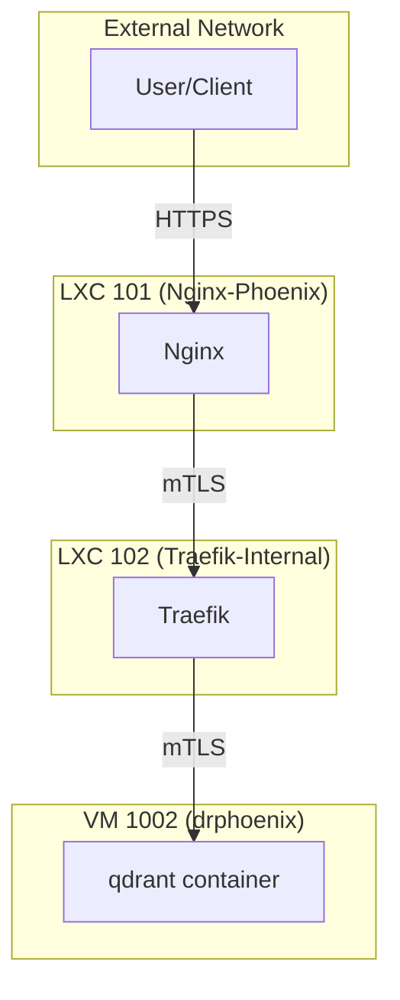

# Qdrant Service Architecture Overview

This document provides a comprehensive overview of the platform architecture supporting the Qdrant vector database service.

## 1. Core Components and Roles

The platform is composed of a set of interconnected LXC containers and QEMU VMs, each with a specific role in the overall architecture.

*   **LXC 103 (Step-CA):** The internal Certificate Authority, responsible for issuing and managing TLS certificates for all internal services. This ensures that all communication within the platform is encrypted and secure.

*   **LXC 101 (Nginx-Phoenix):** The primary ingress gateway. It handles all external-facing traffic, terminates TLS, and forwards requests to the internal Traefik proxy.

*   **LXC 102 (Traefik-Internal):** The internal reverse proxy and service mesh. It dynamically discovers and routes traffic to the various backend services, including the Qdrant container. It also automates the management of internal TLS certificates by integrating with Step-CA.

*   **VM 1001 (Portainer):** The central management hub for the Docker environments. It provides a web UI and API for deploying, managing, and monitoring Docker containers and stacks.

*   **VM 1002 (drphoenix):** The Docker host for the Qdrant service. It runs the Portainer agent, which allows the main Portainer server to manage its Docker environment. The `qdrant_service` Docker stack is deployed on this VM.

## 2. Service Interaction and Request Flow

The following Mermaid diagram illustrates the flow of a request to the Qdrant service:

**Request Flow Breakdown:**

1.  A user or client sends an HTTPS request to the Nginx gateway.
2.  Nginx terminates the external TLS and forwards the request to the internal Traefik proxy over a mutually authenticated TLS (mTLS) connection.
3.  Traefik, based on the hostname (`qdrant.internal.thinkheads.ai`), routes the request to the Qdrant container running on VM 1002, also over an mTLS connection.
4.  The Qdrant container processes the request and returns a response, which follows the same path back to the user.

## 3. How the Components Support the Qdrant Container

The platform provides a secure, scalable, and manageable environment for the Qdrant container through the following mechanisms:

*   **Security:** All internal communication is encrypted using mTLS, with certificates managed by the internal Step-CA. The firewall rules on each component are tightly controlled to only allow necessary traffic.

*   **Scalability:** The use of a reverse proxy (Traefik) allows for easy scaling of the Qdrant service. Multiple instances of the Qdrant container can be deployed, and Traefik will automatically load balance traffic between them.

*   **Manageability:** The entire platform is managed through the Portainer UI, which provides a single pane of glass for deploying, monitoring, and managing the Qdrant service and all other components. The use of Docker stacks allows for the declarative definition and versioning of the Qdrant service configuration.

*   **Service Discovery:** Traefik automatically discovers the Qdrant service through its integration with Docker, eliminating the need for manual configuration when the service is updated or scaled.

This architecture provides a robust and resilient foundation for the Qdrant vector database service, ensuring that it is secure, scalable, and easy to manage.