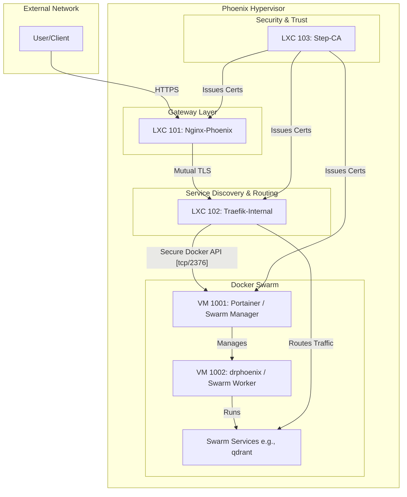

# Service Documentation: Phoenix Hypervisor

This document details the roles and responsibilities of the core components within the Phoenix Hypervisor infrastructure.

## LXC Containers

### LXC 103: Step-CA
- **Role:** Internal Certificate Authority
- **Function:** Acts as the root of trust for the entire internal network. It is responsible for issuing and managing TLS certificates for all internal services, ensuring secure, encrypted communication between components.

### LXC 102: Traefik-Internal
- **Role:** Internal Service Discovery and Reverse Proxy
- **Function:** Manages internal traffic, automatically discovering and routing requests to the appropriate backend services within the Docker Swarm. It secures its own communications using certificates obtained from LXC 103.

### LXC 101: Nginx-Phoenix
- **Role:** External Gateway and Reverse Proxy
- **Function:** Serves as the primary entry point for all external traffic. It handles TLS termination for incoming requests (using certificates from Step-CA) and forwards them to the internal Traefik proxy (LXC 102). This provides a secure boundary for the internal network.

## Virtual Machines

### VM 1001: Portainer (Swarm Manager)
- **Role:** Docker Swarm Manager and Management UI
- **Function:** Orchestrates the entire Docker Swarm, managing service deployments, scaling, and overall cluster health. It also hosts the Portainer UI, providing a graphical interface for managing the containerized environment. Following the `final_fix_plan.md`, it now exposes a secure, TLS-encrypted Docker API on port 2376.

### VM 1002: drphoenix (Swarm Worker)
- **Role:** Docker Swarm Worker Node
- **Function:** Executes the application containers and workloads as directed by the Swarm Manager (VM 1001). It runs the Portainer agent, allowing it to be managed and monitored through the central Portainer instance.

## Service Interaction Diagram

## Security Impact of `final_fix_plan.md`

The changes outlined in the `final_fix_plan.md` represent a significant enhancement to the security posture of the Phoenix Hypervisor environment. The key improvements are:

- **End-to-End Encryption:** By replacing the insecure TCP socket (`tcp://10.0.0.111:2375`) with a TLS-encrypted endpoint (`tcp://10.0.0.111:2376`), all communication between Traefik (LXC 102) and the Docker Swarm Manager (VM 1001) is now encrypted. This prevents eavesdropping and man-in-the-middle attacks on the Docker API.

- **Centralized Certificate Management:** The integration with Step-CA (LXC 103) ensures that all TLS certificates are managed centrally and automatically. This eliminates the need for manually-generated, self-signed certificates, which are often a weak point in security.

- **Hardened Network Security:** The firewall rules have been updated to only allow traffic on the new, secure port (2376), effectively closing off the old, insecure endpoint. This reduces the attack surface of the Docker Swarm Manager.

## Expected Outcome of `phoenix-cli` Commands

Based on the architecture and the declarative nature of the `phoenix-cli`, here is the expected outcome of the commands you are executing:

- **`phoenix setup`**: This command will likely re-apply the base hypervisor configuration, ensuring that all foundational settings (networking, storage, etc.) are correctly configured according to the `phoenix_hypervisor_config.json`.

- **`phoenix create 103 101 102`**: This will create the core infrastructure LXCs in the correct order of dependency (103 -> 101 -> 102). The `lxc-manager.sh` will read the configurations from `phoenix_lxc_configs.json` and provision each container accordingly.

- **`phoenix create 1001 1002`**: This will create the Docker Swarm VMs. The `vm-manager.sh` will use the definitions in `phoenix_vm_configs.json` to clone the base template and apply the specified configurations.

- **`phoenix sync all`**: This is the final orchestration step. It will:
    - **Trigger Certificate Renewals:** The `certificate-renewal-manager.sh` will ensure all services have valid TLS certificates from Step-CA.
    - **Deploy Portainer & Stacks:** The `portainer-manager.sh` will deploy the Portainer service and any defined Docker stacks (like `qdrant_service`).
    - **Configure Proxies:** It will ensure that Nginx and Traefik are correctly configured to route traffic to the newly created services.
    - **Verify System State:** The system will perform health checks to ensure all components are running and communicating correctly.

The end result will be a fully provisioned, secure, and operational environment, with all services running and accessible through the Nginx gateway.