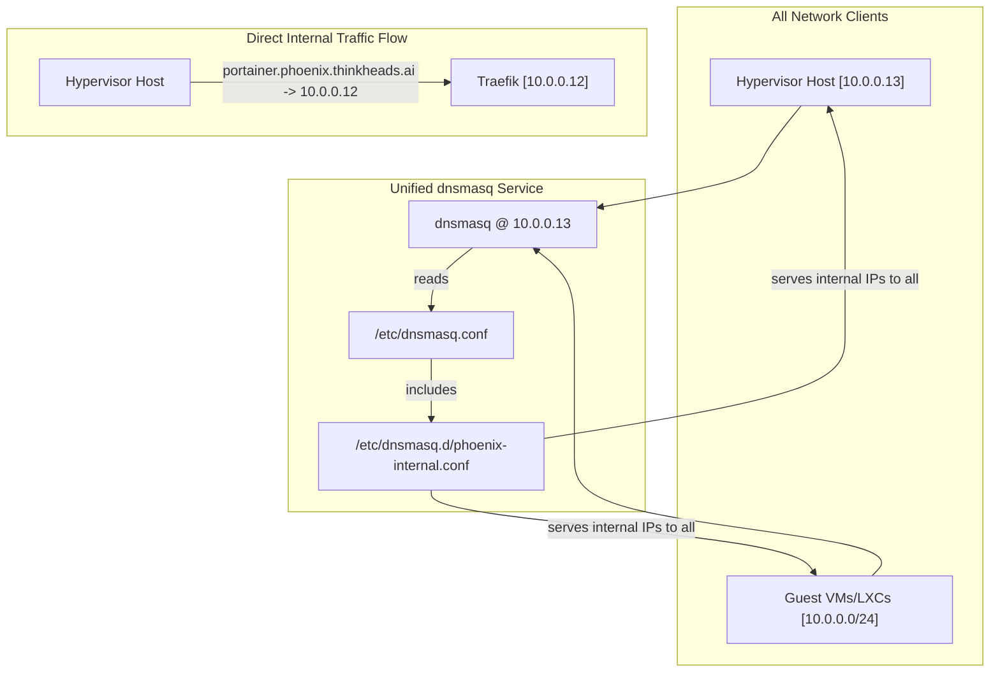

# Simplified DNS and Firewall Enhancement Plan

## 1. Objective

This document outlines a refined and simplified plan to resolve the DNS issues within the Phoenix Hypervisor environment. By removing the unnecessary complexity of a split-horizon setup, we can create a more robust, efficient, and maintainable system.

## 2. The Strategy: Internal-Only DNS

The core of this plan is to reconfigure the `dnsmasq` service to serve a single, unified, internal-only DNS view to all clients on the network (both the hypervisor host and its guests). This eliminates the root cause of the current issues—the unreliable mechanism for differentiating between internal and external clients.

### 2.1. Architectural Impact

This change simplifies the network traffic flow for the hypervisor. Instead of routing its own requests through the Nginx gateway, the host will now resolve internal services directly to the Traefik service mesh, resulting in a more efficient communication path.

### 2.2. Corresponding Firewall Enhancement

To support this more efficient traffic flow, a new firewall rule is required. This rule will explicitly permit the hypervisor host to communicate directly with the Traefik container (LXC 102).

## 3. New Architecture Diagram

## 4. Implementation Steps

The following steps, as reflected in the `update_todo_list`, will be taken to execute this plan:

1.  **Update Firewall Configuration:** A new rule will be added to the `global_firewall_rules` section of `phoenix_hypervisor_config.json` to allow traffic from the host (`10.0.0.13`) to the Traefik container (`10.0.0.12`) on its designated ports.
2.  **Refactor DNS Setup Script:** The `hypervisor_feature_setup_dns_server.sh` script will be significantly simplified to:
    -   Remove all logic related to split-horizon DNS, DHCP tagging, and external record generation.
    -   Generate a single configuration file (`/etc/dnsmasq.d/phoenix-internal.conf`) that maps all services to their internal Traefik IP.
    -   Ensure the main `dnsmasq.conf` is configured to listen on the host's primary IP (`10.0.0.13`) and serve records to all clients.
3.  **Execute and Verify:** The updated script will be run, and a series of `dig` commands will be executed from both the host and a guest container to confirm that all clients correctly resolve internal services to the Traefik IP.

This plan is now ready for your review. Once you approve, we can proceed with the implementation.