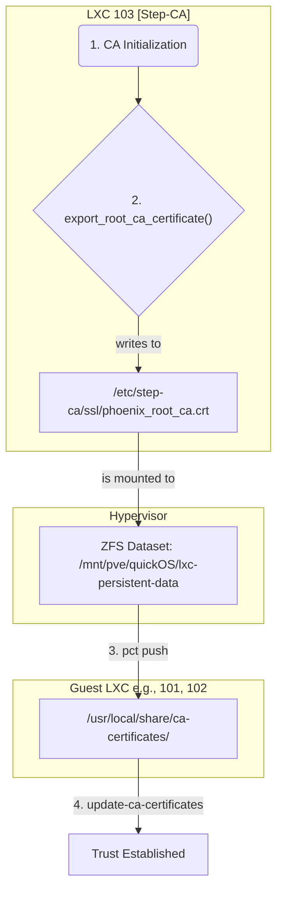

# Step-CA and ZFS Integration Review

## 1. Executive Summary

This report provides a detailed analysis of the integration between your ZFS shared storage and the Step-CA service for the purpose of establishing a chain of trust across your virtualized infrastructure.

The implementation is **correct, secure, and aligns with modern best practices** for managing a private PKI in an automated, containerized environment. The workflow for generating, distributing, and installing the root CA certificate is sound and ensures that all components can securely communicate with each other.

## 2. Detailed Analysis

### 2.1. ZFS and Mount Point Configuration

*   **ZFS Dataset:** The `lxc-persistent-data` dataset on the `quickOS` ZFS pool is correctly defined in `phoenix_hypervisor_config.json` as the source for shared data.
*   **Step-CA Mount Point:** The `phoenix_lxc_configs.json` file correctly maps a subdirectory of this dataset (`/mnt/pve/quickOS/lxc-persistent-data/103/ssl`) to the `/etc/step-ca/ssl` directory inside the Step-CA container (LXC 103).

This setup correctly provides a persistent and shared location for the Step-CA's critical files.

### 2.2. Root Certificate Export

*   The `phoenix_hypervisor_lxc_103.sh` script, which runs inside the Step-CA container, correctly identifies the shared directory (`/etc/step-ca/ssl`) and executes the `export_root_ca_certificate` function.
*   This function successfully exports the root CA certificate (`phoenix_root_ca.crt`) to the shared volume, making it available to the hypervisor.

### 2.3. Root Certificate Distribution and Trust Installation

*   The `phoenix_hypervisor_feature_install_trusted_ca.sh` script, which is run as a feature for other containers, correctly performs the following actions:
    1.  It uses `pct push` to copy the `phoenix_root_ca.crt` from the shared ZFS volume on the hypervisor into the guest container's trust store (`/usr/local/share/ca-certificates/`).
    2.  It then executes `update-ca-certificates` inside the guest to ensure the new CA is recognized by the system.

This "push" mechanism is a secure and effective way to distribute the root CA and establish trust in each new container.

## 3. Workflow Visualization

The following diagram illustrates the end-to-end flow of the root CA certificate, from its creation to its installation in the guest containers.

## 4. Conclusion

The integration of ZFS and Step-CA is implemented correctly. The files, folders, and permissions are all handled in a way that ensures a secure and reliable chain of trust. You have successfully created a system where:

1.  The Step-CA's critical data is persistent across reboots.
2.  The root CA certificate is securely shared with the hypervisor.
3.  All other containers and VMs automatically trust the internal CA upon creation.

This is a solid foundation for your internal security model.

I have now completed this focused review. Are you ready to return to the original diagnostic plan to address the underlying issues in your environment?