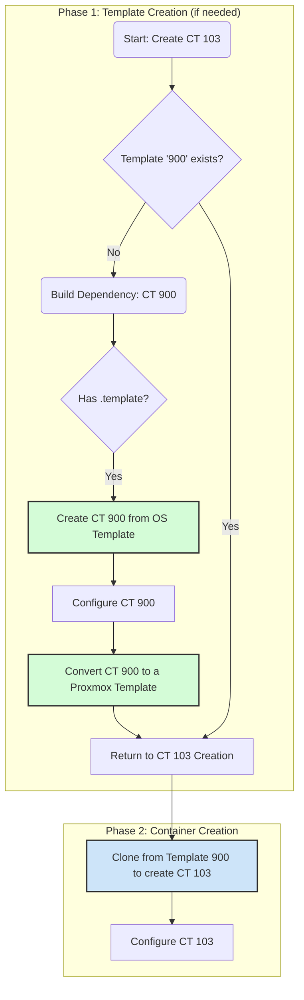

# Strategic Shift: Adopting Proxmox Native LXC Templates

## The Problem with Our Current Approach

Our `vzdump`-based templating system, while offering portability, has proven to be overly complex and a persistent source of failure. The recursive logic required to manage these file-based templates is fragile and has led to a frustrating cycle of errors.

## The New Strategy: Embrace Native Proxmox Templates

We will pivot to using Proxmox's native templating functionality. This aligns our automation with the platform's intended workflow, leading to a simpler, more robust, and more maintainable system.

### The New, Simplified Workflow

This diagram illustrates the new, streamlined process:



### The Implementation Plan

1.  **Configuration Simplification:** The `phoenix_lxc_configs.json` file will be simplified. The `lxc_templates` and `template_file` sections are no longer needed and will be removed. The logic will be driven by `clone_from_ctid` (which will now point to a template) and the base OS `template`.

2.  **Script Refactoring:** The `lxc-manager.sh` script will be significantly refactored:
    *   The `create_lxc_template` function will be replaced with a new function that uses `pct template` to convert a container into a native template.
    *   The `ensure_container_defined` function will be simplified to prioritize cloning from a native template. If the template doesn't exist, it will build and convert it.

This strategic shift will eliminate the root cause of our persistent failures and align our automation with best practices for the Proxmox platform.

### Code Modifications

**`phoenix_lxc_configs.json` Change:**

```diff
--- a/usr/local/phoenix_hypervisor/etc/phoenix_lxc_configs.json
+++ b/usr/local/phoenix_hypervisor/etc/phoenix_lxc_configs.json
@@ -5,22 +5,6 @@
      "nvidia_driver_version": "580.76.05",
      "nvidia_repo_url": "https://developer.download.nvidia.com/compute/cuda/repos/ubuntu2404/x86_64/",
      "nvidia_runfile_url": "https://us.download.nvidia.com/XFree86/Linux-x86_64/580.76.05/NVIDIA-Linux-x86_64-580.76.05.run",
-     "lxc_templates": {
-         "copy-base-v1.tar.gz": {
-             "source_ctid": "900"
-         },
-         "copy-cuda-v1.tar.gz": {
-             "source_ctid": "901"
-         },
-         "nginx-phoenix-v1.tar.gz": {
-             "source_ctid": "101"
-         },
-         "traefik-internal-v1.tar.gz": {
-             "source_ctid": "102"
-         },
-         "step-ca-v1.tar.gz": {
-             "source_ctid": "103"
-         }
-     },
      "lxc_configs": {
          "900": {
              "name": "Copy-Base",
@@ -751,7 +735,6 @@
          },
          "103": {
              "name": "Step-CA",
-             "template_file": "step-ca-v1.tar.gz",
              "start_at_boot": true,
              "boot_order": 1,
              "boot_delay": 5,

```

**`lxc-manager.sh` Change:**

This will be a more significant refactoring, but the core change will be in the `ensure_container_defined` function, which will be simplified to a variation of this logic:

```bash
ensure_container_defined() {
    local CTID="$1"
    # ... (check if container exists)

    local clone_source=$(jq -e ".lxc_configs[\"$CTID\"].clone_from_ctid" "$LXC_CONFIG_FILE")
    if [ -n "$clone_source" ]; then
        # Check if the source is a template and exists
        if ! pct status "$clone_source" > /dev/null 2>&1; then
            # If the template doesn't exist, recursively build it
            ensure_container_defined "$clone_source"
            # Now, convert the newly built container to a template
            pct template "$clone_source"
        fi
        # Clone from the (now existing) template
        pct clone "$clone_source" "$CTID" --full
    elif jq -e ".lxc_configs[\"$CTID\"].template" "$LXC_CONFIG_FILE" > /dev/null; then
        create_container_from_os_template "$CTID"
    else
        log_fatal "No creation method found for $CTID"
    fi
}