# Detailed Explanation of the Certificate and `sync all` Workflow

This document clarifies the intended lifecycle of TLS certificates and the correct, robust sequence of operations for the `phoenix sync all` command.

## Certificate Lifecycle: Two Key Events

Your system manages certificates at two distinct points in time:

1.  **During `phoenix create <id>`:** When a new guest (LXC or VM) is created, its feature scripts (e.g., `feature_install_docker.sh`) are responsible for its initial setup. This includes bootstrapping trust with the Step CA and, in some cases, requesting an initial certificate. This ensures the guest can communicate securely from the moment it comes online.

2.  **During `phoenix sync all`:** This command acts as a master convergence and synchronization process. Here, the [`certificate-renewal-manager.sh`](usr/local/phoenix_hypervisor/bin/managers/certificate-renewal-manager.sh) takes center stage. Its job is to:
    *   Read the entire [`certificate-manifest.json`](usr/local/phoenix_hypervisor/etc/certificate-manifest.json).
    *   For every certificate defined, it checks if the file exists and if it's nearing expiration.
    *   If a certificate is missing or expiring (or if `--force` is used), it generates a new one on the hypervisor. This is the **single source of truth** for all certificates.
    *   It then executes the `post_renewal_command` defined in the manifest. This command is responsible for pushing the new certificate into the correct guest and reloading the relevant service (e.g., Nginx, Docker, Portainer).

## The Correct `phoenix sync all` Workflow (Post-Fix)

The core issue we identified was a race condition. The fix involves reordering the stages within `portainer-manager.sh` to ensure dependencies are met *before* they are needed.

Here is the corrected, high-level workflow that the proposed fixes will achieve:

```mermaid
graph TD
    subgraph "Corrected `phoenix sync all` Workflow"
        A[Start] --> B[Stage 1: Prepare Infrastructure];
        B --> B1[Sync Stack Files to NFS];
        B --> B2[Sync DNS & Firewall on Host];
        
        B2 --> C[Stage 2: Initialize Docker Swarm];
        C --> C1[Ensure Swarm Manager VM 1001 is Active/Leading];
        C1 --> C2[Join all Worker VMs e.g., 1002];
        C2 --> C3[Create Core Overlay Networks e.g., traefik-public];

        C3 --> D[Stage 3: Generate All Certificates];
        D --> D1[Run certificate-renewal-manager.sh --force];
        D1 --> D2{For each cert in manifest};
        D2 --> D3[Generate/Renew Cert on Hypervisor Filesystem];

        D3 --> E[Stage 4: Distribute Certs & Run Post-Renewal];
        E --> E1{For each cert in manifest};
        E1 --> E2[Push Certs/Keys into Guest VM/LXC];
        E2 --> E3[Run post_renewal_command e.g., `docker secret create`];

        E3 --> F[Stage 5: Deploy Services];
        F --> F1[Deploy Portainer Stack];
        F1 --> F2[Deploy Application Stacks];
        
        F2 --> G[Stage 6: Configure Gateways];
        G --> G1[Generate & Push Traefik Config];
        G1 --> G2[Generate & Push Nginx Config];

        G2 --> H[End];
    end
```

### How the Fixes Achieve This Correct Flow:

*   **You are here:** You correctly stated, "The certs all need to be where they need to be before we create the secrets. Docker has to be up fully before we create the secrets."
*   **The Solution:** By moving **Stage 2: Initialize Docker Swarm** to occur *before* **Stage 3 & 4: Certificate Generation and Post-Renewal**, we guarantee that when the `post_renewal_command` for the Portainer certificate is executed (e.g., `docker secret create ...`), the Docker Swarm is already running, initialized, and ready to accept the command. This completely resolves the race condition.
*   **The Certificate Bug:** Fixing the `step ca certificate` command ensures that the certificate files for `portainer-client` physically exist on the hypervisor's filesystem in Stage 3, so that the `docker secret create` command in Stage 4 has a file to read from.

This revised, sequential approach ensures that on a fresh system, the infrastructure is built layer by layer, with each step's dependencies fully met before it begins.
