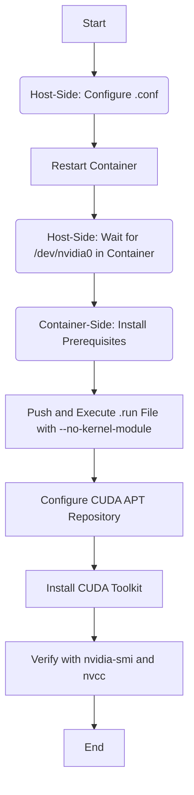

# NVIDIA GPU Management, Passthrough, and Installation Guide

## 1. Overview

The purpose of this document is to serve as the single, authoritative source of truth for all NVIDIA GPU-related setup and configuration within the Phoenix Hypervisor environment. It provides a comprehensive, step-by-step process for system administrators and developers, covering the entire workflow from bare-metal hypervisor configuration to in-container driver installation.

This guide is essential for ensuring a stable, reliable, and performant GPU-accelerated environment for AI/ML workloads in LXC containers.

## 2. Core Architectural Principles

The entire process is built on a set of core principles that ensure stability and maintainability.

*   **Host-Kernel, Container-Userspace Model:** The Proxmox host is solely responsible for managing the NVIDIA kernel module. This is the low-level component that directly interfaces with the hardware. LXC containers, which share the host's kernel, only install the user-space driver components (like `nvidia-smi` and CUDA libraries). This separation is fundamental to how GPU passthrough works in a containerized environment.
*   **Single Source of Truth for Drivers:** The NVIDIA `.run` installer file, specified by the `runfile_url` in the central configuration, is the definitive source for the driver version. The exact same installer file is used on the hypervisor and within the containers. This strict version alignment is critical for preventing compatibility issues between the kernel module and the user-space tools.
*   **Idempotency:** All automation scripts are designed to be idempotent, meaning they can be safely re-run multiple times. The scripts check the current state of the system and only make changes if necessary, preventing configuration drift and ensuring a predictable outcome.
*   **Prerequisites:** A foundational requirement for any GPU passthrough is that IOMMU (Input-Output Memory Management Unit), often referred to as VT-d or AMD-Vi, is enabled in the server's BIOS/UEFI. This allows the hypervisor to safely delegate direct hardware access to a guest.

## 3. Phase 1: Hypervisor Preparation (VFIO Passthrough)

**Objective:** Prepare the Proxmox host to release its control over the physical NVIDIA GPU, making it available for passthrough to a guest environment like an LXC container.

**Script:** `usr/local/phoenix_hypervisor/bin/hypervisor_setup/hypervisor_feature_setup_vfio.sh`

This initial phase configures the underlying virtualization technology required for direct hardware access.

**Key Steps:**

1.  **Blacklist Conflicting Drivers:** The script creates configuration files to prevent the default open-source `nouveau` driver and the `nvidiafb` framebuffer driver from loading. These drivers would otherwise compete with the `vfio-pci` driver needed for passthrough.
2.  **Load VFIO Kernel Modules:** The script ensures that the necessary VFIO modules are loaded at boot time by adding them to `/etc/modules`. The key modules are:
    *   `vfio`: The core VFIO module.
    *   `vfio_pci`: The module that handles PCI device passthrough.
    *   `vfio_iommu_type1`: The IOMMU driver for the system.
3.  **Update `initramfs`:** After modifying the module configurations, the initial RAM filesystem (`initramfs`) is updated. This ensures that the changes are applied early in the boot process, before the kernel attempts to load any conflicting drivers.
4.  **Mandatory Reboot:** A reboot of the hypervisor is **required** after this phase to apply all the changes to the kernel and module loading.

## 4. Phase 2: Hypervisor NVIDIA Driver Installation

**Objective:** Install the official NVIDIA driver on the Proxmox host. This installs the kernel module that the containers will ultimately use.

**Script:** `usr/local/phoenix_hypervisor/bin/hypervisor_setup/hypervisor_feature_install_nvidia.sh`

**Key Steps:**

1.  **Idempotency Check:** The script first checks if `nvidia-smi` is present and if the reported driver version matches the target version from the configuration file. If they match, the installation is skipped.
2.  **Aggressive Cleanup:** To ensure a clean installation, the script performs a thorough purge of any existing NVIDIA packages, DKMS modules, and related configuration files.
3.  **Dependency Installation:** It installs the packages required to build the kernel module, including the correct Proxmox kernel headers (`pve-headers`) and `build-essential`.
4.  **`.run` File Execution:** The script executes the cached NVIDIA `.run` file.
    *   **CRITICAL DETAIL:** The installation is performed using the `--no-dkms` flag. This means the driver is compiled specifically for the currently running kernel. If the Proxmox host's kernel is updated (e.g., via `apt upgrade`), the NVIDIA driver **will not** be automatically rebuilt and will cease to function. The installation script must be manually re-run after a kernel upgrade.
5.  **Verification:** After the installer finishes, the script runs `nvidia-smi` to confirm that the driver is loaded and functional.
6.  **Mandatory Reboot:** A second host reboot is required to unload any final conflicting modules and properly load the new NVIDIA kernel driver.

## 5. Phase 3: LXC Container GPU Passthrough and Driver Installation

**Objective:** Configure a specific LXC container to access the host's GPU and install the matching user-space driver components and CUDA Toolkit.

**Script:** `usr/local/phoenix_hypervisor/bin/lxc_setup/phoenix_hypervisor_feature_install_nvidia.sh`

This is a multi-stage process orchestrated by a single script.

**Key Steps:**

1.  **Host-Side Configuration:** The script first modifies the container's configuration file (e.g., `/etc/pve/lxc/901.conf`) on the Proxmox host.
    *   It adds `lxc.cgroup2.devices.allow` rules to grant the container permission to access the NVIDIA character devices.
    *   It adds `lxc.mount.entry` lines to bind-mount the GPU device nodes (e.g., `/dev/nvidia0`, `/dev/nvidiactl`) from the host into the container's filesystem.
2.  **Container Restart and Device Wait:** To apply these hardware configuration changes, the container must be restarted. After starting it, the script intelligently pauses and waits for the `/dev/nvidia0` device node to become visible inside the container, which resolves potential race conditions.
3.  **In-Container Installation:** Once the device is present, the script proceeds with installation inside the container.
    *   The same `.run` file used on the host is pushed into the container's `/tmp` directory.
    *   The installer is executed with the `--no-kernel-module` flag. This is crucial, as it tells the installer to only install the user-space components and to not interfere with the kernel.
    *   The official NVIDIA CUDA `apt` repository is configured inside the container.
    *   The `cuda-toolkit-12-8` package (or as specified in the configuration) is installed via `apt`.
4.  **Final Verification:** The script concludes by running `nvidia-smi` and `/usr/local/cuda/bin/nvcc --version` inside the container to confirm that both the user-space driver and the CUDA Toolkit are installed and functioning correctly.

## 6. Troubleshooting

*   **`nvidia-smi` fails on host:** This usually indicates an issue with the kernel module. Ensure both reboots (after VFIO setup and after driver install) were completed. Check `dmesg | grep -i -e "vfio" -e "nvidia"` for errors.
*   **`/dev/nvidia0` not in container:** The passthrough configuration is likely incorrect. Verify the `lxc.mount.entry` and `lxc.cgroup2.devices.allow` lines in the container's `.conf` file. Also, check the host's `dmesg` log for any VFIO-related errors that might have occurred when the container started.
*   **Driver version mismatch error in container:** This is a critical error. It means the user-space driver in the container does not match the kernel driver on the host. This can happen if the host driver was updated but the container installation was not re-run. The solution is to re-run the installation feature for the container to align the versions.