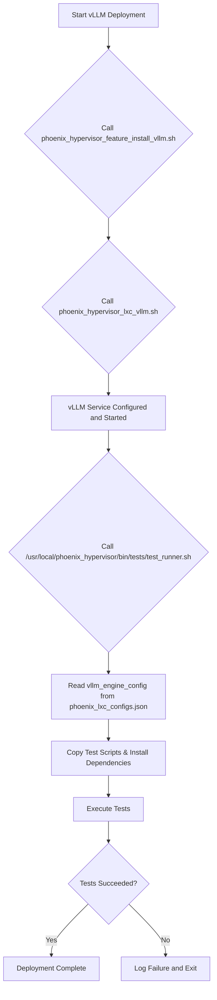

# vLLM Integration Testing Guide

## 1. Overview

This document outlines the automated integration testing framework for vLLM containers within the Phoenix Hypervisor environment. The framework is designed to verify the correctness and performance of vLLM deployments automatically after their installation.

The primary goal of this system is to ensure that every vLLM container is fully functional and meets performance expectations before it is put into service.

## 2. Architecture

The testing framework consists of three main components:

*   **Python Test Scripts:** Located in `/usr/local/phoenix_hypervisor/bin/tests/`, these scripts perform the actual tests against the vLLM API.
    *   `test_vllm_context_window.py`: Verifies that the model can handle its advertised context window size.
    *   `test_vllm_responsiveness.py`: Measures the API's response latency to ensure it meets performance standards.
*   **Orchestration Script:** The `/usr/local/phoenix_hypervisor/bin/tests/test_runner.sh` script manages the entire testing process. It reads the container's configuration, copies the test scripts into the container, installs dependencies, and executes the tests.
*   **Integration Point:** The testing framework is integrated into the main LXC orchestration workflow in `/usr/local/phoenix_hypervisor/bin/managers/lxc-manager.sh`.

## 3. Control Flow

The testing process is triggered automatically at the end of a successful container creation workflow. The new control flow, reflecting the two-script implementation, is as follows:

1.  The `lxc-manager.sh` script orchestrates the container setup.
2.  It first executes `phoenix_hypervisor_feature_install_vllm.sh` to install all necessary dependencies.
3.  Next, it runs the container's designated `application_script` (e.g., `phoenix_hypervisor_lxc_vllm.sh`), which generates and deploys the systemd service.
4.  Finally, it calls the `run_post_deployment_validation` function, which executes the `test_runner.sh` script.
5.  The `test_runner.sh` script now parses the `vllm_engine_config` object in `phoenix_lxc_configs.json` to extract the `served_model_name` and `max_model_len`.
6.  The Python test scripts are copied into the container, dependencies are installed, and the tests are executed with the extracted parameters.
7.  A test failure will halt the deployment and signal an error.

## 4. Usage

This testing framework is fully automated and requires no manual intervention. The results of the tests will be logged to the main orchestrator log file. If a deployment fails, the logs will contain the output from the failed test, which can be used for troubleshooting.