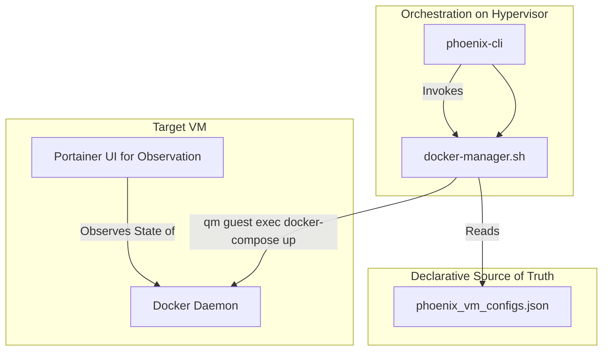
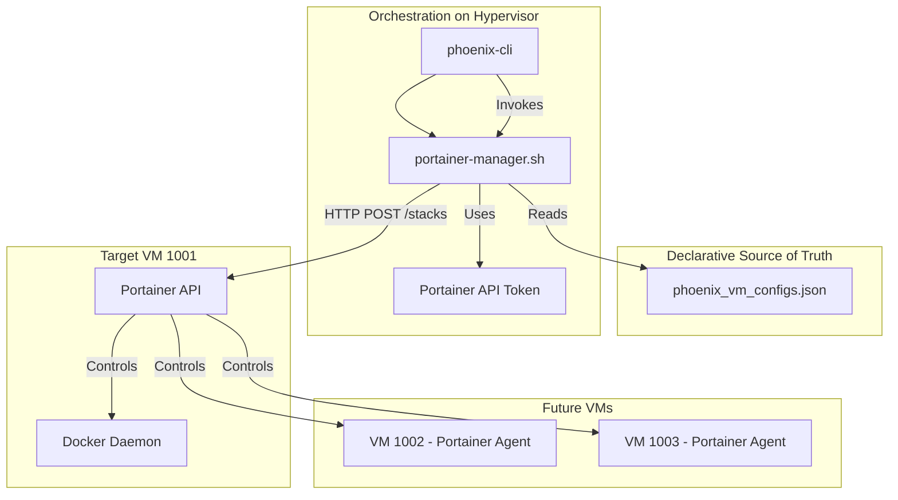

# Architectural Deep Dive: Comparing Docker Management Strategies

**Author:** Roo
**Version:** 1.0
**Date:** 2025-10-03

## 1. Introduction

This document explores two distinct architectural strategies for integrating Docker container management into the Phoenix Hypervisor orchestrator. The choice between these models is a fundamental architectural decision that will impact how we manage, scale, and synchronize our containerized environments.

-   **Option A: Direct Docker Control:** The `phoenix-cli` orchestrator directly controls the Docker daemon inside VMs.
-   **Option B: Portainer API-Driven Orchestration:** The `phoenix-cli` orchestrator acts as a client to the Portainer API, which in turn controls the Docker daemons.

## 2. Option A: Direct Docker Control via `docker-manager.sh`

### 2.1. Core Principle

The Git-versioned `phoenix_vm_configs.json` file is the **absolute and only source of truth**. The orchestrator bypasses all external management layers (like the Portainer API) and enforces this truth directly on the Docker daemon within the target VM using the hypervisor's trusted communication channel.

### 2.2. CLI Syntax

`phoenix docker <vmid> converge [stack_name]`

### 2.3. Workflow

### 2.4. Pros

-   **Maximum Simplicity & Security:** This model is self-contained. It requires no API tokens, network ACLs for an API, or management of external credentials. The attack surface is minimal.
-   **Zero External Dependencies:** The orchestration relies only on the hypervisor's built-in `qm guest exec` command. It will function even if the Portainer container is down.
-   **Unambiguous Source of Truth:** There is no question about the desired state. It is what is defined in the version-controlled JSON file. Configuration drift is impossible in the long run, as the orchestrator will always revert the system to the state defined in Git.

### 2.5. Cons

-   **Portainer is Passive:** Portainer becomes a read-only/observability tool. Any advanced features it has for stack management, GitOps integration, or environment syncing are not leveraged by the orchestrator.
-   **Requires Strict Discipline:** An administrator making a "quick fix" in the Portainer UI will have their changes overwritten by the next `phoenix docker converge` run. This enforces consistency but can be surprising if the operational model isn't clearly communicated.

## 3. Option B: Portainer API-Driven Orchestration

### 3.1. Core Principle

Portainer is the **centralized engine and API for all Docker environments**. The `phoenix-cli` orchestrator's role is to be a declarative client to this engine. It reads the desired state from `phoenix_vm_configs.json` and uses the Portainer API to make the live environment match. This model is ideal for managing and synchronizing multiple Docker environments (e.g., prod, test, dev) from a single point.

### 3.2. CLI Syntax

`phoenix portainer <vmid> converge [stack_name]`

### 3.3. Workflow

### 3.4. Pros

-   **Leverages Portainer's Power:** This model uses Portainer as intended—a powerful, centralized management platform. We can leverage its features for stack updates, secret management, and multi-environment synchronization.
-   **Centralized Control Hub:** Portainer becomes the single pane of glass and control for all Docker environments, including future VMs running the Portainer agent. This directly supports the goal of syncing prod, test, and dev environments.
-   **Richer Functionality:** The Portainer API is more expressive than raw `docker-compose` commands. It can provide better feedback, handle complex updates gracefully, and integrate with other tools.

### 3.5. Cons

-   **Adds Dependency & Complexity:** The orchestrator now critically depends on the Portainer service being available and healthy. If the Portainer container is down, we cannot manage any Docker environments.
-   **Secret Management:** We must securely generate, store on the hypervisor, and use a Portainer API token. This introduces a new secret that requires careful handling.
-   **More Complex Manager:** The `portainer-manager.sh` becomes more complex. It must be able to construct and send authenticated HTTP requests and parse JSON responses from the API.

## 4. Recommendation

The choice between these two architectures is a strategic one based on the desired role of Portainer in your ecosystem.

-   **Choose Option A if:** You prioritize simplicity, security, and a self-contained system. In this model, your Git repository is the ultimate source of truth for *everything*, and Portainer is a convenience for observation.
-   **Choose Option B if:** You envision Portainer as a critical piece of your infrastructure—a central management plane for synchronizing multiple environments. This model embraces Portainer's power and aligns with your stated goal of using it to manage prod, test, and dev environments cohesively.

Please review these two options. Once you decide on the architectural direction, I will update the main project plan accordingly.