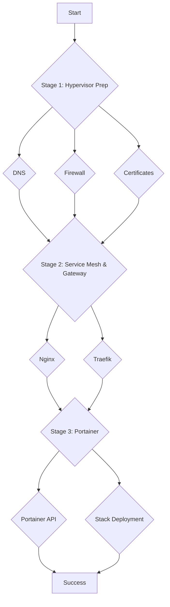

# End-to-End `phoenix sync all` Diagnostics Plan

This document consolidates the individual diagnostic plans into a single, sequential workflow. By executing these steps in order, we can systematically validate each component of the Phoenix Hypervisor system and pinpoint the exact cause of the `phoenix sync all` failures.

## Workflow Diagram

## Stage 1: Hypervisor Preparation (DNS, Firewall, Certificates)

This stage ensures the fundamental networking and security services on the Proxmox host are functioning correctly.

1.  **DNS Verification:** Execute all steps in `temp_docs/dns_diagnostics_plan.md`.
2.  **Firewall and Connectivity Verification:** Execute all steps in `temp_docs/firewall_and_dns_analysis.md`.
3.  **Certificate Verification:** Execute all steps in `temp_docs/certificate_verification_plan.md`.

**Do not proceed to Stage 2 until all verifications in Stage 1 pass.**

## Stage 2: Service Mesh and Gateway (LXC 101 & 102)

This stage validates that the internal and external traffic routing is correctly configured.

1.  **Nginx and Traefik Verification:** Execute all steps in `temp_docs/nginx_diagnostics_plan.md`.

**Do not proceed to Stage 3 until the end-to-end routing test in the Nginx/Traefik plan is successful.**

## Stage 3: Portainer API and Stack Deployment (VM 1001 & 1002)

This final stage verifies the application deployment layer.

1.  **Portainer API and Stack Deployment Analysis:** Execute all steps in `temp_docs/portainer_api_analysis.md`.

## Conclusion

By following this structured plan, we will methodically test every critical dependency in the `phoenix sync all` process. The results of these tests will provide a clear path to remediation.
