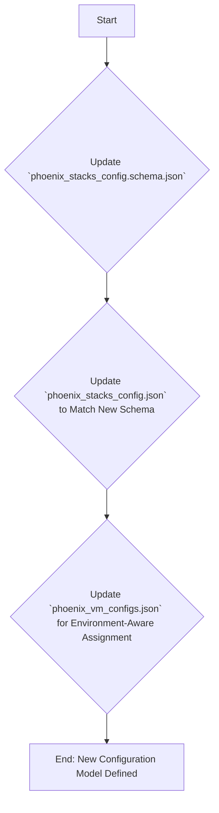
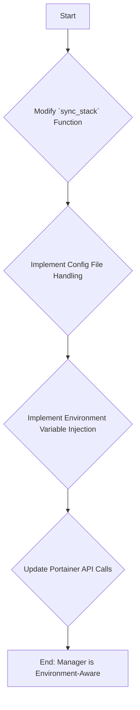

# Project Plan: Enhanced Portainer Stack Management

**Document Purpose:** This document provides a detailed, phased plan for evolving the `phoenix_stacks_config.json` and enhancing the `portainer-manager.sh` to support environment-specific, configuration-first deployments.

**Architectural Vision:** To create a robust, declarative system for managing Docker stacks across multiple environments (e.g., production, testing, development) by defining environment variables and configuration files within a central manifest, and orchestrating their deployment via the Portainer API.

---

## Phase 1: Schema and Configuration Redesign

**Goal:** To update the core configuration files and their schemas to support the new, more detailed stack definition model. This phase is about defining the new "blueprint" for our system.

**Key Files to Modify:**
*   `usr/local/phoenix_hypervisor/etc/phoenix_stacks_config.schema.json`
*   `usr/local/phoenix_hypervisor/etc/phoenix_stacks_config.json`
*   `usr/local/phoenix_hypervisor/etc/phoenix_vm_configs.json`

### Workflow for Phase 1:



### Detailed Steps & Architectural Tips:

1.  **Update `phoenix_stacks_config.schema.json`:**
    *   **Action:** Modify the schema to reflect the new, richer stack definition. This includes adding properties for `description`, `compose_file_path`, and an `environments` object. The `environments` object will contain patterns for different environments (e.g., `production`, `testing`), each with optional `variables` (an array of key-value pairs) and `files` (an array of source/destination objects) arrays.
    *   **Architecture Tip:** Make the `environments` block flexible. Using `patternProperties` in the JSON schema can allow for any environment name (not just hardcoded ones), which increases future flexibility.

2.  **Update `phoenix_stacks_config.json`:**
    *   **Action:** Update the live configuration file to match the new schema. Convert the existing `qdrant_service` to the new format and add a placeholder for the `thinkheads_ai_app` as a template.
    *   **Architecture Tip:** Even for simple stacks like `qdrant_service`, define a default `production` environment. This establishes a consistent pattern and makes it easier to add other environments later.

3.  **Update `phoenix_vm_configs.json`:**
    *   **Action:** Modify the `docker_stacks` array within the VM definitions. It should now be an array of objects, where each object specifies both the `name` of the stack and the `environment` to deploy.
    *   **Example:**
        ```json
        "docker_stacks": [
          { "name": "qdrant_service", "environment": "production" }
        ]
        ```
    *   **Architecture Tip:** This change is critical. It decouples the VM from the stack's internal configuration, allowing you to deploy the *same* stack with *different* environments to different VMs. For example, VM 1003 could run the `testing` environment of `thinkheads_ai_app`, while VM 1004 runs `production`.

---

## Phase 2: Enhance `portainer-manager.sh` Intelligence

**Goal:** To upgrade the `portainer-manager.sh` script to understand and act upon the new, richer configuration model. This is where the declarative blueprint is translated into concrete API actions.

**Key Files to Modify:**
*   `usr/local/phoenix_hypervisor/bin/managers/portainer-manager.sh`

### Workflow for Phase 2:



### Detailed Steps & Architectural Tips:

1.  **Modify `sync_stack` Function Signature:**
    *   **Action:** The `sync_stack` function will now be called with the VMID and the stack object from `phoenix_vm_configs.json` (e.g., `{ "name": "qdrant_service", "environment": "production" }`). It will need to parse the stack name and environment from this object.
    *   **Architecture Tip:** Pass the entire JSON object to the function. This is more extensible than passing individual arguments. If you later add a `version` tag, for example, you won't need to change the function signature.

2.  **Implement Configuration File Handling:**
    *   **Action:** Before deploying a stack, the manager must check the `files` array for the specified environment. For each file:
        1.  Read the content of the `source` file on the hypervisor.
        2.  Use a `POST` request to the `/api/configs/create` Portainer endpoint to create a "Config" object.
        3.  Store the ID of the newly created Portainer Config.
    *   **Architecture Tip:** Make this process idempotent. Before creating a config, check if one with the same name already exists. If it does, you may need to delete and recreate it to ensure the content is up-to-date.

3.  **Implement Environment Variable Injection:**
    *   **Action:** The manager will read the `variables` array for the specified environment and format them as required by the Portainer API.
    *   **Architecture Tip:** This is straightforward. The Portainer API accepts a simple array of objects, each with a `name` and `value` key.

4.  **Update Portainer API Calls:**
    *   **Action:** The final `POST` (for create) or `PUT` (for update) request to `/api/stacks` must be modified. The JSON payload will now include not only the compose file content but also the array of environment variables and references to the Portainer Configs created in the previous step.
    *   **Architecture Tip:** This is the most critical part. Carefully consult the Portainer API documentation for the exact structure of the stack creation payload. It needs to correctly reference the external configuration files (Configs) so they can be mounted into the containers as specified in the `docker-compose.yml`.

---

## Phase 3: Documentation Update

**Goal:** To update all relevant documentation to reflect the new, more powerful stack management capabilities.

**Key Files to Modify:**
*   `Thinkheads.AI_docs/02_technical_strategy_and_architecture/26_phoenix_hypervisor_unified_architecture_guide.md`
*   `Thinkheads.AI_docs/03_phoenix_hypervisor_implementation/00_guides/15_vm_creation_guide.md`

### Detailed Steps:

1.  **Update Architecture Guide:**
    *   **Action:** Update the "Declarative Stack Management" section to describe the new, environment-aware structure of `phoenix_stacks_config.json`. Explain how it manages environment variables and configuration files.
2.  **Update VM Creation Guide:**
    *   **Action:** Update the "Practical Example" section to showcase the new, richer configuration format. Provide a clear example of defining a stack with multiple environments and assigning a specific environment to a VM.
