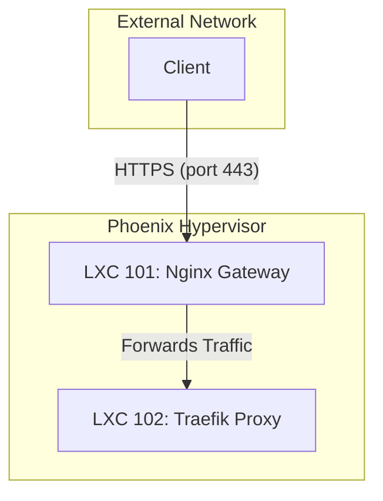

# External Gateway Audit Report

## 1. Executive Summary

This report examines the architecture and configuration of the external gateway for the Phoenix Hypervisor environment. The gateway is implemented using a dedicated Nginx container (LXC 101), which acts as a reverse proxy, TLS termination point, and the primary entry point for all external traffic. This centralized approach provides a secure and manageable solution for exposing internal services to the outside world.

## 2. Architecture Overview

The external gateway is a critical component of the three-tiered networking model. It is responsible for:

*   **Receiving all external traffic:** The Nginx container is the only component of the system that is directly exposed to the external network.
*   **TLS Termination:** It terminates SSL/TLS connections using certificates issued by the internal Step-CA.
*   **Routing:** It forwards traffic to the internal service mesh (Traefik, LXC 102) for further processing and routing to the appropriate backend services.

The following diagram illustrates the role of the external gateway in the overall network architecture:

## 3. Configuration and Routing

The Nginx configuration is managed declaratively and applied by the `phoenix_hypervisor_lxc_101.sh` script. The core of the configuration is the `gateway` site, which defines how Nginx listens for traffic and proxies it to the internal mesh.

### 3.1. Key Configuration Details

The Nginx configuration is defined in the `phoenix_hypervisor_lxc_101.sh` script and the associated configuration files. The key aspects of the configuration are as follows:

*   **Listening Ports:** Nginx is configured to listen on port 80 for HTTP traffic and port 443 for HTTPS traffic.
*   **HTTP to HTTPS Redirection:** All incoming HTTP traffic is automatically redirected to HTTPS.
*   **TLS Termination:** Nginx terminates TLS connections using the `internal_traefik_proxy.crt` and `internal_traefik_proxy.key` files, which are issued by the internal Step-CA.
*   **Proxying:** All traffic is proxied to the Traefik internal mesh at `https://10.0.0.12:443`.
*   **NJS Module:** The Nginx JavaScript module (NJS) is used to handle dynamic routing and other advanced traffic management tasks.
*   **Stream Gateway:** A stream gateway is configured to proxy TCP traffic on port 9001 to the Portainer agent.

## 4. Security

The external gateway is a critical security component. Its security is maintained through several mechanisms:

*   **Minimal Exposure:** Only the Nginx container is exposed to the external network.
*   **TLS Enforcement:** All traffic is encrypted using TLS.
*   **Declarative Firewall Rules:** The Nginx container has a specific set of firewall rules that restrict access to only the necessary ports (80 and 443).

## 5. Analysis and Recommendations

This section will analyze the effectiveness of the current external gateway configuration and provide recommendations for potential improvements.

### 5.1. Strengths

*   **Centralized Entry Point:** A single, well-defined entry point simplifies security management and monitoring.
*   **Secure by Default:** The use of TLS and a restrictive firewall policy provides a strong security foundation.
*   **Declarative Configuration:** Managing the Nginx configuration as code ensures consistency and auditability.

### 5.2. Areas for Improvement

*   **Limited Rate Limiting:** The current Nginx configuration does not include rate limiting. This could leave the gateway vulnerable to denial-of-service (DoS) attacks.
*   **Basic Caching:** While Nginx has powerful caching capabilities, they are not currently being utilized. Caching could significantly improve the performance of the gateway and reduce the load on backend services.
*   **Lack of a Web Application Firewall (WAF):** There is no WAF in place to protect against common web application attacks, such as SQL injection and cross-site scripting (XSS).

### 5.3. Recommendations

*   **Implement Rate Limiting:** Configure Nginx to limit the rate of incoming requests. This can be done on a per-IP basis to prevent any single client from overwhelming the gateway.
*   **Enable Caching:** Implement a caching strategy to cache frequently accessed content. This will improve performance and reduce the load on the backend services.
*   **Integrate a Web Application Firewall (WAF):** As a long-term security enhancement, consider integrating a WAF, such as ModSecurity, with the Nginx gateway. This would provide an additional layer of protection against common web application attacks.
