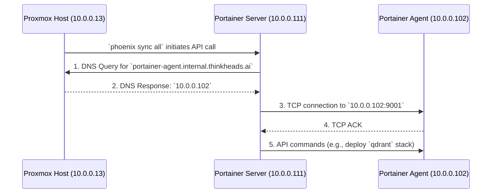

# Analysis of VM 1001 to VM 1002 Communication

This document explains why, based on the current configuration, VM 1001 (Portainer Server) should be able to communicate with VM 1002 (Portainer Agent) to deploy the `qdrant` stack.

## The Intended Communication Flow

The process of deploying the `qdrant` stack involves a specific sequence of network interactions. Here is a visualization of that flow:



For this to succeed, three things must be true:
1.  **DNS Resolution:** VM 1001 must be able to resolve `portainer-agent.internal.thinkheads.ai` to `10.0.0.102`.
2.  **Firewall Rules:** The firewall must permit TCP traffic from `10.0.0.111` to `10.0.0.102` on port `9001`.
3.  **Service Availability:** The Portainer agent service must be running and listening on port `9001` inside VM 1002.

## Justification from Configuration Files

Here are the specific rules in your configuration that are designed to allow this communication:

### 1. DNS Resolution

The [`hypervisor_feature_setup_dns_server.sh`](usr/local/phoenix_hypervisor/bin/hypervisor_setup/hypervisor_feature_setup_dns_server.sh) script configures `dnsmasq` on the Proxmox host (10.0.0.13). Both VM 1001 and VM 1002 are configured to use this as their primary nameserver in [`usr/local/phoenix_hypervisor/etc/phoenix_vm_configs.json`](usr/local/phoenix_hypervisor/etc/phoenix_vm_configs.json:52).

The DNS server script automatically creates an 'A' record for `portainer-agent.internal.thinkheads.ai` pointing to `10.0.0.102` based on the `portainer_agent_hostname` and `network_config.ip` fields for VM 1002.

### 2. Firewall Permissions

The communication is explicitly permitted by two key firewall rules defined in [`usr/local/phoenix_hypervisor/etc/phoenix_vm_configs.json`](usr/local/phoenix_hypervisor/etc/phoenix_vm_configs.json):

*   **Egress from VM 1001:** An outbound rule for VM 1001 allows it to initiate connections *to* the agent.
    ```json
    "vmid": 1001,
    ...
    "firewall": {
        "rules": [
            {
                "type": "out",
                "action": "ACCEPT",
                "dest": "10.0.0.102",
                "proto": "tcp",
                "port": "9001",
                "comment": "Allow Portainer server to access agent"
            }
        ]
    }
    ```

*   **Ingress to VM 1002:** An inbound rule for VM 1002 allows it to accept connections *from* the server.
    ```json
    "vmid": 1002,
    ...
    "firewall": {
        "rules": [
            {
                "type": "in",
                "action": "ACCEPT",
                "source": "10.0.0.111",
                "proto": "tcp",
                "port": "9001",
                "comment": "Allow Portainer server to access agent"
            }
        ]
    }
    ```

## Conclusion

Based on a review of the declarative configuration, the system is **designed** for this communication to succeed. The DNS records and firewall rules are all in place to permit the connection.

**This is why we should feel confident in the design.** However, the fact that it's failing in practice means there is a discrepancy between this *intended state* and the *actual state* of the running system.

Our diagnostic plan is designed to systematically test each of these configured rules in the live environment to find that discrepancy.
