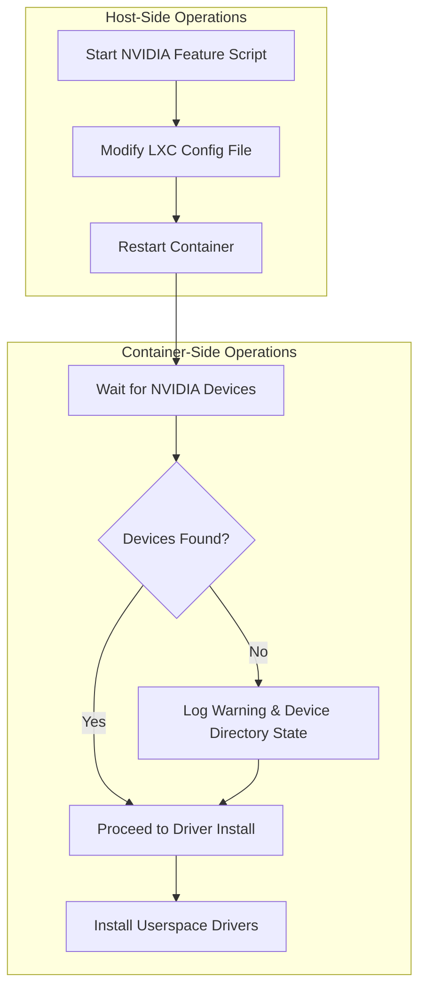

# Plan to Resolve Intermittent NVIDIA GPU Failures in LXC Containers (Final, Revised)

## 1. Executive Summary

This document outlines a revised plan to resolve the intermittent failures in connecting NVIDIA GPU devices during LXC container creation. The root cause is a race condition where the container starts before the Proxmox host has made the GPU devices available for passthrough.

Based on user feedback, this plan adopts a "fail later" philosophy. Instead of making the script stricter with hard failures, we will convert the timeout error into a strong warning. This allows the container creation process to complete, shifting the failure point to a more definitive downstream process (e.g., the driver installation) if the GPU device is truly unavailable. To mitigate the risk of obscuring future issues, the script will be enhanced to log the detailed state of the container's `/dev` directory upon a timeout, providing a clear diagnostic trail.

## 2. Problem Analysis

The current implementation in `phoenix_hypervisor_feature_install_nvidia.sh` fails intermittently because it treats the 30-second timeout for device availability as a fatal error. This is overly aggressive for what is likely a transient race condition.

## 3. Proposed Solution

The following changes will be made to `usr/local/phoenix_hypervisor/bin/lxc_setup/phoenix_hypervisor_feature_install_nvidia.sh`:

### 3.1. Host-Side Configuration (`configure_host_gpu_passthrough`)

**No changes will be made to this function.** The existing logic correctly logs a warning if a specific GPU device is not found on the host but proceeds to add the configuration entry anyway.

### 3.2. Container-Side Device Wait (`wait_for_nvidia_device`)

This is the core of the change. The function will be modified to no longer cause a fatal error on timeout.

*   **Convert Fatal Error to Warning:** If the timeout is reached, the function will log a strong warning message indicating that the devices were not found, but it will **not** exit the script.

*   **Enhanced Diagnostic Logging:** Upon a timeout, the script will execute `pct exec "$ctid" -- ls -la /dev/` and print the output to the log. This will capture the exact state of the device directory at the time of the timeout, providing invaluable information for any future debugging.

*   **Continue on Timeout:** The main execution flow of the script will be modified to check the return code of `wait_for_nvidia_device`. If it indicates a timeout, the script will log that it is proceeding with the driver installation anyway, with the expectation that a more definitive error will occur if the devices are truly missing.

## 4. Implementation Steps

1.  **Modify `wait_for_nvidia_device`:**
    *   Change the `log_fatal` call at the end of the function to `log_warn`.
    *   Add a call to `pct exec "$ctid" -- ls -la /dev/` within the timeout block to log the state of the `/dev` directory.
    *   Ensure the function returns a non-zero exit code (e.g., `return 1`) on timeout, and `return 0` on success.

2.  **Modify the `main` function:**
    *   The call to `configure_host_gpu_passthrough` will now be followed by a check of its return code.
    *   If `wait_for_nvidia_device` returns a non-zero status, a warning will be logged, but the script will proceed to call `install_drivers_in_container`.

## 5. Workflow Diagram

The following Mermaid diagram illustrates the revised workflow, showing how a timeout becomes a non-blocking event with enhanced logging.

## 6. Conclusion

This plan directly addresses the intermittent failures by gracefully handling the race condition. It is a minimal, non-disruptive change that respects the stability of the existing system. By converting the fatal error to a warning and adding detailed diagnostic logging, we prevent transient timing issues from halting the container creation process while ensuring that we have the necessary information to debug any future, non-transient failures.