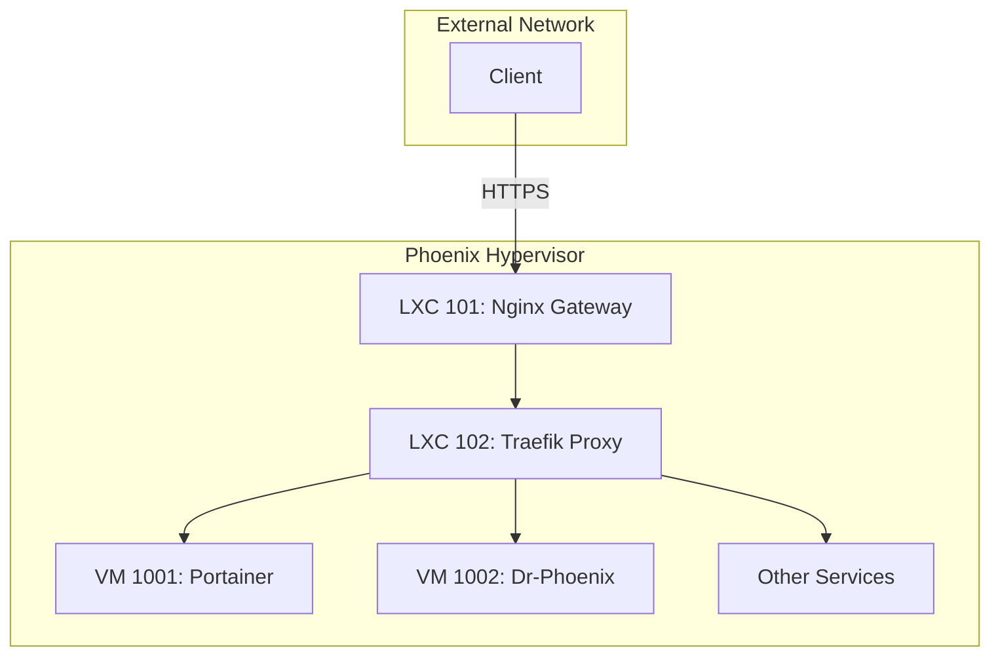

# Internal Mesh Audit Report

## 1. Executive Summary

This report provides an analysis of the internal service mesh within the Phoenix Hypervisor environment. The mesh is managed by a dedicated Traefik container (LXC 102), which acts as a reverse proxy and service discovery mechanism for all internal services. This architecture simplifies inter-service communication, enhances security through centralized TLS termination, and provides a single point of control for internal traffic routing.

## 2. Architecture Overview

The internal service mesh is built on a three-tiered networking model, with Traefik serving as the central hub for internal communication.

*   **LXC 101 (Nginx Gateway):** The external gateway receives all incoming traffic and forwards it to the Traefik internal proxy.
*   **LXC 102 (Traefik):** This container is the core of the service mesh. It uses file-based service discovery to route traffic to the appropriate backend services (VMs and other containers). It also integrates with the Step-CA (LXC 103) to provide automatic SSL certificate management for all internal services.
*   **Backend Services:** These are the individual applications and services running in VMs and other LXC containers (e.g., Portainer, Qdrant, vLLM containers).

The following diagram illustrates the flow of traffic through the internal service mesh:

## 3. Service Discovery and Routing

Service discovery is managed through a declarative, file-based approach. The `phoenix_hypervisor_lxc_102.sh` script generates a dynamic configuration file (`/etc/traefik/dynamic/dynamic_conf.yml`) that defines the routers and services for the mesh. This file maps hostnames to their corresponding backend service URLs.

The following table details the routing rules for the internal service mesh:

| Hostname | Backend Service URL |
|---|---|
| `traefik.internal.thinkheads.ai` | `api@internal` (Traefik Dashboard) |
| `granite-embedding.internal.thinkheads.ai` | `http://10.0.0.141:8000` |
| `granite-3b.internal.thinkheads.ai` | `http://10.0.0.142:8000` |
| `ollama.internal.thinkheads.ai` | `http://10.0.0.155:11434` |
| `llamacpp.internal.thinkheads.ai` | `http://10.0.0.157:8081` |

## 4. Security and TLS

Security is a key feature of the internal mesh. Traefik provides centralized TLS termination for all internal services, ensuring that all inter-service communication is encrypted. It integrates with the Step-CA (LXC 103) to automatically issue and renew SSL certificates for all services in the mesh.

## 5. Analysis and Recommendations

This section will analyze the effectiveness of the current internal mesh configuration and provide recommendations for potential improvements.

### 5.1. Strengths

*   **Centralized Traffic Management:** Traefik provides a single point of control for routing, load balancing, and security for all internal services.
*   **Automated TLS:** The integration with Step-CA provides a robust, automated solution for internal certificate management.
*   **Declarative Configuration:** The file-based service discovery mechanism aligns with the Infrastructure-as-Code principles of the Phoenix Hypervisor.

### 5.2. Areas for Improvement

*   **Lack of Health Checks:** The current Traefik configuration does not include health checks for the backend services. If a backend service becomes unresponsive, Traefik will continue to route traffic to it, resulting in errors.
*   **Centralized Logging:** While Traefik provides access logs, they are not currently being aggregated in a centralized location. This can make it difficult to troubleshoot issues and gain insights into traffic patterns.
*   **Static Backend URLs:** The backend service URLs are currently hardcoded in the dynamic configuration file. This could become difficult to manage as the number of services grows.

### 5.3. Recommendations

*   **Implement Health Checks:** Configure Traefik to perform regular health checks on all backend services. This will allow Traefik to automatically remove unresponsive services from the load balancing pool, improving the resilience of the mesh.
*   **Integrate with a Centralized Logging Solution:** Configure Traefik to forward its logs to a centralized logging solution, such as the ELK Stack or Grafana Loki. This will provide a unified view of all logs and make it easier to monitor and troubleshoot the environment.
*   **Leverage a Dynamic Service Discovery Mechanism:** As a long-term goal, consider integrating Traefik with a dynamic service discovery mechanism, such as Consul or etcd. This would allow Traefik to automatically discover and configure backend services, reducing the need for manual configuration.
