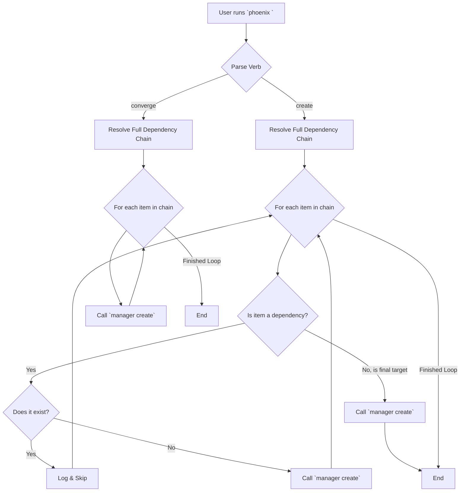

# Implementation Plan: Phoenix CLI `create` and `converge` Enhancement

**Author:** Roo
**Date:** 2025-10-01
**Status:** Proposed

---

## 1. Context and Goals

### 1.1. Current Situation
The `phoenix` CLI currently employs a strict convergence model for the `create` command. When a user requests to create a guest (e.g., `phoenix create 941`), the orchestrator resolves the entire dependency graph (`900` -> `901` -> `921` -> `953` -> `941`) and executes the `create` workflow for every single component in the chain. While this guarantees absolute consistency with the JSON configuration files, it is highly inefficient for iterative development. It causes unnecessary and time-consuming rebuilds of components that already exist and are in a trusted, stable state.

### 1.2. Desired State
The `phoenix` CLI should be optimized for developer productivity and efficiency, while retaining the power of a full-state convergence model for situations that require it.

-   The `create` command should be fast and intelligent, creating **only the missing components** of a dependency chain.
-   A new, explicit command should be introduced to perform the strict, full-chain convergence for maintenance and repair scenarios.

This plan outlines the technical requirements for achieving this desired state.

---

## 2. Detailed Implementation Requirements

### 2.1. Requirement: Refactor the `create` Verb Logic

The `phoenix` dispatcher script (`usr/local/phoenix_hypervisor/bin/phoenix`) will be modified to change the behavior of the `create` verb.

-   **File to Modify:** `usr/local/phoenix_hypervisor/bin/phoenix`
-   **Target Function:** `main()`
-   **Specific Logic Change:**
    1.  Within the main `for` loop that iterates through the `targets_to_process` array (currently line 372), a conditional check must be added.
    2.  This check will determine if the current `target` in the loop is the **final target** requested by the user or if it is a **dependency**.
    3.  **If the `target` is a dependency:**
        -   The script must check if the guest (LXC or VM) already exists on the system. This can be accomplished by calling `pct status <ID>` or `qm status <ID>` and checking the exit code.
        -   If the guest **exists** (exit code 0), the script will log an informational message (e.g., `log_info "Dependency '$target' already exists. Skipping creation."`) and the loop will continue to the next item.
        -   If the guest **does not exist**, the script will proceed to call the appropriate manager (`lxc-manager.sh` or `vm-manager.sh`) with the `create` verb, as it does currently.
    4.  **If the `target` is the final requested guest:**
        -   The script will **always** pass this target to the appropriate manager script for the `create` workflow. This ensures that the user's intended target is always fully configured according to the JSON definition.

### 2.2. Requirement: Introduce the `converge` Verb

A new verb, `converge`, will be introduced to provide the original, strict convergence functionality.

-   **File to Modify:** `usr/local/phoenix_hypervisor/bin/phoenix`
-   **Specific Logic Changes:**
    1.  **Update Verb Validation:** Add `"converge"` to the `valid_verbs` string (currently line 296).
    2.  **Implement `converge` Workflow:**
        -   A new conditional block will be added to the main logic. If the `VERB` is `converge`, the script will execute the *original* logic: it will resolve the full dependency chain and iterate through the entire list, calling the `create` workflow in the appropriate manager for **every single component**, regardless of its existence. This forces a re-application of all configurations and features.
    3.  **Update Help Text:**
        -   Modify the `print_usage()` function (currently line 54).
        -   Add a new entry for the `converge` verb with a clear and concise description:
            ```
            converge  Creates a guest if it doesn't exist, and forcefully re-applies all configurations and features for the guest and its entire dependency chain.
            ```

---

## 3. Workflow Diagram

The following diagram illustrates the new, refined logic for the `phoenix` dispatcher.



---

## 4. Acceptance Criteria

-   Running `phoenix create <ID>` on a fully provisioned stack will result in no actions being taken on existing dependencies.
-   Running `phoenix create <ID>` when a dependency is missing will result in the creation of only the missing dependency and the final target.
-   Running `phoenix converge <ID>` will always execute the `create` workflow for all components in the dependency chain.
-   The `phoenix --help` command will display the new `converge` verb and its description.
-   The changes must not break any existing functionality for other verbs (e.g., `start`, `stop`, `delete`).