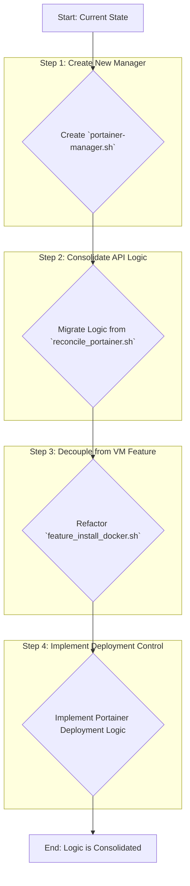
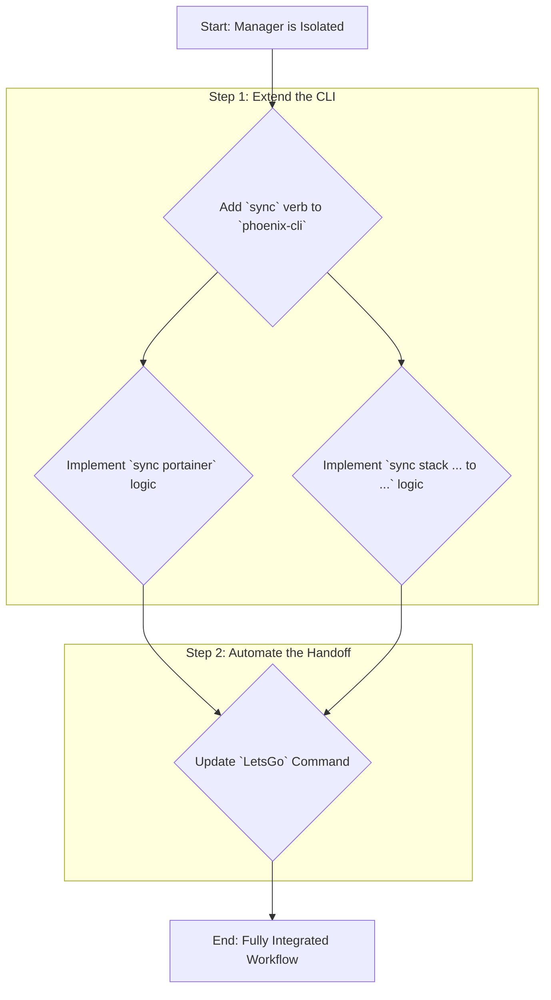
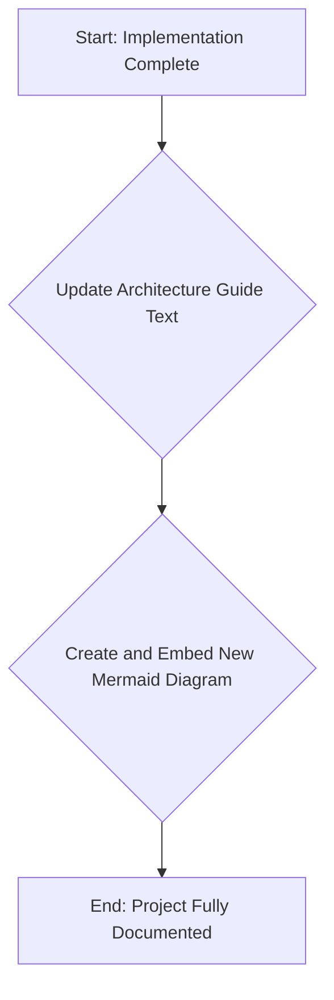

# Project Plan: Portainer Manager Refactoring

**Document Purpose:** This document provides a detailed, phased plan for refactoring the Portainer integration into a dedicated `portainer-manager.sh`. It is designed to be a clear and unambiguous guide for the implementation team, outlining goals, workflows, architectural principles, and key files for each stage.

**Architectural Vision:** The end state is a two-layered orchestration model that separates Infrastructure Provisioning (managed by `vm-manager.sh`) from Environment Management (managed by `portainer-manager.sh`). This enhances modularity, simplifies maintenance, and aligns with best practices for Infrastructure-as-Code.

---

## Phase 1: Foundational Refactoring - Isolate and Abstract

**Goal:** To cleanly separate all Portainer-related logic from the VM provisioning workflow and consolidate it into the new `portainer-manager.sh`. The system's end-to-end functionality should remain unchanged in this phase; it is purely a code organization and abstraction effort.

**Key Files to Read for this Phase:**
*   `usr/local/phoenix_hypervisor/bin/reconcile_portainer.sh` (to be migrated)
*   `usr/local/phoenix_hypervisor/bin/vm_features/feature_install_docker.sh` (to be refactored)
*   `usr/local/phoenix_hypervisor/bin/vm_features/portainer_agent_setup.sh` (to be deprecated)
*   `usr/local/phoenix_hypervisor/etc/phoenix_vm_configs.json` (to understand `portainer_role`)

### Workflow for Phase 1:

### Detailed Steps & Architectural Tips:

1.  **Create `portainer-manager.sh`:**
    *   **Action:** Create the new file `usr/local/phoenix_hypervisor/bin/managers/portainer-manager.sh`.
    *   **Architecture Tip:** Structure it immediately with a main dispatcher function (e.g., `main_portainer_orchestrator`) that uses a `case` statement for verbs (`sync`, `sync-stack`). This mirrors the robust design of `lxc-manager.sh` and `vm-manager.sh`, ensuring consistency. Source `phoenix_hypervisor_common_utils.sh` at the top.

2.  **Migrate Reconciliation Logic:**
    *   **Action:** Move the functions and logic from `reconcile_portainer.sh` into `portainer-manager.sh`. This includes API authentication, endpoint/environment creation, and stack deployment loops.
    *   **Architecture Tip:** Encapsulate the core logic within a `sync_all` function. This function should be idempotent: if an environment or stack already exists and matches the configuration, it should report that and move on, not error out or try to recreate it.

3.  **Refactor `feature_install_docker.sh`:**
    *   **Action:** Edit `usr/local/phoenix_hypervisor/bin/vm_features/feature_install_docker.sh` and remove the entire section that checks for `PORTAINER_ROLE` and deploys the Portainer server or agent.
    *   **Architecture Tip:** The script's responsibility should end after it successfully installs and enables the Docker service. This enforces the boundary between the Infrastructure Layer (a VM with Docker) and the Environment Layer (what runs *on* Docker).

4.  **Implement Portainer Deployment in `portainer-manager.sh`:**
    *   **Action:** Create a new function, `deploy_portainer_instances`, within the manager. This function will be called by `sync_all`. It will read `phoenix_vm_configs.json`, find all VMs with a `portainer_role`, and use `pct exec <VMID> -- <command>` to run the appropriate `docker` commands inside the guest to start the server or agent.
    *   **Architecture Tip:** This is the critical link between the hypervisor and the guest environment. Use `pct exec` to maintain central control. The commands should be idempotent (e.g., use `docker ps -a --filter "name=..."` to check if the container already exists before trying to run it).

5.  **Cleanup:**
    *   **Action:** Delete the now-empty `reconcile_portainer.sh` and the now-redundant `portainer_agent_setup.sh`.
    *   **Outcome:** The codebase is cleaner and the separation of concerns is physically represented by the file structure.

---

## Phase 2: Integration and Workflow Orchestration

**Goal:** To integrate the new `portainer-manager.sh` into the `phoenix-cli` dispatcher, making it a fully functional part of both the automated `LetsGo` workflow and the new manual `sync` commands.

**Key Files to Read for this Phase:**
*   `usr/local/phoenix_hypervisor/bin/phoenix-cli` (to be modified)
*   `usr/local/phoenix_hypervisor/bin/managers/portainer-manager.sh` (to be called)

### Workflow for Phase 2:

### Detailed Steps & Architectural Tips:

1.  **Introduce the `sync` Verb:**
    *   **Action:** Modify `usr/local/phoenix_hypervisor/bin/phoenix-cli`. Add `sync` to the list of valid verbs and create a new `case` block for it.
    *   **Architecture Tip:** The logic within this `case` block should be dedicated to parsing the arguments that follow `sync`. It should determine if the user wants a full sync (`portainer`) or a granular stack sync (`stack ... to ...`) and then call the `portainer-manager.sh` with the appropriate arguments. This keeps the dispatcher clean and delegates the "how" to the manager.

2.  **Implement Granular and Full Sync Logic:**
    *   **Action:** In `portainer-manager.sh`, create the two distinct functions: `sync_all` and `sync_stack(stack_name, vmid)`. The main orchestrator in the manager will call the correct function based on the arguments it receives from `phoenix-cli`.
    *   **Architecture Tip:** Both functions should begin by authenticating to the Portainer API. This ensures that even for a single-stack sync, the operation is secure and authorized. Avoid duplicating code by having both functions call a shared `get_portainer_jwt` function.

3.  **Update the `LetsGo` Master Command:**
    *   **Action:** In `phoenix-cli`, at the end of the `LetsGo` workflow (after all guest creation loops), add the call to the Portainer manager.
    *   **Architecture Tip:** The call should be `"$SCRIPT_DIR/managers/portainer-manager.sh" sync all`. This explicitly shows the handoff from the Infrastructure Layer to the Environment Layer. Add clear log messages before and after this step (e.g., `log_info "All infrastructure provisioned. Handing off to Portainer manager for environment synchronization..."`).

---

## Phase 3: Documentation and Finalization

**Goal:** To update all project documentation to reflect the new architecture, ensuring the system remains easy to understand, maintain, and onboard new developers to.

**Key Files to Read for this Phase:**
*   `Thinkheads.AI_docs/02_technical_strategy_and_architecture/26_phoenix_hypervisor_unified_architecture_guide.md` (to be updated)

### Workflow for Phase 3:

### Detailed Steps & Architectural Tips:

1.  **Update Architecture Guide:**
    *   **Action:** Edit the `26_phoenix_hypervisor_unified_architecture_guide.md` file.
    *   **Architecture Tip:** Focus on explaining the "why" behind the change. Describe the two-layered model and how the new `portainer-manager.sh` enforces this separation. Clearly define the boundaries of responsibility for `vm-manager.sh` vs. `portainer-manager.sh`.

2.  **Create New Diagram:**
    *   **Action:** Create the new Mermaid diagram we designed that visually represents the two layers and the handoff from `phoenix-cli` to the different managers.
    *   **Architecture Tip:** Embed this diagram in the "Orchestration Workflows" section of the guide. A good diagram is worth a thousand words and will be the quickest way for someone to grasp the new, improved flow.
