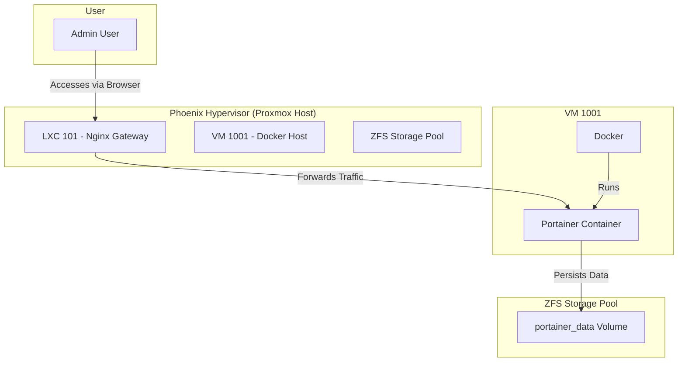

# Portainer Deployment Architecture

This document outlines the target architecture for deploying Portainer within the Phoenix Hypervisor environment.

## Architecture Diagram

The following diagram illustrates the key components and data flows for the Portainer service.

## Key Components

*   **Admin User:** The end-user who will access and manage Docker environments through the Portainer UI.
*   **LXC 101 - Nginx Gateway:** The existing Nginx gateway, which will be configured to securely expose the Portainer service.
*   **VM 1001 - Docker Host:** The primary Docker host VM where the Portainer container will be deployed.
*   **Portainer Container:** The Portainer service, running as a Docker container within VM 1001.
*   **ZFS Storage Pool:** The underlying ZFS storage on the hypervisor, which will provide a dedicated, persistent volume for Portainer's data.

This architecture ensures that Portainer is deployed in a way that is consistent with the existing infrastructure, with clear separation of concerns and robust data persistence.