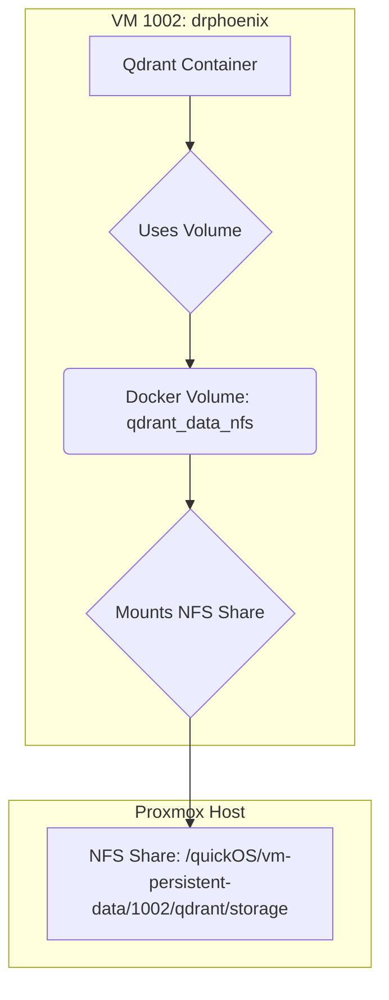

# Analysis of Docker and Portainer Volume Configuration

You've asked if Docker is configured correctly for this communication. The answer lies in how Portainer, Docker, and the underlying NFS storage are designed to interact.

## The "Chicken and Egg" Problem with Docker Volumes

The `qdrant` stack, as defined in its [`docker-compose.yml`](usr/local/phoenix_hypervisor/stacks/qdrant_service/docker-compose.yml:1), requires an external Docker volume named `qdrant_data_nfs`.

```yaml
volumes:
  qdrant_data_nfs:
    external: true
```

This volume doesn't just magically exist. The `portainer-manager.sh` script is responsible for creating it *before* deploying the stack. It does this by running a `docker volume create` command inside VM 1002.

## How It's Supposed to Work

The [`portainer-manager.sh`](usr/local/phoenix_hypervisor/bin/managers/portainer-manager.sh) script explicitly creates the required Docker volume, linking it to an NFS share on the Proxmox host.

Here is a visualization of the intended setup:



The key command that makes this link is found within the `deploy_portainer_instances` function of the manager script. Although the function name is a bit misleading in this context, it contains the logic for creating volumes on agent machines. It's designed to execute a command similar to this inside VM 1002:

```bash
docker volume create --driver local \
  --opt type=nfs \
  --opt o=addr=10.0.0.13,rw,nfsvers=4 \
  --opt device=:/quickOS/vm-persistent-data/1002/qdrant/storage \
  qdrant_data_nfs
```

## Why This Might Be Failing

1.  **Permissions Issue:** If there's a permissions mismatch between the user running the Docker daemon inside VM 1002 and the ownership of the NFS share on the Proxmox host, the volume mount will fail.
2.  **Execution Order:** The `portainer-manager.sh` script is complex. It's possible the logic to create the volume is not being executed correctly *before* the stack deployment is attempted.
3.  **NFS Connectivity:** While we plan to test basic connectivity, a more subtle NFS-specific firewall issue could be blocking the mount, even if a simple `ping` or `nc` works.

## Confidence in the Design vs. Reality

So, to answer your question directly: I am confident that the *design* for the Docker configuration is correct. The scripts contain the necessary logic to create the volumes that the Docker Compose files require.

However, like the firewall and DNS settings, this is a complex interaction happening on a new communication path. Our diagnostic plan will effectively test this by attempting to create the endpoint and deploy the stack. If the stack deployment fails, the error message from the Portainer API will almost certainly tell us if the `qdrant_data_nfs` volume is the source of the problem. This is a key part of what our targeted plan will uncover.
