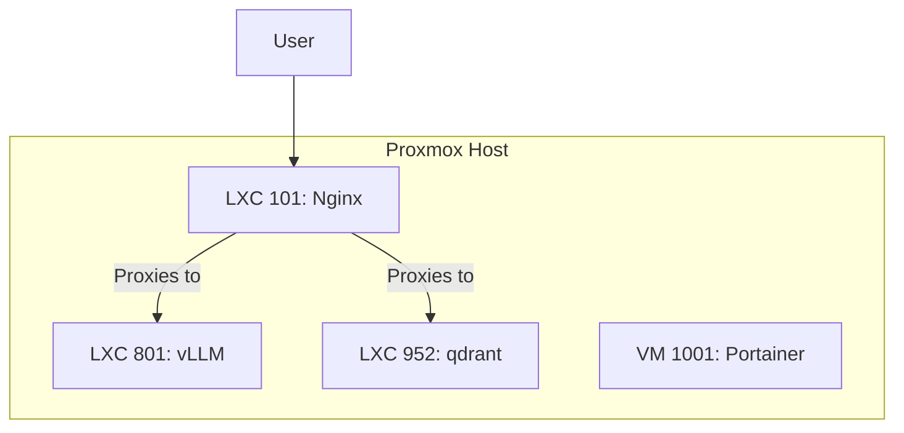
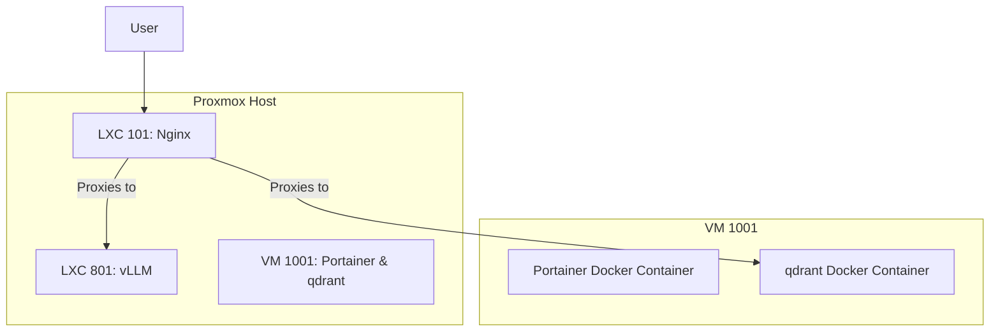

# Project Plan: Qdrant Service Migration

**Author:** Roo
**Version:** 1.0
**Date:** 2025-10-03

## 1. Executive Summary

This document outlines the project plan for migrating the qdrant service from its dedicated LXC container (952) to a Docker container running within the existing Portainer VM (1001). This initiative is part of a broader strategy to consolidate services, streamline management, and decommission legacy containers.

The plan includes a detailed analysis of the feasibility and implications of the migration, a step-by-step migration plan, and a decommissioning plan for the legacy containers. The primary goal is to ensure a seamless transition with minimal downtime and no disruption to existing services.

## 2. Current State Architecture

The current architecture involves several interconnected LXC containers, each with a dedicated role. The following diagram illustrates the existing setup:

## 3. Proposed Architecture

The proposed architecture consolidates the qdrant service into the Portainer VM, running as a Docker container. This simplifies the architecture and aligns with the project's strategy of containerizing services.

## 4. Analysis

### 4.1. Resource Allocation

-   **Current State:**
    -   LXC 952 (qdrant): 2 cores, 2048 MB RAM, 32 GB storage.
    -   VM 1001 (Portainer): 4 cores, 8192 MB RAM, 100 GB storage.
-   **Proposed State:**
    -   VM 1001 will need to accommodate both Portainer and qdrant. Based on the current allocation for LXC 952, we recommend increasing the resources for VM 1001 to:
        -   **Cores:** 6
        -   **RAM:** 10240 MB
        -   **Storage:** 132 GB
-   **Conclusion:** The resource increase is manageable and will not strain the hypervisor's capacity.

### 4.2. Networking

-   **Current State:** Nginx (LXC 101) proxies requests to qdrant (LXC 952) at `10.0.0.152`.
-   **Proposed State:** Nginx will need to be reconfigured to proxy requests to the new qdrant container within VM 1001. The qdrant container will expose its port to the VM, and Nginx will connect to the VM's IP address (`10.0.0.101`) on the exposed port.
-   **Conclusion:** The networking changes are straightforward and can be implemented with a simple Nginx configuration update.

### 4.3. Compatibility

-   **Portainer and qdrant:** Both services are designed to run in containerized environments and there are no known compatibility issues. Running them in the same Docker environment is a common practice and should not pose any problems.

## 5. Migration Plan

### 5.1. Phase 1: Preparation

1.  **Backup qdrant Data:** Create a snapshot of the existing qdrant data in LXC 952.
2.  **Increase VM 1001 Resources:** Apply the new resource allocation to VM 1001.
3.  **Create Docker Compose File:** Create a `docker-compose.yml` file for qdrant to be managed by Portainer.

### 5.2. Phase 2: Deployment

1.  **Deploy qdrant Container:** Deploy the qdrant container in VM 1001 using the Docker Compose file.
2.  **Migrate Data:** Restore the qdrant data from the backup to the new container.
3.  **Reconfigure Nginx:** Update the Nginx configuration in LXC 101 to point to the new qdrant service.

### 5.3. Phase 3: Verification and Testing

1.  **Test qdrant Service:** Verify that the qdrant service is running correctly and accessible through Nginx.
2.  **Test Portainer Service:** Ensure that Portainer is still functioning as expected.
3.  **Test vLLM Service:** Verify that the vLLM service is unaffected and remains accessible through Nginx.

## 6. Decommissioning Plan

Once the migration is successfully validated, the legacy LXC containers can be decommissioned.

1.  **Shut Down Legacy Containers:** Stop LXC containers 950, 951, 952, and 953.
2.  **Create Final Backups:** Create final backups of the legacy containers.
3.  **Delete Containers:** Delete the legacy containers from the hypervisor.
4.  **Clean Up DNS and Firewall Rules:** Remove any DNS entries and firewall rules associated with the decommissioned containers.

## 7. Rollback Plan

In the event of a critical failure during the migration, the following steps will be taken to roll back to the previous state:

1.  **Restore Nginx Configuration:** Revert the Nginx configuration in LXC 101 to its original state.
2.  **Restore VM 1001 Resources:** Revert the resource allocation for VM 1001 to its original state.
3.  **Stop qdrant Container:** Stop and remove the new qdrant container in VM 1001.
4.  **Restore qdrant LXC:** If necessary, restore the qdrant LXC (952) from the pre-migration snapshot.