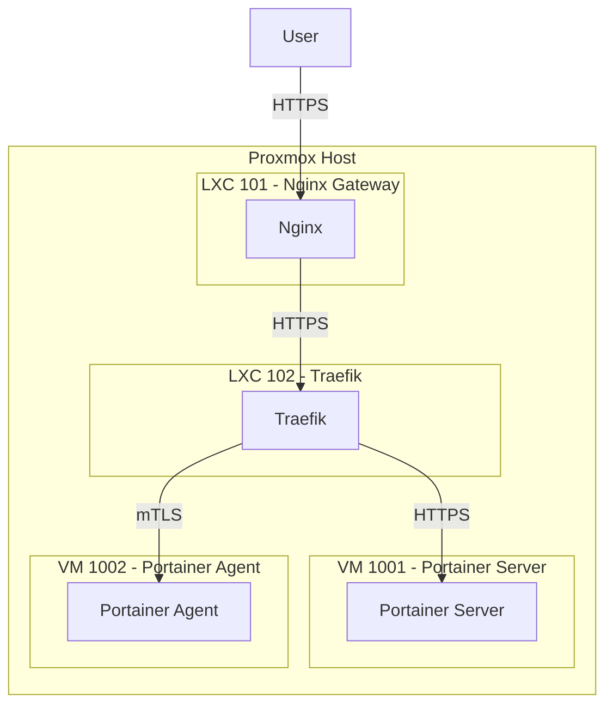

# Portainer API Remediation Plan

## 1. Problem Summary

The `phoenix sync all` command fails because the Portainer API does not become available after deployment. This is caused by a routing loop, where Traefik is configured to proxy requests back to the public-facing Nginx gateway instead of the internal Portainer service.

The root cause is that the `portainer-manager.sh` script uses undefined `PORTAINER_SERVER_IP` and `AGENT_IP` variables when generating the Traefik dynamic configuration.

## 2. Proposed Solution

To fix this, I will modify the `portainer-manager.sh` script to correctly resolve the IP addresses of the Portainer server and agent VMs before generating the Traefik configuration. This will ensure that Traefik routes traffic to the correct internal endpoints.

## 3. Corrected Architecture

The following diagram illustrates the corrected traffic flow:

## 4. Files to be Modified

- `usr/local/phoenix_hypervisor/bin/managers/portainer-manager.sh`:
    - Add logic to fetch the IP addresses of the Portainer server and agent VMs.
    - Use the correct IP variables when generating the Traefik dynamic configuration file.

- `usr/local/phoenix_hypervisor/etc/traefik/dynamic_conf.yml`:
    - This file will be overwritten by the corrected `portainer-manager.sh` script, so no manual changes are needed.
