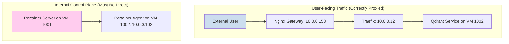

# Analysis: Direct vs. Proxied Internal Communication

It is a standard and secure practice to route all user-facing traffic through a gateway like Nginx, and your system is designed to do exactly that for services like `qdrant`. However, the communication between the Portainer Server and its Agent is different.

## Two Distinct Traffic Paths

Your architecture has two fundamental communication patterns:

1.  **External/Proxied Traffic:** This is for services that are exposed to the outside world or other internal services via a user-friendly URL. This traffic **must** go through the Nginx/Traefik proxy stack to handle TLS termination, routing, and load balancing. The `qdrant` service is a perfect example.

2.  **Internal Control Plane Traffic:** This is low-level management communication between core infrastructure components. The Portainer Server-to-Agent link falls into this category. This is not standard HTTP traffic; it's a dedicated TCP tunnel that Portainer uses to manage the Docker daemon on the agent machine.

## Why the Agent Connection Must Be Direct

1.  **It's Not HTTP:** The Portainer agent communicates over a raw TCP socket, not over HTTP/S. The `portainer-manager.sh` script constructs the URL as `tcp://portainer-agent.internal.thinkheads.ai:9001`. Your Nginx gateway is configured as an HTTP/S reverse proxy and is not equipped to handle this type of raw TCP stream. Forcing this traffic through Nginx would require significant and complex changes to your gateway configuration (e.g., using Nginx's stream module), which is not the intended design.

2.  **The Firewall Rules Confirm the Intent:** Your own declarative configuration in [`usr/local/phoenix_hypervisor/etc/phoenix_vm_configs.json`](usr/local/phoenix_hypervisor/etc/phoenix_vm_configs.json) proves this intended direct path. The firewall rules explicitly open a direct channel between the two VMs on port 9001, bypassing the Nginx gateway entirely.

    *   VM 1001 has an **`out`** rule to `10.0.0.102:9001`.
    *   VM 1002 has an **`in`** rule from `10.0.0.111` on port `9001`.

There are no corresponding rules to route this traffic through the Nginx gateway (10.0.0.153).

## Visualizing the Difference

This diagram illustrates the two distinct paths:

**Conclusion:** The DNS record for `portainer-agent.internal.thinkheads.ai` **must** point to the agent's true IP (`10.0.0.102`) because the Portainer Server needs to establish a direct, unproxied TCP connection to manage it. The current DNS misconfiguration is sending this specialized traffic to an HTTP proxy that doesn't know how to handle it, causing the connection to fail.

## Security Implications of the Direct Connection

This direct connection pattern is secure and standard for several reasons:

1.  **Strictly Internal:** The entire communication path (`10.0.0.111` -> `10.0.0.102`) is confined to your internal `vmbr0` network. It is not, and cannot be, accessed from the public internet. Your main firewall on the Proxmox host blocks this by default.

2.  **Principle of Least Privilege:** The firewall rules you have defined are a perfect example of the principle of least privilege. Access is not wide open. It is restricted to **only** the Portainer Server (`10.0.0.111`) and **only** on the specific Portainer Agent port (`9001`). No other machine can talk to the agent, and the server cannot talk to the agent on any other port.

3.  **Control Plane vs. Data Plane:** This is a classic separation of the "Control Plane" (how you manage the system) from the "Data Plane" (how users access the services). It is industry best practice to secure these two planes separately. The Portainer-to-Agent link is a core part of your control plane.

In summary, you are not creating a security vulnerability. You are simply enabling a necessary, highly restricted, and internally-isolated communication channel that is fundamental to how Portainer and Docker management works.
