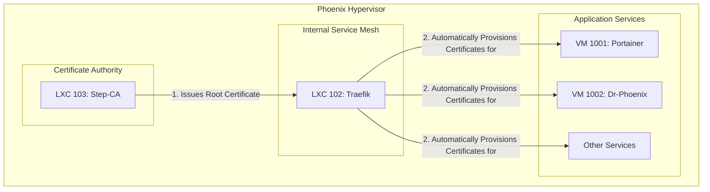

# SSL Certificate Audit Report

## 1. Executive Summary

This report provides a detailed analysis of the SSL certificate management architecture within the Phoenix Hypervisor ecosystem. The current implementation is based on a centralized, automated approach that leverages a dedicated internal Certificate Authority (CA) to issue and manage certificates for all internal services. This strategy provides a strong foundation for secure communication within the hypervisor environment.

## 2. Architecture Overview

The SSL certificate management architecture is composed of three key components:

*   **LXC 103 (Step-CA):** A dedicated LXC container that runs a Smallstep Step-CA instance. This container serves as the internal root Certificate Authority for the entire Phoenix Hypervisor environment.
*   **LXC 102 (Traefik):** An internal service mesh and reverse proxy that integrates with the Step-CA to automatically request, provision, and renew SSL certificates for all internal services.
*   **LXC 101 (Nginx):** The external-facing API gateway, which is configured to use certificates issued by the internal CA for secure communication with the Traefik internal proxy.

The following diagram illustrates the certificate issuance and management workflow:

## 3. Certificate Lifecycle Management

The certificate lifecycle is managed through a combination of automated processes and declarative configurations:

*   **Issuance:** When a new service is deployed, Traefik automatically detects it and requests a new SSL certificate from the Step-CA.
*   **Renewal:** Traefik is configured to automatically renew certificates before they expire, ensuring uninterrupted service availability.
*   **Distribution:** The root CA certificate is distributed to all necessary components, including the Nginx gateway and the Docker VMs, to establish a chain of trust.

## 4. Certificate Inventory

This section provides a detailed breakdown of the required SSL certificates for each major component of the Phoenix Hypervisor ecosystem. All certificates are issued by the internal Certificate Authority running in LXC 103.

### 4.1. Proxmox Host
*   **Certificate:** `phoenix_ca.crt` (Root CA Certificate)
*   **Location:** Installed in the system's trust store (e.g., `/usr/local/share/ca-certificates/`).
*   **Purpose:** To allow tools on the hypervisor (like `curl`, `step`) to trust and securely communicate with internal services that use certificates issued by the internal CA.
*   **Origin:** LXC 103 (Step-CA).

### 4.2. LXC 103 (Step-CA)
*   **Certificate:** `root_ca.crt` & `root_ca.key` (Root CA)
*   **Location:** `/root/.step/certs/` and `/root/.step/secrets/`.
*   **Purpose:** This is the foundational certificate and key for the entire internal Public Key Infrastructure (PKI). It is used to sign intermediate certificates.
*   **Origin:** Generated locally by `step ca init`.

*   **Certificate:** `intermediate_ca.crt` & `intermediate_ca.key` (Intermediate CA)
*   **Location:** `/root/.step/certs/` and `/root/.step/secrets/`.
*   **Purpose:** Used to sign all the individual service (leaf) certificates, protecting the root key from frequent use.
*   **Origin:** Signed by the Root CA within LXC 103.

### 4.3. LXC 101 (Nginx Gateway)
*   **Certificate:** `internal_traefik_proxy.crt` & `internal_traefik_proxy.key`
*   **Location:** `/etc/nginx/ssl/`.
*   **Purpose:** To secure the connection between the Nginx gateway and its upstream service, the Traefik internal proxy. The certificate is for the wildcard domain `*.internal.thinkheads.ai`.
*   **Origin:** LXC 103 (Step-CA), requested by the `phoenix_hypervisor_lxc_101.sh` script during setup.

*   **Certificate:** `phoenix_ca.crt` (Root CA Certificate)
*   **Location:** Installed in the system's trust store.
*   **Purpose:** To allow Nginx to trust the certificates presented by the backend services it proxies to (e.g., Traefik).
*   **Origin:** LXC 103 (Step-CA).

### 4.4. LXC 102 (Traefik Internal Proxy)
*   **Certificate:** `phoenix_ca.crt` (Root CA Certificate)
*   **Location:** Installed in the system's trust store and located at `/etc/traefik/ssl/`.
*   **Purpose:** To bootstrap the connection to the Step-CA, allowing Traefik to act as an ACME client.
*   **Origin:** LXC 103 (Step-CA).

*   **Certificate(s):** Dynamically generated service certificates (e.g., `traefik.internal.thinkheads.ai`, `qdrant.internal.thinkheads.ai`, etc.)
*   **Location:** Managed internally by Traefik and stored in `/etc/traefik/acme.json`.
*   **Purpose:** To provide TLS termination for all internal services routed through the mesh.
*   **Origin:** LXC 103 (Step-CA), automatically requested and renewed by Traefik's ACME resolver.

### 4.5. VM 1001 (Portainer Server Host) & VM 1002 (Agent Host)
*   **Certificate:** `phoenix_ca.crt` (Root CA Certificate)
*   **Location:** Installed in the system's trust store and the Docker daemon's trust store.
*   **Purpose:** Ensures the host OS and the Docker daemon trust the internal CA. This is critical for the Portainer server and agent to communicate securely.
*   **Origin:** LXC 103 (Step-CA).

### 4.6. Portainer Server (Service in VM 1001)
*   **Certificate:** `cert.pem` & `key.pem`
*   **Location:** `/certs` directory inside the Portainer container (mounted from the host).
*   **Purpose:** To secure the Portainer web UI and API, presented to users and API clients. The certificate is for the domain `portainer.phoenix.local`.
*   **Origin:** LXC 103 (Step-CA), requested by the `portainer-manager.sh` script.

### 4.7. Portainer Agent (Service in VM 1002)
*   **Certificate:** `portainer-server-client.crt` & `portainer-server-client.key` (mTLS Client Certificate)
*   **Location:** Used by the Portainer Server when connecting to the agent.
*   **Purpose:** Secures the connection from the Portainer Server to the Agent using mutual TLS (mTLS), ensuring both parties are authenticated.
*   **Origin:** LXC 103 (Step-CA), requested by the `portainer-manager.sh` script.

### 4.8. Qdrant (Docker Service in VM 1002)
*   **Certificate:** Dynamically generated service certificate.
*   **Location:** Managed by Traefik.
*   **Purpose:** The certificate is not present in the Qdrant container itself. Traefik handles TLS termination for the service, presenting a certificate for a domain like `qdrant.internal.thinkheads.ai`.
*   **Origin:** LXC 103 (Step-CA), automatically requested by Traefik.

## 5. Analysis and Recommendations

This section will detail the strengths of the current architecture, identify potential areas for improvement, and provide concrete recommendations.

### 5.1. Strengths

*   **Centralized Management:** The use of a dedicated internal CA provides a single source of truth for all internal certificates.
*   **Automation:** The integration between Traefik and Step-CA automates the entire certificate lifecycle, reducing the risk of human error.
*   **Enhanced Security:** The elimination of self-signed certificates and the enforcement of encrypted communication significantly improve the security posture of the environment.

### 5.2. Areas for Improvement

*   **Root Certificate Distribution:** The process for distributing the root CA certificate could be further streamlined and automated.

### 5.3. Recommendations

*   **Automate Root Certificate Distribution:** Develop a script to automatically distribute the root CA certificate to all new containers and VMs upon creation.
