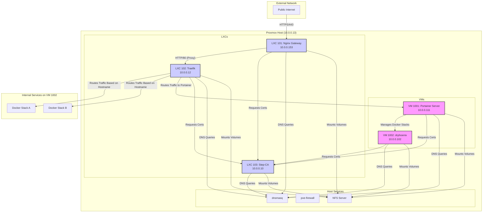

# System Architecture & Network Flow

This diagram illustrates the high-level architecture of the Phoenix Hypervisor system and the flow of network traffic from the public internet to the backend services.

