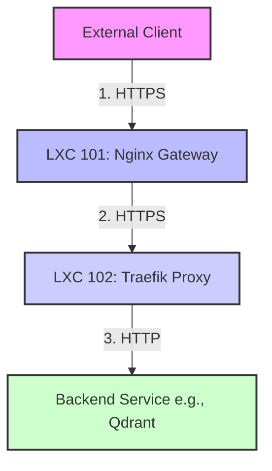

# Phoenix Hypervisor Traffic Flow

This document clarifies the flow of network traffic within the Phoenix Hypervisor environment, detailing the protocol used at each hop. Understanding this flow is crucial for troubleshooting and for appreciating the security design.

## High-Level Overview

The network architecture is designed with a "TLS everywhere" philosophy for external and inter-service communication, while using plain HTTP for the final hop to the backend service within the trusted internal mesh.

## Detailed Step-by-Step Breakdown

### 1. External Client to Nginx Gateway (HTTPS)

*   **Source:** External Client (e.g., a user's web browser)
*   **Destination:** LXC 101 (Nginx Gateway) at `10.0.0.153` on port `443`.
*   **Protocol:** **HTTPS**
*   **Description:** The client initiates a secure connection to the Nginx gateway. Nginx terminates the TLS connection using a certificate issued by our internal Step-CA. For this to work, the client must trust our internal root CA certificate (`phoenix_ca.crt`).

### 2. Nginx Gateway to Traefik Proxy (HTTPS)

*   **Source:** LXC 101 (Nginx Gateway)
*   **Destination:** LXC 102 (Traefik Proxy) at `10.0.0.12` on port `443`.
*   **Protocol:** **HTTPS**
*   **Description:** Nginx re-encrypts the traffic and proxies the request to the Traefik internal mesh. This connection is secured by a certificate that Traefik obtains from the Step-CA. Nginx is able to trust this certificate because the root CA is installed in its trust store.

### 3. Traefik Proxy to Backend Service (HTTP)

*   **Source:** LXC 102 (Traefik Proxy)
*   **Destination:** Backend Service (e.g., Qdrant in VM 1002 at `10.0.0.102`) on its designated port (e.g., `8000`).
*   **Protocol:** **HTTP**
*   **Description:** This is the final hop in the chain. Traefik terminates the TLS connection and forwards the request to the backend service using plain HTTP. This is considered secure because this traffic never leaves the trusted, isolated environment of the Proxmox hypervisor's internal network bridge. This design simplifies the configuration of the backend services, as they do not need to be concerned with TLS termination.

## Summary of Encryption Boundaries

*   **Encrypted:**
    *   Traffic from the external client to the Nginx gateway.
    *   Traffic from the Nginx gateway to the Traefik proxy.
*   **Unencrypted:**
    *   Traffic from the Traefik proxy to the final backend service.

This hybrid approach provides a strong security posture for all external and inter-service communication, while simplifying the configuration of the individual backend applications.