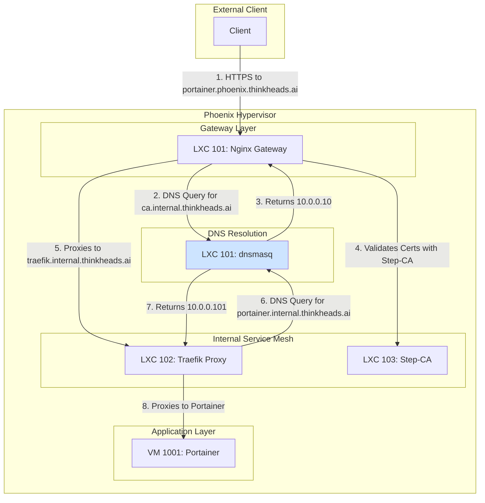
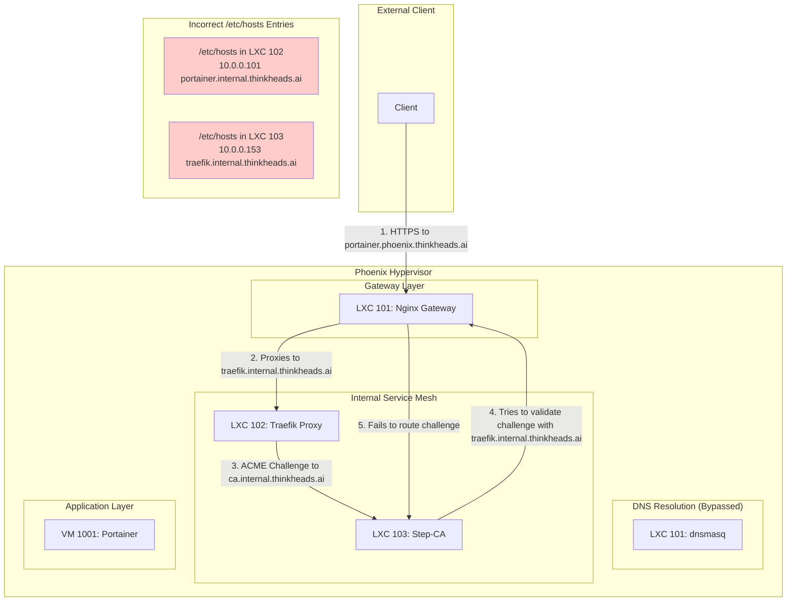

# Network Traffic and DNS Resolution Flow Analysis

This document provides a visual analysis of the intended versus the actual network traffic and DNS resolution flows within the Phoenix Hypervisor environment. The diagrams highlight the critical DNS misconfigurations that are causing the system to fail.

## Intended Traffic Flow

This diagram illustrates the correct, intended flow of traffic and DNS resolution, as designed in the architecture.

## Actual (Broken) Traffic Flow

This diagram shows the actual, broken flow caused by the incorrect `/etc/hosts` entries in the setup scripts.

## Analysis

The root cause of the failure is the static, incorrect `/etc/hosts` entries being injected into the Traefik and Step-CA containers. This misconfiguration completely bypasses the central `dnsmasq` server, leading to the following critical issues:

1.  **Step-CA (LXC 103) Failure:** The Step-CA container has a hardcoded entry pointing `traefik.internal.thinkheads.ai` to the Nginx gateway's IP (`10.0.0.153`). When Traefik attempts an ACME challenge, the Step-CA tries to validate the challenge by sending a request to the Nginx gateway instead of directly to Traefik. The Nginx gateway is not configured to handle these internal validation requests, causing the ACME challenge to fail.
2.  **Traefik (LXC 102) Failure:** The Traefik container has hardcoded entries for all backend services, pointing them to the wrong IP address. This prevents Traefik from discovering and routing traffic to the correct services.

The combination of these two failures creates a complete breakdown of the internal networking and certificate management systems. The system is unable to issue or validate certificates, and internal services are unreachable.