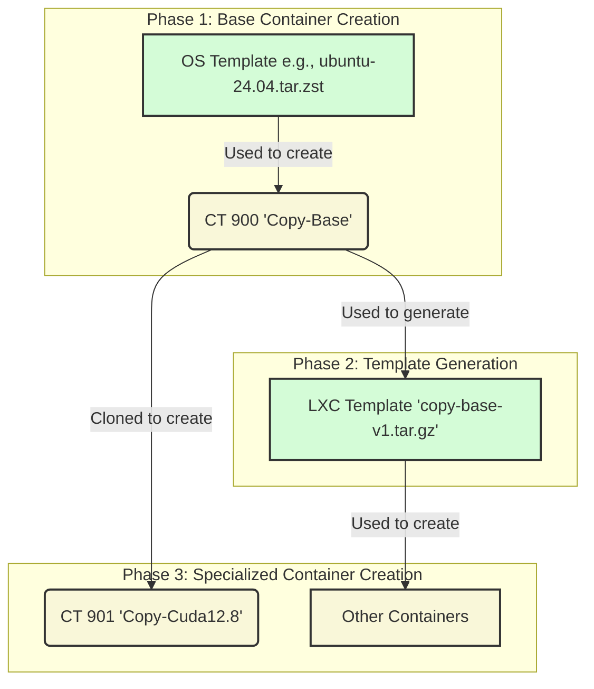

# LXC Template Dependency Flow

This diagram illustrates the correct, non-circular workflow for creating LXC containers from a base OS template and then generating specialized templates from those base containers.

## Explanation

1.  **Base Container Creation:** The process must start with a downloaded OS template (e.g., Ubuntu 24.04). This is used to create the initial, foundational container, `CT 900`.
2.  **Template Generation:** Once `CT 900` is fully configured with base setup, it is used to generate a reusable LXC template (`copy-base-v1.tar.gz`).
3.  **Specialized Container Creation:** Subsequent containers that require the same base configuration can then be efficiently created by either:
    *   **Cloning** directly from the now-existing `CT 900`.
    *   **Creating from the template** file `copy-base-v1.tar.gz`.

The error we are seeing is because the logic attempts to use the `copy-base-v1.tar.gz` template to create `CT 900`, which is a circular dependency. The proposed code change ensures that for `CT 900`, the script uses the OS Template directly.