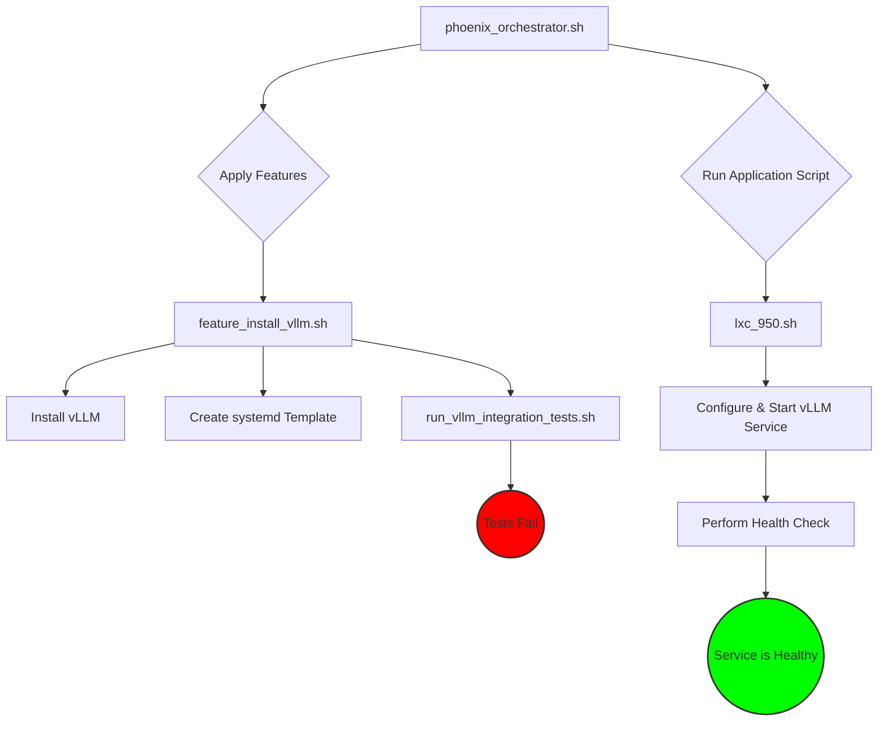
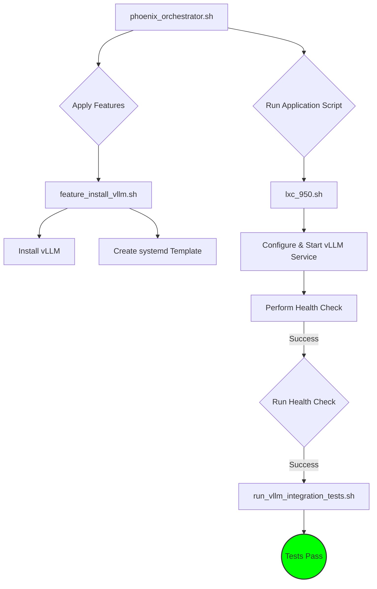

# Revised Workflow for vLLM Integration Testing

This document outlines the architectural changes required to fix the critical failure in the vLLM integration testing workflow.

## 1. The Problem: Incorrect Test Execution Order

The root cause of the failure is that the integration tests are executed by the `phoenix_hypervisor_feature_install_vllm.sh` script immediately after the vLLM software is installed. However, the vLLM service itself is only configured and started much later by the container-specific application script, `phoenix_hypervisor_lxc_950.sh`.

### Current Flawed Workflow



## 2. The Solution: Orchestrator-Managed Testing

The solution is to move the responsibility of running integration tests from the feature script to the main orchestrator. The tests will be triggered only *after* the application script has successfully started the service and the health check has passed.

This creates a more logical and robust workflow with a clear separation of concerns.

### Proposed Corrected Workflow



This revised architecture ensures that tests are only executed against a confirmed healthy and operational service, resolving the core issue.


## 3. Implementation Steps

### Step 3.1: Modify `phoenix_hypervisor_feature_install_vllm.sh`

The call to `run_vllm_integration_tests.sh` must be removed from this script. The script's sole responsibility should be to install the vLLM feature.

**File to Edit:** `usr/local/phoenix_hypervisor/bin/lxc_setup/phoenix_hypervisor_feature_install_vllm.sh`

**Action:** Remove the following lines from the `main` function:

```diff
-     # Run integration tests if vLLM was installed
-     log_info "Running vLLM integration tests..."
-     /usr/local/phoenix_hypervisor/bin/tests/run_vllm_integration_tests.sh "$CTID"
```


### Step 3.2: Modify `phoenix_orchestrator.sh`

The orchestrator needs a new function to handle the execution of integration tests. This function will read the test script's path from the container's configuration, making the solution generic and reusable for other containers.

**File to Edit:** `usr/local/phoenix_hypervisor/bin/phoenix_orchestrator.sh`

**Action 1: Add the new `run_integration_tests` function.**

This function should be added after the `run_health_check` function.

```bash
# =====================================================================================
# Function: run_integration_tests
# Description: Executes integration tests for a container if defined in the configuration.
# =====================================================================================
run_integration_tests() {
    local CTID="$1"
    log_info "Checking for integration tests for CTID: $CTID"
    local test_script_name
    test_script_name=$(jq_get_value "$CTID" ".integration_tests.script" || echo "")

    if [ -z "$test_script_name" ]; then
        log_info "No integration tests to run for CTID $CTID."
        return 0
    fi

    local test_script_path="${PHOENIX_BASE_DIR}/bin/tests/${test_script_name}"
    log_info "Executing integration tests: $test_script_name"

    if [ ! -f "$test_script_path" ]; then
        log_fatal "Integration test script not found at $test_script_path."
    fi

    if ! "$test_script_path" "$CTID"; then
        log_fatal "Integration test script '$test_script_name' failed for CTID $CTID."
    fi

    log_info "Integration tests completed successfully for CTID $CTID."
}
```

**Action 2: Update the `orchestrate_container_stateless` function.**

Call the new `run_integration_tests` function after the `run_health_check` has successfully completed.

```diff
# ... inside orchestrate_container_stateless function ...
     apply_features "$ctid_to_orchestrate"
     run_application_script "$ctid_to_orchestrate"
     run_health_check "$ctid_to_orchestrate"
+    run_integration_tests "$ctid_to_orchestrate"
 
     # 9. Create snapshot if it's a template
     create_template_snapshot "$ctid_to_orchestrate"
# ...
```


### Step 3.3: Update LXC Configuration

To enable the new functionality, the `phoenix_lxc_configs.json` file must be updated to include a new `integration_tests` object for the relevant container (e.g., CTID 950).

**File to Edit:** `usr/local/phoenix_hypervisor/etc/phoenix_lxc_configs.json`

**Action:** Add the `integration_tests` key to the configuration for CTID 950.

```diff
  "950": {
    "name": "vllm-api-server",
    "clone_from_ctid": "900",
    "storage_pool": "fastdata",
    "memory_mb": 16384,
    "cores": 4,
    "features": ["vllm"],
    "application_script": "phoenix_hypervisor_lxc_950.sh",
    "health_check": {
      "command": "/usr/local/bin/health_check_950.sh",
      "retries": 30,
      "interval": 10
    },
+   "integration_tests": {
+     "script": "run_vllm_integration_tests.sh"
+   },
    "vllm_model": "teknium/OpenHermes-2.5-Mistral-7B",
    "vllm_served_model_name": "OpenHermes-2.5-Mistral-7B",
    "vllm_port": "8000",
    "vllm_args": [
      "--tensor-parallel-size 1",
      "--gpu-memory-utilization 0.90",
      "--max-model-len 4096"
    ]
  }
```

This completes the architectural plan. The proposed changes create a robust, reusable, and correctly ordered workflow for running integration tests.
