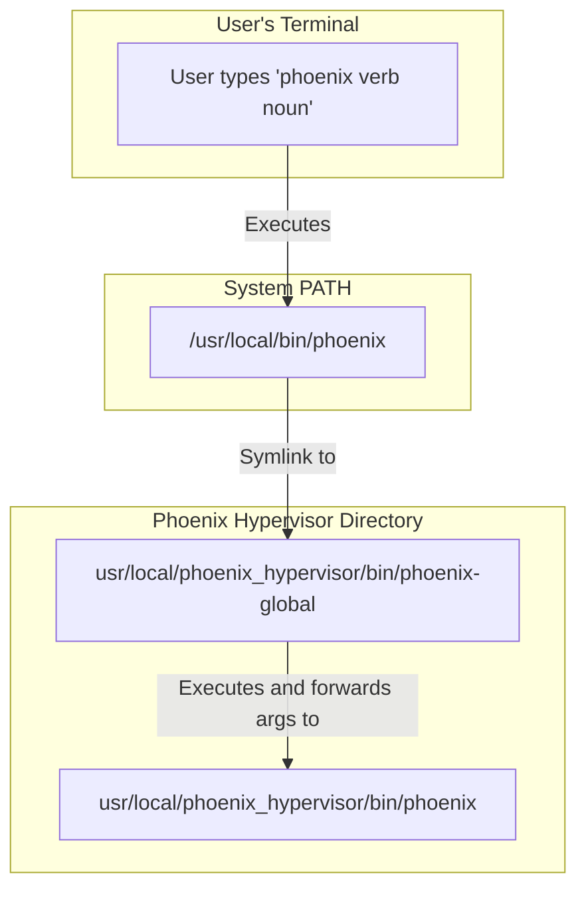

# Plan: Phoenix Global Wrapper Script

This document outlines the plan to create a wrapper script that allows the `phoenix` command to be run from any directory on the system, providing an experience identical to running the script directly from its location.

## 1. Objective

The primary goal is to create a script named `phoenix-global` in `usr/local/phoenix_hypervisor/bin/`. This script will act as a proxy, seamlessly passing all commands and arguments to the main `phoenix` script while ensuring all relative paths within the Phoenix Hypervisor ecosystem continue to work correctly.

## 2. Implementation Steps

### Step 1: Create the Wrapper Script

A new bash script will be created at `usr/local/phoenix_hypervisor/bin/phoenix-global`.

The script's logic will be as follows:
1.  **Shebang:** Start with `#!/bin/bash` to ensure it's executed with the correct interpreter.
2.  **Directory Discovery:** The script will determine its own absolute path. This is crucial for reliably locating the main `phoenix` script, regardless of where `phoenix-global` is called from.
3.  **Execution and Argument Forwarding:** The script will execute the main `phoenix` script, which is located in the same directory. It will use `"$@"` to pass all command-line arguments it receives, ensuring that commands like `phoenix create 952` are forwarded as `.../phoenix create 952`.

### Step 2: Make the Script Executable

The script will be given execute permissions using the `chmod +x` command. This is a necessary step to allow the script to be run as a command.

### Step 3: Provide Instructions for Global Access

After the script is created and made executable, I will provide you with a simple, one-line command to create a symbolic link. This command will link the `phoenix-global` script to a standard directory in your system's `$PATH`, such as `/usr/local/bin`. This final step is what makes the `phoenix` command truly global.

This step is intentionally left for you to execute, as it typically requires `sudo` privileges.

## 3. Visualization

The following diagram illustrates the proposed workflow:

## 4. Next Steps

Once you approve this plan, I will proceed with creating the wrapper script and providing the necessary instructions to complete the setup.