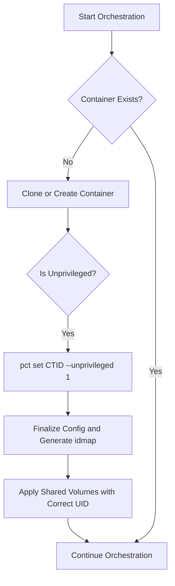

# IDMAP Resolution and Permissions Strategy

## 1. Executive Summary

This document provides a definitive analysis of the `idmap` warning encountered during the creation of unprivileged LXC containers and outlines a comprehensive strategy to resolve it. The root cause is a race condition in the `phoenix_orchestrator.sh` script, where `idmap` generation is attempted before the container is correctly configured as unprivileged.

The solution involves a targeted refactoring of the orchestrator script to align with the logic described in the `Orchestrator Script Refinement Plan.md`. This will ensure that the `--unprivileged 1` flag is set at the correct point in the container creation workflow, guaranteeing that the `idmap` is available when needed for shared volume permissioning.

## 2. Root Cause Analysis

The `[WARN] phoenix_orchestrator.sh: No idmap found in /etc/pve/lxc/953.conf` message is a direct result of the orchestrator script attempting to read the `idmap` for a container that has not yet been fully configured as unprivileged.

### The Flawed Workflow

1.  **`clone_container` is called**: A new container is cloned from a template. At this stage, the cloned container inherits the base configuration but is not yet explicitly set as unprivileged.
2.  **`finalize_container_config` is called**: This function starts and stops the container with the intention of forcing Proxmox to generate the `idmap`. However, because the `--unprivileged 1` flag has not yet been applied, Proxmox does not generate the `idmap`.
3.  **`apply_shared_volumes` is called**: This function attempts to read the `idmap` from the container's configuration file to set ownership on shared volumes. Since the `idmap` was never generated, the script logs the warning and defaults to `nobody:nogroup`, which can cause permission issues for services running as root inside the container.

The core of the problem is that the logic proposed in `Orchestrator Script Refinement Plan.md`—specifically, setting the unprivileged flag *immediately* after creation—was not correctly implemented in the main orchestration flow for cloned containers.

## 3. Proposed Solution

The solution is to refactor the `phoenix_orchestrator.sh` script to ensure the correct order of operations. The `ensure_container_defined` function will be modified to explicitly set the `--unprivileged 1` flag immediately after a container is created or cloned, before any other operations are performed on it.

### Corrected Workflow Diagram



### Key Script Modifications

The `ensure_container_defined` function in `phoenix_orchestrator.sh` will be updated to include the logic for setting the unprivileged flag.

**`ensure_container_defined` (Updated Logic):**

```bash
ensure_container_defined() {
    log_info "Ensuring container $CTID is defined..."
    if ! pct status "$CTID" > /dev/null 2>&1; then
        log_info "Container $CTID does not exist. Proceeding with creation..."
        local clone_from_ctid
        clone_from_ctid=$(jq_get_value "$CTID" ".clone_from_ctid" || echo "")

        if [ -n "$clone_from_ctid" ]; then
            clone_container
        else
            create_container_from_template
        fi

        # Set unprivileged flag immediately after creation to generate idmap
        local unprivileged_bool
        unprivileged_bool=$(jq_get_value "$CTID" ".unprivileged")
        if [ "$unprivileged_bool" == "true" ]; then
            log_info "Setting container $CTID as unprivileged..."
            run_pct_command set "$CTID" --unprivileged 1 || log_fatal "Failed to set container as unprivileged."
        fi
    else
        log_info "Container $CTID already exists. Skipping creation."
    fi
}
```

This change ensures that the `idmap` is generated before any function that depends on it is called, resolving the race condition and eliminating the warning.

## 4. Finalized Permissions Strategy

With the `idmap` issue resolved, the dynamic UID/GID mapping strategy outlined in `Shared Volume Permissions Strategy.md` can be fully implemented.

1.  **Configuration-Driven Ownership**: The `owner` property in `phoenix_hypervisor_config.json` will be the single source of truth for shared volume ownership.
2.  **`container_root` as the Standard**: For services that need to write to shared volumes as root (e.g., NGINX logs, application data), the `owner` should be set to `container_root`.
3.  **Default to `nobody:nogroup`**: For volumes that do not require root-level write access from within the container, the `owner` can be omitted, and the system will default to the secure `nobody:nogroup` ownership.

This approach provides a secure, flexible, and maintainable system for managing permissions between the host and unprivileged containers.