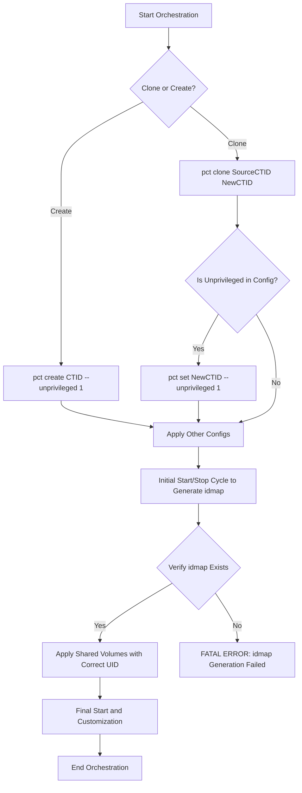

# Unprivileged LXC Creation Architecture

## 1. Executive Summary

This document outlines the official, correct-by-construction architecture for creating and configuring unprivileged LXC containers within the Phoenix Hypervisor environment. It supersedes all previous strategy documents, including `IDMAP_Resolution_and_Permissions_Strategy.md`.

The recurring `idmap` warning is the result of a fundamental architectural flaw in the container cloning workflow. The previous process attempted to generate the `idmap` before the container was correctly configured as unprivileged, leading to a race condition and subsequent permissioning failures.

This new architecture defines a non-negotiable, sequential workflow that guarantees the `idmap` is generated correctly *before* any dependent operations, such as applying shared volumes, are attempted. Adherence to this workflow is critical for the stability and reliability of the container orchestration system.

## 2. Host Prerequisite Check

Before any container orchestration begins, the `phoenix_orchestrator.sh` script **must** perform a mandatory check to ensure the Proxmox host is correctly configured for unprivileged containers. This prevents `idmap` failures at their root cause.

The script must perform the following steps:
1.  **Check for `/etc/subuid`**: Verify the existence of the `/etc/subuid` file.
2.  **Check for `/etc/subgid`**: Verify the existence of the `/etc/subgid` file.
3.  **Auto-Remediate**: If either file is missing, the script **must** create it and populate it with the content `root:100000:65536`.
4.  **Log Status**: The script **must** log a clear, informative message indicating whether the files were found or if they were created.

This check ensures that the underlying system dependencies for user namespace remapping are met before any `pct` commands are executed, guaranteeing a stable foundation for unprivileged container creation.

## 3. The Correct-by-Construction Workflow

The following sequence of operations is mandatory for all unprivileged container creation and cloning.

### Workflow Diagram

### Step-by-Step Breakdown

1.  **Define Container**:
    *   **Creation**: If creating a new container from a template, the `--unprivileged 1` flag **must** be included in the initial `pct create` command.
    *   **Cloning**: If cloning from an existing template container, use the standard `pct clone` command.

2.  **Set Unprivileged Flag (Clone-Only, Configuration-Driven)**:
    *   Immediately following a `pct clone` operation, the orchestrator **must** check the container's JSON configuration file.
    *   If the configuration specifies `"unprivileged": true`, the orchestrator **must** execute `pct set <CTID> --unprivileged 1`. This is the most critical step for ensuring cloned containers are correctly configured. This step is skipped if the configuration does not specify the container should be unprivileged.

3.  **Apply Core Configurations**:
    *   Apply all other settings from the JSON configuration (`memory`, `cores`, `net0`, etc.) using `pct set`.

4.  **Initial Start/Stop Cycle (IDMAP Generation)**:
    *   Start the container with `pct start <CTID>`.
    *   Immediately stop the container with `pct stop <CTID>`.
    *   This cycle, now performed on a correctly configured unprivileged container, will reliably trigger Proxmox to generate the `idmap` in the container's configuration file.

5.  **Verify IDMAP Existence**:
    *   After the start/stop cycle, the orchestrator **must** parse the `/etc/pve/lxc/<CTID>.conf` file and verify that the `lxc.idmap` entry is present.
    *   If the `idmap` is not found, the orchestration **must** fail with a fatal error. This is a critical safety check to prevent misconfigured containers from being used.

6.  **Apply Shared Volumes**:
    *   With the `idmap` now guaranteed to exist, the orchestrator can safely read the mapped root UID and GID.
    *   These mapped values **must** be used to set the correct ownership (`chown`) and permissions (`chmod`) on all shared volumes as defined in the `phoenix_hypervisor_config.json`.

7.  **Final Startup and Customization**:
    *   Start the container again with `pct start <CTID>`.
    *   Proceed with all subsequent orchestration steps, such as applying features and running application-specific scripts.

## 4. Rationale and Justification

This workflow is designed to be declarative and idempotent. It eliminates the race condition by enforcing a strict order of operations that aligns with the Proxmox LXC lifecycle. By making `idmap` verification a mandatory gate, we prevent the system from ever reaching a state where shared volumes have incorrect permissions. This architecture prioritizes correctness and predictability over complex recovery logic.