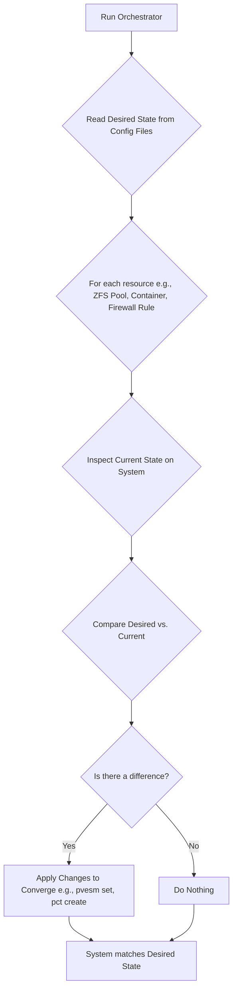

# Declarative State Architecture for Phoenix Orchestrator v2.0

## 1. Overview

This document outlines the refactored architecture for the Phoenix Orchestrator, which transitions the system from an imperative, script-based execution model to a declarative, convergent state engine. This new architecture aligns with modern Infrastructure-as-Code (IaC) principles, significantly improving the system's reliability, idempotency, and maintainability. This document serves as the primary technical blueprint for implementing the declarative model.

## 2. Core Principles

-   **Single Source of Truth**: The `phoenix_hypervisor_config.json` and `phoenix_lxc_configs.json` files are the definitive source of truth for the entire system's desired state. The live system is considered a reflection of this state.
-   **Stateless Execution**: The orchestrator itself is stateless. It does not retain knowledge of past executions. Each run is a fresh evaluation of the system's state against the source of truth.
-   **Idempotent Convergence**: The orchestrator's primary function is to converge the *current state* of the system with the *desired state* defined in the configuration. If the states match, no action is taken. If they differ, the orchestrator applies the necessary changes to align them.

## 3. Architectural Model: The Convergent Loop

The new model is based on a continuous "Inspect, Compare, Converge" loop that is applied to every resource managed by the orchestrator.

### 3.1. Inspect

The orchestrator uses native system commands to determine the precise configuration of a resource as it currently exists on the Proxmox host. This involves parsing the output of commands to extract key-value pairs representing the current state.

*   **Example (ZFS Pool)**: `zfs get -H -o property,value all my-pool/my-dataset`
*   **Example (LXC Container)**: `pct config CTID`
*   **Example (Storage)**: `pvesm status`

### 3.2. Compare

The inspected state is compared against the state defined in the JSON configuration files. The comparison is granular, checking specific properties.

*   **Example (LXC Memory)**:
    *   **Desired State (JSON)**: `"memory_mb": 4096`
    *   **Current State (from `pct config`)**: `memory: 4096`
    *   **Result**: Match. No action needed.

*   **Example (ZFS Property)**:
    *   **Desired State (JSON)**: `"properties": {"compression": "lz4"}`
    *   **Current State (from `zfs get`)**: `compression zl4`
    *   **Result**: Mismatch. Action needed.

### 3.3. Converge

If the comparison reveals a discrepancy, the orchestrator calculates and executes the minimal set of commands required to bring the resource into alignment with its desired state.

*   **Example (LXC Memory)**: If memory was mismatched, the command would be `pct set CTID --memory 4096`.
*   **Example (ZFS Property)**: If compression was mismatched, the command would be `zfs set compression=lz4 my-pool/my-dataset`.
*   **Example (Missing Resource)**: If a container defined in the JSON does not exist, the command would be `pct create ...`.

## 4. Implementation Details

The implementation will be a phased refactoring of the existing `phoenix_orchestrator.sh` and its helper scripts.

### 4.1. Refactoring `hypervisor_setup` Scripts

Each script in `/usr/local/phoenix_hypervisor/bin/hypervisor_setup` will be converted into a self-contained state engine for the resource it manages. For example, `hypervisor_feature_setup_zfs.sh` will be responsible for inspecting, comparing, and converging all ZFS datasets defined in the configuration.

### 4.2. Refactoring Container Orchestration

The main `orchestrate_container` function in `phoenix_orchestrator.sh` will be refactored to follow the declarative model for the entire container lifecycle, including:
*   Creation/Cloning
*   Configuration (memory, cores, network, etc.)
*   State (running/stopped)
*   Shared Volume Mounts
*   Feature Installation

## 5. Benefits of this Architecture

-   **Reliability**: The system becomes self-healing. Configuration drift is automatically detected and corrected on every run.
-   **Predictability**: The state of the system is guaranteed to match the configuration files, eliminating guesswork.
-   **Maintainability**: Changes are made by modifying the source of truth (the JSON files), not by writing complex imperative scripts.
-   **Idempotency**: The orchestrator can be run safely at any time, as it will only make changes when necessary. This is critical for automation and recovery scenarios.