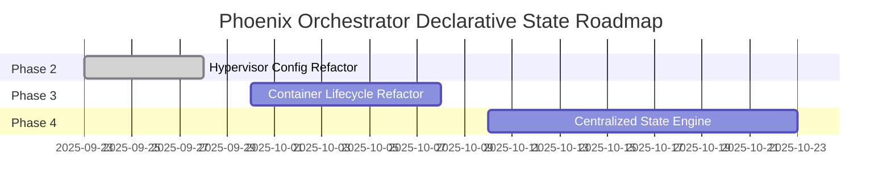

# Declarative State Implementation Roadmap

## 1. Overview

This roadmap outlines the phased transition of the Phoenix Orchestrator to a declarative state model. The primary goal is to manage this complex refactoring process in a structured, iterative manner, delivering value at each stage and minimizing disruption.

## 2. Phased Implementation Plan

### Phase 1: Foundational Resources (Complete)

This phase serves as the blueprint for the declarative model and has already been completed.

*   **Tasks**:
    *   Refactor `hypervisor_feature_setup_zfs.sh` to be fully convergent.
*   **Deliverables**:
    *   A self-contained, idempotent script for managing ZFS resources.
*   **Effort Estimate**: Complete.

### Phase 2: Hypervisor Configuration

This phase extends the declarative model to all other hypervisor-level configurations.

*   **Tasks**:
    *   Refactor `hypervisor_feature_setup_nfs.sh` to be convergent.
    *   Refactor `hypervisor_feature_setup_samba.sh` to be convergent.
    *   Refactor `hypervisor_feature_install_nvidia.sh` to be convergent.
    *   Refactor `hypervisor_feature_setup_firewall.sh` to be convergent.
    *   Refactor `hypervisor_feature_create_admin_user.sh` to be convergent.
*   **Deliverables**:
    *   A fully idempotent `setup_hypervisor` mode in the orchestrator.
*   **Effort Estimate**: 3-5 developer days.
*   **Dependencies**: None.

### Phase 3: Container Lifecycle Management

This phase focuses on refactoring the core container orchestration logic to be fully declarative.

*   **Tasks**:
    *   Create helper functions to inspect the current state of a container (memory, cores, network, etc.).
    *   Refactor the `apply_configurations` function to perform a compare and converge loop.
    *   Refactor the `start_container` function to manage state (running/stopped) based on the config.
    *   Refactor `apply_shared_volumes` to be fully declarative.
*   **Deliverables**:
    *   An orchestrator that can create, configure, and manage the state of containers in a fully declarative manner.
*   **Effort Estimate**: 5-8 developer days.
*   **Dependencies**: Phase 2 completion is recommended but not strictly required.

### Phase 4: Centralized State Engine and Finalization

This is the final phase, where the state management logic is centralized and the transition is completed.

*   **Tasks**:
    *   Refactor the main loop of `phoenix_orchestrator.sh` to be a master state engine.
    *   Convert the feature-specific setup scripts into modules that are called by the master engine.
    *   Refactor the `apply_features` and `run_application_script` functions to be declarative.
    *   Thorough end-to-end testing of the entire declarative system.
*   **Deliverables**:
    *   A fully declarative, convergent Phoenix Orchestrator.
    *   Updated documentation reflecting the new architecture.
*   **Effort Estimate**: 8-13 developer days.
*   **Dependencies**: Completion of Phases 2 and 3.

## 3. Timeline and Milestones

This timeline is an estimate and can be adjusted based on developer availability and unforeseen complexities.