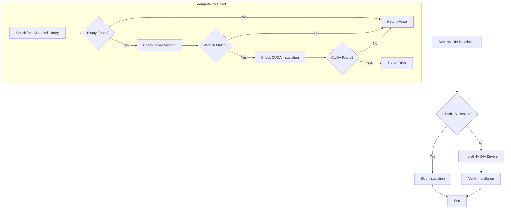

# NVIDIA Idempotency Check - Proposed Architecture

This document outlines a robust idempotency check for the NVIDIA feature installation script.

## Proposed Architecture

## Implementation Details

The new function, `is_nvidia_installed_robust`, will be implemented in `phoenix_hypervisor_common_utils.sh` and will perform the following checks:

1.  **Check for `nvidia-smi`**: Instead of relying on `command -v`, the function will search for the `nvidia-smi` binary in common installation directories.
2.  **Verify Driver Version**: If `nvidia-smi` is found, the function will execute it and compare the reported driver version against the version specified in the configuration.
3.  **Check for CUDA**: The function will check for the existence of the CUDA toolkit directory and the `nvcc` compiler.

This approach ensures that the script will not attempt to reinstall the NVIDIA drivers if they are already present, even if `nvidia-smi` is not in the system's `PATH`.

## Script Modifications

### `phoenix_hypervisor_common_utils.sh`

- **New Function**: `is_nvidia_installed_robust`
  - This function will replace the existing `_check_nvidia_installed` function and will contain the new idempotency logic.

### `phoenix_hypervisor_feature_install_nvidia.sh`

- **Update `install_drivers_in_container`**:
  - The call to `is_command_available` will be removed.
- **Update `main`**:
  - The call to `is_feature_installed` will be replaced with a call to the new `is_nvidia_installed_robust` function.

## Verification Strategy

To ensure the new idempotency check works as expected, the following steps should be performed:

1.  **Clone a Container**: Create a new container from a template that already has the NVIDIA drivers installed.
2.  **Run the Installation Script**: Execute the `phoenix_hypervisor_feature_install_nvidia.sh` script on the new container.
3.  **Verify Skipped Installation**: The script should detect the existing installation and skip the installation process. The logs should indicate that the NVIDIA feature is already installed.
4.  **Test on a Clean Container**: Run the script on a container without the NVIDIA drivers to ensure the installation proceeds as expected.