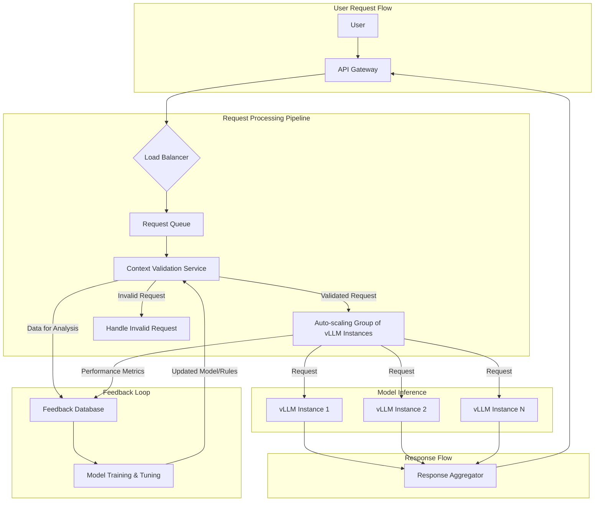

# LXC 951 Enhancement Plan

## 1. Introduction

This document presents a comprehensive plan to enhance the `lxc 951` embedding model, `vllm-granite-embed`, with robust responsiveness and context-checking capabilities. The current single-container architecture will be evolved into a scalable, resilient, and intelligent system capable of handling varying loads and ensuring the semantic relevance of input data.

## 2. Proposed Architecture

The proposed architecture transitions from a monolithic model to a microservices-based approach. This new design introduces several new components to address the requirements for high responsiveness and robust context-checking.

### 2.1. High-Level Architectural Diagram



### 2.2. Architectural Components

#### 2.2.1. API Gateway

*   **Description:** A single entry point for all incoming requests. It will handle authentication, rate limiting, and request routing to the appropriate services.
*   **Responsibilities:**
    *   Authenticate and authorize incoming requests.
    *   Enforce rate limits to prevent abuse.
    *   Route requests to the Load Balancer.
    *   Aggregate responses from the backend services and return them to the user.

#### 2.2.2. Load Balancer

*   **Description:** Distributes incoming traffic across multiple instances of the Context Validation Service and the vLLM model instances.
*   **Responsibilities:**
    *   Ensure high availability and fault tolerance.
    *   Balance the load evenly across the available service instances.
    *   Perform health checks on the service instances and route traffic only to healthy instances.

#### 2.2.3. Request Queue

*   **Description:** A message broker or queueing system to manage traffic bursts and decouple the request ingestion from the processing pipeline.
*   **Responsibilities:**
    *   Buffer incoming requests during traffic spikes.
    *   Ensure that no requests are lost.
    *   Allow for asynchronous processing of requests.

#### 2.2.4. Context Validation Service

*   **Description:** A new microservice responsible for validating the semantic relevance of input data before it is sent to the embedding model.
*   **Responsibilities:**
    *   Perform initial validation checks on the input data.
    *   Use a lightweight model or a set of rules to determine if the input is semantically relevant.
    *   Forward valid requests to the vLLM instances and reject or flag invalid requests.
    *   Log data for the feedback loop to continuously improve the validation model.

#### 2.2.5. Auto-scaling Group of vLLM Instances

*   **Description:** A pool of `lxc 951` containers that can be automatically scaled up or down based on the request volume.
*   **Responsibilities:**
    *   Run the `vllm-granite-embed` model and generate embeddings.
    *   Scale horizontally to handle varying loads.
    *   Ensure high availability and fault tolerance.

#### 2.2.6. Feedback Loop Mechanism

*   **Description:** A system for collecting data on the performance of the context validation and embedding models and using it to continuously improve them.
*   **Responsibilities:**
    *   Collect data on the accuracy of the context validation.
    *   Monitor the performance of the embedding model.
    *   Use this data to retrain and fine-tune the models.

## 3. Addressing Key Requirements

### 3.1. Responsiveness

*   **Optimized Model Inference Speed:**
    *   **Model Quantization:** Explore techniques like quantization to reduce the model size and improve inference speed.
    *   **Hardware Acceleration:** Ensure the vLLM instances are running on hardware with GPU acceleration.
    *   **Batching:** Implement dynamic batching to group incoming requests and process them together.
*   **Efficient Resource Allocation:**
    *   **Auto-scaling:** The auto-scaling group will ensure that we have the optimal number of vLLM instances running at all times.
    *   **Resource Monitoring:** Implement a monitoring solution to track resource utilization and identify bottlenecks.
*   **Load Balancing and Scaling:**
    *   **Load Balancer:** The load balancer will distribute traffic evenly across the vLLM instances.
    *   **Horizontal Scaling:** The auto-scaling group will allow us to scale horizontally by adding more vLLM instances as needed.

### 3.2. Context Checks

*   **Semantic Relevance Validation:**
    *   **Context Validation Service:** This new service will be dedicated to validating the semantic relevance of input data.
    *   **Lightweight Model:** The service will use a lightweight model or a set of rules to perform the validation.
*   **Handling Out-of-Context Queries:**
    *   **Rejection or Flagging:** The Context Validation Service will either reject out-of-context queries or flag them for further review.
    *   **User Feedback:** Provide a mechanism for users to give feedback on the validation results.
*   **Feedback Loop:**
    *   **Continuous Improvement:** The feedback loop will allow us to continuously improve the context validation model by learning from new data.
    *   **Data-Driven Decisions:** The data collected in the feedback loop will be used to make data-driven decisions about how to improve the system.

## 4. Implementation Roadmap

The implementation will be broken down into the following phases:

### Phase 1: Foundational Infrastructure (Timeline: 2-3 Weeks)

*   [ ] Set up the API Gateway.
*   [ ] Deploy the Load Balancer.
*   [ ] Implement the Request Queue.
*   [ ] Create the initial version of the Context Validation Service with a basic set of rules.
*   [ ] Set up the auto-scaling group with a single vLLM instance.

### Phase 2: Context Validation and Feedback Loop (Timeline: 3-4 Weeks)

*   [ ] Develop a lightweight model for the Context Validation Service.
*   [ ] Implement the feedback loop mechanism to collect data.
*   [ ] Set up a process for retraining and updating the context validation model.

### Phase 3: Performance Optimization and Scaling (Timeline: 2-3 Weeks)

*   [ ] Implement model quantization and other optimization techniques.
*   [ ] Configure auto-scaling policies based on performance metrics.
*   [ ] Conduct load testing to ensure the system can handle the expected traffic.

## 8. Detailed Implementation Roadmap

This section provides a more detailed breakdown of the implementation roadmap, including specific tasks, timelines, and milestones for each phase.

### Phase 1: Foundational Infrastructure (Timeline: 2-3 Weeks)

*   **Week 1: API Gateway and Load Balancer**
    *   [ ] **Task:** Select and deploy an API Gateway.
    *   [ ] **Task:** Configure the API Gateway for authentication, rate limiting, and routing.
    *   [ ] **Task:** Select and deploy a Load Balancer.
    *   [ ] **Task:** Configure the Load Balancer for health checks and traffic distribution.
    *   [ ] **Milestone:** API Gateway and Load Balancer are deployed and configured.
*   **Week 2: Request Queue and Initial Service Setup**
    *   [ ] **Task:** Select and deploy a Request Queue.
    *   [ ] **Task:** Integrate the Request Queue with the API Gateway and the backend services.
    *   [ ] **Task:** Create the initial version of the Context Validation Service with a basic set of rules.
    *   [ ] **Task:** Set up the auto-scaling group with a single vLLM instance.
    *   [ ] **Milestone:** Foundational infrastructure is in place and ready for the next phase.

### Phase 2: Context Validation and Feedback Loop (Timeline: 3-4 Weeks)

*   **Week 3-4: Context Validation Model Development**
    *   [ ] **Task:** Collect and label a dataset for training the context validation model.
    *   [ ] **Task:** Train and evaluate a lightweight text classification model.
    *   [ ] **Task:** Integrate the model into the Context Validation Service.
    *   [ ] **Milestone:** Context Validation Service is using a machine learning model to validate requests.
*   **Week 5-6: Feedback Loop Implementation**
    *   [ ] **Task:** Design and implement the data model for the feedback loop.
    *   [ ] **Task:** Implement the data collection mechanism to store validation results and user feedback.
    *   [ ] **Task:** Set up a process for regularly retraining and deploying the context validation model.
    *   [ ] **Milestone:** Feedback loop is operational and collecting data.

### Phase 3: Performance Optimization and Scaling (Timeline: 2-3 Weeks)

*   **Week 7: Model Optimization**
    *   [ ] **Task:** Research and implement model quantization techniques.
    *   [ ] **Task:** Benchmark the performance of the quantized model.
    *   [ ] **Task:** Explore and implement other optimization techniques, such as using TensorRT.
    *   [ ] **Milestone:** Model inference speed is significantly improved.
*   **Week 8: Auto-scaling and Load Testing**
    *   [ ] **Task:** Configure and tune the auto-scaling policies based on performance metrics.
    *   [ ] **Task:** Develop a load testing plan and scripts.
    *   [ ] **Task:** Conduct comprehensive load testing to ensure the system can handle the expected traffic.
    *   [ ] **Milestone:** System is fully optimized and ready for production.

## 5. Success Metrics

The success of these enhancements will be measured by the following key metrics:

*   **Responsiveness:**
    *   **Inference Latency:** The time it takes to generate an embedding for a single request.
    *   **Throughput:** The number of requests that can be processed per second.
    *   **P95/P99 Latency:** The latency for the 95th and 99th percentile of requests.
*   **Context-Checking:**
    *   **Validation Accuracy:** The percentage of out-of-context queries that are correctly identified.
    *   **False Positive Rate:** The percentage of valid queries that are incorrectly identified as out-of-context.
*   **System Performance:**
    *   **Uptime:** The percentage of time that the system is available.
    *   **Resource Utilization:** The CPU, memory, and GPU utilization of the vLLM instances.

## 6. Context Validation Service Design

This section provides a detailed design for the Context Validation Service, a key component of the enhanced architecture.

### 6.1. API Specification

The Context Validation Service will expose a single API endpoint for validating input data.

*   **Endpoint:** `/v1/validate`
*   **Method:** `POST`
*   **Request Body:**
    ```json
    {
      "input_text": "The text to be validated."
    }
    ```
*   **Success Response (200 OK):**
    ```json
    {
      "is_valid": true,
      "validation_details": {
        "confidence_score": 0.95,
        "reason": "The input text is semantically relevant."
      }
    }
    ```
*   **Error Response (400 Bad Request):**
    ```json
    {
      "is_valid": false,
      "validation_details": {
        "confidence_score": 0.2,
        "reason": "The input text is out-of-context."
      }
    }
    ```

### 6.2. Validation Logic

The validation logic will be implemented as a pipeline of checks, starting with simple, low-cost checks and progressing to more complex, computationally expensive checks.

1.  **Input Sanitization and Preprocessing:**
    *   Remove any special characters or formatting from the input text.
    *   Convert the text to lowercase.
    *   Perform tokenization and stemming.
2.  **Keyword Matching:**
    *   Check for the presence of a predefined set of keywords that are relevant to the domain.
    *   This will be a simple and fast way to filter out obviously irrelevant inputs.
3.  **Lightweight Classification Model:**
    *   Use a lightweight text classification model (e.g., a logistic regression model or a small transformer model) to classify the input text as either "in-context" or "out-of-context."
    *   This model will be trained on a labeled dataset of in-context and out-of-context examples.
4.  **Confidence Scoring:**
    *   The classification model will output a confidence score that indicates the probability that the input is in-context.
    *   This score will be used to make the final decision about whether to accept or reject the input.

### 6.3. Feedback Loop Data Model

The feedback loop will collect data to continuously improve the validation model. The following data will be collected for each validation request:

*   **Request ID:** A unique identifier for the request.
*   **Input Text:** The original input text.
*   **Validation Result:** The result of the validation (in-context or out-of-context).
*   **Confidence Score:** The confidence score from the classification model.
*   **User Feedback (Optional):** A field for users to provide feedback on the validation result.
*   **Timestamp:** The time the request was processed.

This data will be stored in a database and used to retrain and fine-tune the validation model on a regular basis.

## 7. Model Inference Speed Optimization Plan

To ensure the system is highly responsive, we will implement several strategies to optimize the inference speed of the `vllm-granite-embed` model.

### 7.1. Model Quantization

*   **Description:** Model quantization is the process of reducing the precision of the model's weights from 32-bit floating-point numbers to a lower precision, such as 16-bit floating-point or 8-bit integers. This can significantly reduce the model size and improve inference speed with a minimal impact on accuracy.
*   **Action Items:**
    *   [ ] Research and select the most appropriate quantization technique for the `vllm-granite-embed` model.
    *   [ ] Implement the chosen quantization technique and benchmark the performance of the quantized model.
    *   [ ] Evaluate the trade-off between inference speed and accuracy to ensure the quantized model meets our requirements.

### 7.2. Hardware Acceleration

*   **Description:** Leveraging specialized hardware, such as GPUs, can dramatically accelerate the inference speed of deep learning models.
*   **Action Items:**
    *   [ ] Ensure that the vLLM instances are deployed on servers with high-performance GPUs.
    *   [ ] Optimize the vLLM configuration to make full use of the available GPU resources.
    *   [ ] Explore using TensorRT, a high-performance deep learning inference optimizer from NVIDIA, to further accelerate the model.

### 7.3. Dynamic Batching

*   **Description:** Dynamic batching is a technique for grouping multiple inference requests together and processing them as a single batch. This can improve the throughput of the system by making more efficient use of the GPU.
*   **Action Items:**
    *   [ ] Configure the vLLM server to use dynamic batching.
    *   [ ] Tune the batch size and other batching parameters to find the optimal settings for our workload.
    *   [ ] Conduct load testing to measure the impact of dynamic batching on throughput and latency.

### 7.4. Continuous Profiling and Optimization

*   **Description:** To ensure that the system remains performant over time, we will implement a process for continuous profiling and optimization.
*   **Action Items:**
    *   [ ] Set up a monitoring and profiling solution to track the performance of the vLLM instances.
    *   [ ] Regularly analyze the performance data to identify bottlenecks and areas for improvement.
    *   [ ] Continuously explore new optimization techniques and tools as they become available.