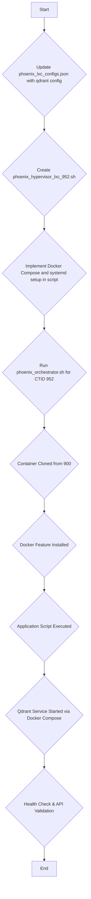

This document outlines the architectural plan for the creation and configuration of LXC container `952`, named `qdrant-lxc`. This container will host a Qdrant vector database, providing a high-performance, scalable solution for vector similarity search. The setup will be consistent with the existing platform architecture, leveraging a dedicated setup script and centralized configuration.

## High-Level Plan

The deployment will follow these stages:

1.  **Configuration:** Update `phoenix_lxc_configs.json` with the specific parameters for container `952`.
2.  **Script Creation:** Develop a new application runner script, `phoenix_hypervisor_lxc_952.sh`, to automate the installation, configuration, and service management of Qdrant.
3.  **Execution:** The `phoenix_orchestrator.sh` script will use the updated configuration to create, configure, and launch the container.
4.  **Validation:** The new script will perform health checks to ensure the Qdrant service is operational and accessible.

## Requirements

### Functional Requirements

- The container must run a stable version of the Qdrant vector database.
- The Qdrant service must be accessible on the network at `http://10.0.0.152:6333`.
- The service must be managed by `systemd` to ensure it is persistent and restarts on failure.
- The Qdrant data must be stored in a designated directory, `/opt/qdrant/storage`.
- The setup must allow for the configuration of a Qdrant API key for security.

### Non-Functional Requirements

- The container setup must be fully automated and repeatable.
- All configuration parameters must be centralized in `phoenix_lxc_configs.json`.
- The container should be based on a suitable template (e.g., a base Debian/Ubuntu template).
- Resource allocation (CPU, memory, storage) must be appropriate for a production vector database.

## Technical Specifications

### LXC Configuration (`phoenix_lxc_configs.json`)

The following parameters will be added to the configuration for CTID `952`:

```json
"952": {
    "name": "qdrant-lxc",
    "memory_mb": 32000,
    "cores": 8,
    "storage_pool": "quickOS-lxc-disks",
    "storage_size_gb": 256,
    "network_config": {
        "name": "eth0",
        "bridge": "vmbr0",
        "ip": "10.0.0.152/24",
        "gw": "10.0.0.1"
    },
    "mac_address": "52:54:00:67:89:B2",
    "unprivileged": true,
    "portainer_role": "database",
    "clone_from_ctid": "900",
    "features": [
        "docker"
    ],
    "application_script": "phoenix_hypervisor_lxc_952.sh",
    "qdrant_api_key": "YOUR_SECRET_API_KEY",
    "qdrant_version": "v1.7.4"
}
```

### Resource Allocation

-   **CPU:** 8 cores
-   **Memory:** 32000 MB
-   **Storage:** 256 GB on the `quickOS-lxc-disks` pool.

### Software and Configuration

-   **Qdrant:** Version `v1.7.4` will be installed via Docker.
-   **Docker:** The container will have Docker installed as a feature.
-   **API Key:** A secure API key will be configured for Qdrant.
-   **Data Persistence:** Qdrant's data will be mapped to `/opt/qdrant/storage` on the host to ensure data persistence across container restarts.

## Scripting Needs

### `phoenix_hypervisor_lxc_952.sh`

A new script, `phoenix_hypervisor_lxc_952.sh`, will be created in `phoenix_hypervisor/bin/`. This script will be responsible for the complete setup and configuration of the Qdrant service within the container.

**Key Responsibilities:**

-   **Directory Creation:** Create the `/opt/qdrant/storage` directory for persistent data storage.
-   **Docker Compose Setup:**
    -   Generate a `docker-compose.yml` file in `/opt/qdrant/`.
    -   This file will define the Qdrant service, specifying the official Docker image, version, port mappings, volume mounts, and API key.
-   **Service Management:**
    -   Use `docker-compose` to pull the Qdrant image and start the service.
    -   Create a `systemd` service file (`/etc/systemd/system/qdrant.service`) to manage the `docker-compose` service, ensuring it starts on boot and restarts on failure.
-   **Health Check:** Perform a health check by querying the Qdrant API (e.g., the `/metrics` or `/healthz` endpoint) to verify the service is running correctly.
-   **Display Connection Info:** Output the IP address, port, and API key for user access.

### Feature Scripts

-   **`qdrant-backup.sh` (Optional):** A potential feature script could be developed to handle automated backups of the Qdrant database. This script would snapshot the data volume and store it in a designated backup location.
-   **`qdrant-collection-manager.sh` (Optional):** Another useful script could provide an interface for managing Qdrant collections, allowing for the creation, deletion, and inspection of collections via the command line.

## Workflow Diagram


