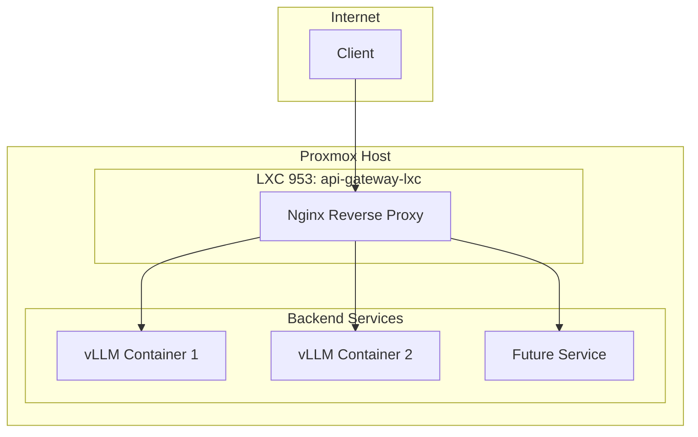

## 1. Introduction

This document provides a detailed architectural plan for the transformation of LXC container `953` into a dedicated Nginx reverse proxy, named `api-gateway-lxc`. This container will serve as a secure and efficient entry point for all backend services within the Proxmox environment, aligning with modern microservice architecture principles.

The plan addresses key considerations, including performance optimization, security hardening, integration with the existing infrastructure, and specific configurations for the Proxmox LXC environment.

## 2. Nginx Security and Performance Best Practices

To ensure the reverse proxy is both secure and performant, the following best practices will be implemented:

### 2.1. Performance Best Practices

*   **Caching:** Implement caching for frequently accessed content to reduce latency and offload backend servers.
*   **Load Balancing:** Utilize Nginx's load balancing capabilities to distribute traffic evenly across multiple backend servers, improving scalability and reliability.
*   **HTTP/2:** Enable HTTP/2 to leverage its performance benefits, such as multiplexing and header compression.
*   **Gzip Compression:** Use Gzip compression to reduce the size of transferred data, improving load times.
*   **Keepalive Connections:** Optimize keepalive connections to reduce the overhead of establishing new connections for each request.

### 2.2. Security Best Practices

*   **SSL/TLS Termination:** Terminate SSL/TLS connections at the reverse proxy to offload cryptographic operations from backend servers and centralize certificate management.
*   **Web Application Firewall (WAF):** Integrate a WAF, such as ModSecurity, to protect against common web vulnerabilities like SQL injection and cross-site scripting (XSS).
*   **Rate Limiting:** Implement rate limiting to prevent abuse and protect against denial-of-service (DoS) attacks.
*   **Access Control:** Enforce strict access control policies to restrict access to backend services based on IP address, user agent, or other criteria.
*   **Security Headers:** Add security-related HTTP headers, such as `Strict-Transport-Security`, `Content-Security-Policy`, and `X-Frame-Options`, to protect against various attacks.
*   **Regular Updates:** Keep Nginx and all its modules up to date to patch any known vulnerabilities.

## 3. Reverse Proxy Architecture

The reverse proxy will be deployed in a dedicated LXC container, `api-gateway-lxc`, which will act as the single point of entry for all incoming traffic. This architecture provides a layer of abstraction and security, isolating the backend services from direct exposure to the internet.

### 3.1. Architectural Diagram



### 3.2. Backend Services

Initially, the reverse proxy will be configured to route traffic to the following backend services:

*   **vLLM Embedding Service:** `http://10.0.0.151:8000`

Additional services can be easily added to the configuration as needed.

## 4. Nginx Configuration Plan

The Nginx configuration will be modular and easy to manage, with separate files for each component.

### 4.1. Main Configuration (`/etc/nginx/nginx.conf`)

The main configuration file will be kept clean and will include the `sites-enabled` directory.

### 4.2. Server Blocks (`/etc/nginx/sites-available/`)

A separate server block will be created for each domain or service. For example, a server block for the vLLM services would look like this:

```nginx
upstream vllm_backend {
    server 10.0.0.151:8000;
}

server {
    listen 80;
    server_name api.example.com;

    location / {
        proxy_pass http://vllm_backend;
        proxy_set_header Host $host;
        proxy_set_header X-Real-IP $remote_addr;
        proxy_set_header X-Forwarded-For $proxy_add_x_forwarded_for;
        proxy_set_header X-Forwarded-Proto $scheme;
    }
}
```

### 4.3. Upstream Configuration

The `upstream` module will be used to define the backend server pools. This allows for easy load balancing and failover.

### 4.4. Caching Configuration

A caching zone will be defined in the `http` block of the main configuration file, and the `proxy_cache` directive will be used in the server blocks to enable caching.

## 5. LXC Networking and Resource Allocation

The LXC container will be configured with the following network and resource settings to ensure optimal performance and stability.

### 5.1. Network Configuration

*   **IP Address:** `10.0.0.153/24`
*   **Gateway:** `10.0.0.1`
*   **Bridge:** `vmbr0`
*   **MAC Address:** `52:54:00:67:89:B3`

### 5.2. Resource Allocation

*   **CPU:** 4 cores
*   **Memory:** 4096 MB
*   **Storage:** 32 GB
*   **Storage Pool:** `quickOS-lxc-disks`

## 6. Security Hardening and Mitigation Strategies

A multi-layered security approach will be implemented to protect the reverse proxy and the backend services.

### 6.1. LXC Container Hardening

*   **Unprivileged Container:** The LXC container will be run as an unprivileged container to limit the potential impact of a container breakout.
*   **Minimalist OS:** The container will be based on a minimal OS image to reduce the attack surface.
*   **Regular Updates:** The container's OS and all packages will be kept up to date with the latest security patches.

### 6.2. Nginx Hardening

*   **Hide Nginx Version:** The Nginx version number will be hidden to prevent attackers from identifying potential vulnerabilities.
*   **Disable Unused Modules:** Any unused Nginx modules will be disabled to reduce the attack surface.
*   **Run as Non-Root User:** The Nginx worker processes will be run as a non-root user to limit their privileges.

### 6.3. Intrusion Detection and Prevention

*   **Fail2ban:** Fail2ban will be installed and configured to monitor Nginx logs and automatically ban IP addresses that show signs of malicious activity.
*   **ModSecurity:** The ModSecurity WAF will be integrated with Nginx to provide real-time protection against a wide range of web application attacks.

## 7. Implementation and Validation Plan

The implementation will be carried out in a phased approach to minimize disruption and ensure a smooth rollout.

### 7.1. Implementation Steps

1.  **Update `phoenix_lxc_configs.json`:** Modify the configuration for LXC container `953` with the new settings.
2.  **Create `phoenix_hypervisor_lxc_953.sh`:** Develop the application runner script to automate the installation and configuration of Nginx.
3.  **Run `phoenix_orchestrator.sh`:** Execute the orchestrator script to create and configure the container.
4.  **Deploy Nginx Configuration:** Apply the Nginx configuration files.
5.  **Enable Security Features:** Install and configure Fail2ban and ModSecurity.

### 7.2. Validation Plan

*   **Health Checks:** The `phoenix_hypervisor_lxc_953.sh` script will perform health checks to verify that the Nginx service is running and that the backend services are accessible.
*   **Performance Testing:** Conduct performance testing to ensure the reverse proxy can handle the expected traffic load.
*   **Security Audit:** Perform a security audit to identify and address any potential vulnerabilities.
*   **User Acceptance Testing (UAT):** Conduct UAT to ensure the reverse proxy is functioning as expected from an end-user perspective.