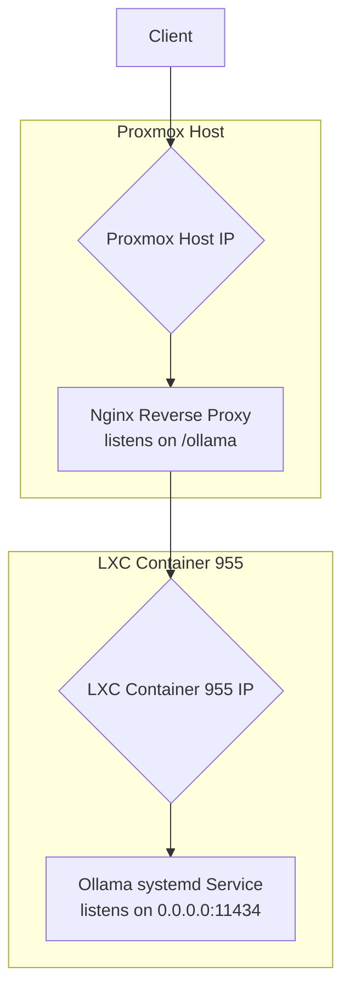

# Ollama LXC Container (ID 955) Integration Plan

## 1. Introduction

This document outlines the architectural plan for the complete integration and operationalization of the Ollama service within the LXC container (ID 955). The objective is to transition from a manual setup to a robust, automated, and securely exposed service that starts on boot and is accessible via a reverse proxy.

This plan covers four key areas:
1.  **Environment Configuration:** Ensuring the `ollama` executable is in the system's `PATH`.
2.  **Service Management:** Creating a `systemd` service for automated control.
3.  **Nginx Reverse Proxy:** Exposing the Ollama API securely to the host network.
4.  **Verification and Testing:** A full suite of tests to validate the entire setup.

## 2. System Architecture Overview

The following diagram illustrates the final architecture, showing the flow of an API request from a client to the Ollama service running inside the LXC container.



## 3. Environment Configuration: Updating the PATH

To ensure the `ollama` executable is available to all users without specifying its full path, `/usr/local/bin` must be added to the shell's `PATH` environment variable. The best practice is to create a dedicated script in `/etc/profile.d/`.

**Action:** Create a new file named `ollama.sh` inside the LXC container.

**File Path (inside LXC 955):** `/etc/profile.d/ollama.sh`

**Content:**
```bash
#!/bin/sh
export PATH="$PATH:/usr/local/bin"
```

**Implementation Note:** This change will take effect for all users on their next login.

## 4. Service Management: Systemd Service

A `systemd` service is required to manage the Ollama process, ensuring it starts automatically on boot, runs consistently in the background, and restarts if it fails.

**Action:** Create a `systemd` service unit file for Ollama.

**File Path (inside LXC 955):** `/etc/systemd/system/ollama.service`

**Content:**
```ini
[Unit]
Description=Ollama API Service
After=network-online.target

[Service]
ExecStart=/usr/local/bin/ollama serve
User=root
Group=root
Restart=always
RestartSec=3
Environment="OLLAMA_HOST=0.0.0.0:11434"

[Install]
WantedBy=multi-user.target
```

**Implementation Steps:**
1.  Create the file at the specified path.
2.  Reload the `systemd` daemon: `systemctl daemon-reload`
3.  Enable the service to start on boot: `systemctl enable ollama.service`
4.  Start the service immediately: `systemctl start ollama.service`

## 5. Nginx Reverse Proxy Configuration

To expose the Ollama API outside the container, an Nginx reverse proxy will be configured on the Proxmox host. This proxy will forward requests from a specific path (e.g., `/ollama`) to the Ollama service running inside the container.

**Action:** Create a new Nginx configuration file on the Proxmox host.

**File Path (on Proxmox Host):** `/usr/local/phoenix_hypervisor/etc/nginx/sites-available/ollama_proxy`

**Content:**
```nginx
server {
    listen 80;
    server_name <PROXMOX_HOST_IP_OR_DOMAIN>; # Replace with actual host IP or domain

    location /ollama/ {
        # Rewrite the URL to remove the /ollama prefix
        rewrite ^/ollama/(.*)$ /$1 break;

        # Proxy settings
        proxy_pass http://<LXC_955_IP>:11434; # Replace with LXC 955's IP address
        proxy_set_header Host $host;
        proxy_set_header X-Real-IP $remote_addr;
        proxy_set_header X-Forwarded-For $proxy_add_x_forwarded_for;
        proxy_set_header X-Forwarded-Proto $scheme;

        # WebSocket support for interactive sessions
        proxy_http_version 1.1;
        proxy_set_header Upgrade $http_upgrade;
        proxy_set_header Connection "upgrade";
    }
}
```

**Implementation Steps:**
1.  Create the configuration file.
2.  Replace `<PROXMOX_HOST_IP_OR_DOMAIN>` and `<LXC_955_IP>` with the correct values.
3.  Enable the site by creating a symbolic link: `ln -s /usr/local/phoenix_hypervisor/etc/nginx/sites-available/ollama_proxy /etc/nginx/sites-enabled/`
4.  Test the Nginx configuration: `nginx -t`
5.  Reload Nginx to apply the changes: `systemctl reload nginx`

## 6. Verification and Testing Plan

A series of checks must be performed to validate that each component is configured correctly and the entire system is functional.

### 6.1. Inside LXC Container (ID 955)

1.  **Verify `PATH` Configuration:**
    *   Log out and log back into the container.
    *   Run `echo $PATH` and confirm that `/usr/local/bin` is present in the output.
    *   Run `which ollama` and confirm the output is `/usr/local/bin/ollama`.

2.  **Verify `systemd` Service:**
    *   Check the service status: `systemctl status ollama.service`. The service should be `active (running)`.
    *   Check the service logs for errors: `journalctl -u ollama.service`.

3.  **Verify Network Listener:**
    *   Confirm Ollama is listening on all interfaces: `ss -tlnp | grep 11434`. The output should show `0.0.0.0:11434`.

4.  **Direct API Test:**
    *   Make a direct API call from within the container: `curl http://127.0.0.1:11434/api/tags`. This should return a JSON object of installed models.

### 6.2. On Proxmox Host

1.  **Verify Nginx Configuration:**
    *   Run `nginx -t`. The output should confirm the syntax is okay and the test is successful.

2.  **Proxy API Test:**
    *   Make an API call through the Nginx reverse proxy: `curl http://<PROXMOX_HOST_IP>/ollama/api/tags`.
    *   The output should be identical to the direct API test performed inside the container. This confirms the entire request flow is working correctly.