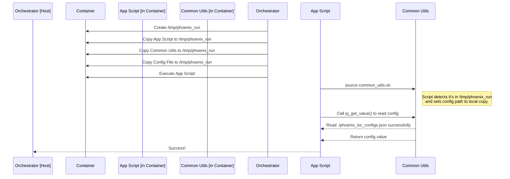

This document outlines the architecture, state machine, configuration, and usage of the `phoenix_orchestrator.sh` script, the cornerstone of the Phoenix Hypervisor project's container provisioning system.

## Overview

The `phoenix_orchestrator.sh` script is the cornerstone of the Phoenix Hypervisor project's virtualization provisioning system. It is designed to be a robust, idempotent, and user-friendly tool for creating and configuring both LXC containers and Virtual Machines (VMs) based on declarative JSON configurations. This document outlines its architecture, state machine, configuration, and usage.

## Core Architecture

The orchestrator is built around a state machine and a feature-based customization model. This ensures container provisioning is resumable, predictable, and highly modular.

### Key Components:

-   **State Machine:** The script progresses a container through a series of states: `defined` -> `created` -> `configured` -> `running` -> `customizing` -> `completed`. This ensures that each step of the provisioning process is completed successfully before moving to the next.
-   **Configuration-Driven:** All container specifications are defined in a central JSON file (`phoenix_lxc_configs.json`). This declarative approach separates the "what" from the "how," making the system easier to manage and scale.
-   **Feature-Based Customization:** After a container is running, the orchestrator applies a series of modular "feature" scripts based on a `features` array in the configuration. This allows for a compositional approach to building containers.
-   **Application Runner:** For containers that run persistent services, an optional `application_script` can be defined. This script is executed after all features are applied to launch the final application.
-   **Health Checks:** The orchestrator can perform health checks on services after they are started. This ensures that the service is running and accessible before the provisioning is marked as complete.
-   **Idempotency:** Rerunning the script for a container that is already fully provisioned will result in no changes.
-   **Logging:** Comprehensive logging provides a clear audit trail of the script's execution.
-   **Dry-Run Mode:** A `--dry-run` flag allows for safe validation of the configuration and script logic without making any actual changes to the system.

### Application Script Execution Model: Contextual Configuration

To provide a consistent, reliable, and sandboxed environment for application scripts, the orchestrator follows a "Contextual Configuration" model. This model ensures that scripts running inside a container have access to necessary configurations without requiring them to be permanently installed in the container image.

The process is as follows:

1.  **Staging:** A temporary directory is created inside the container (`/tmp/phoenix_run`).
2.  **Artifact Deployment:** The orchestrator copies all necessary files for the script's execution from the host into this temporary directory. This includes:
    *   The application script itself (e.g., `phoenix_hypervisor_lxc_951.sh`).
    *   The shared `phoenix_hypervisor_common_utils.sh` script.
    *   The relevant configuration file, `phoenix_lxc_configs.json`.
3.  **Execution:** The application script is made executable and then run from within the container.
4.  **Context-Aware Configuration:** The `phoenix_hypervisor_common_utils.sh` script is designed to be context-aware. It detects that it is running from `/tmp/phoenix_run` and automatically sets its `LXC_CONFIG_FILE` path to the local copy in that directory, rather than the absolute path used on the host.
5.  **Cleanup:** After the script finishes, the temporary directory and all its contents are removed from the container, leaving the container's filesystem clean.

This model guarantees that application scripts are self-contained and portable, with their dependencies explicitly provided at runtime.



## Dual-Mode Operation

The orchestrator now operates in two primary modes:

-   **Hypervisor Setup (`--setup-hypervisor`)**: This mode is responsible for the initial configuration of the Proxmox host itself. It reads its configuration from `hypervisor_config.json` and executes a series of modular scripts to set up storage, networking, users, and other system-level features.
-   **LXC/VM Provisioning**: This mode of operation focuses on creating and configuring both LXC containers and Virtual Machines based on definitions in `phoenix_lxc_configs.json` and `phoenix_hypervisor_config.json` respectively.

This unified approach allows the `phoenix_orchestrator.sh` script to be the single entry point for the entire lifecycle of the hypervisor and its containers.

## The State Machine

The state of each container is stored in `/var/lib/phoenix_hypervisor/state/<CTID>.state`. The script transitions the container through the following states:

1.  **`defined`**: The initial state. The container is defined in the configuration but does not yet exist. The orchestrator will either create or clone the container.
2.  **`created`**: The container exists but is not yet configured. The orchestrator will apply settings like memory, CPU, and network.
3.  **`configured`**: The container is configured but not running. The orchestrator will start the container.
4.  **`running`**: The container is running. The orchestrator will proceed to the customization phase.
5.  **`customizing`**: The orchestrator executes all feature scripts defined in the container's `features` array.
6.  **`completed`**: The final state. All features and application scripts have been executed.

## Configuration File Format

The orchestrator relies on the `phoenix_lxc_configs.json` file for all container definitions.

```json
{
  "lxc_configs": {
    "950": {
      "name": "vllmQwen3Coder",
      "clone_from_ctid": "920",
      "memory_mb": 40960,
      "cores": 8,
      "features": [
        "base_setup",
        "nvidia",
        "docker",
        "vllm"
      ],
      "application_script": "phoenix_hypervisor_lxc_950.sh"
    }
  }
}
```

## How to Use the Script

### Hypervisor Setup

To perform the initial, idempotent setup of the hypervisor, use the `--setup-hypervisor` flag. The script will read its configuration from `etc/hypervisor_config.json` and apply all system-level settings.

```bash
./phoenix_orchestrator.sh --setup-hypervisor
```

### LXC Container and Virtual Machine Provisioning

To provision a container, simply run the script with the container's ID (CTID) as an argument:

```bash
./phoenix_orchestrator.sh 950
```

### Dry-Run Mode

To see what actions the script *would* take without actually executing them, use the `--dry-run` flag:

```bash
./phoenix_orchestrator.sh 950 --dry-run
```

### Logging

All actions are logged to `/var/log/phoenix_hypervisor/orchestrator_YYYYMMDD.log`.
