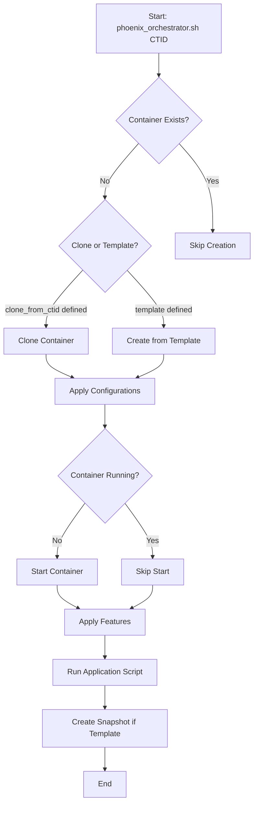

## 1. Executive Summary

This document outlines the new, unified architectural strategy for the Phoenix Hypervisor project. It addresses the root cause of persistent `idmap` generation failures and defines a clear, professional-grade approach to users, permissions, and file access across the entire platform.

## 2. Core Architecture

The Phoenix Hypervisor project is a sophisticated, automated system for provisioning Proxmox LXC containers and Virtual Machines (VMs). It leverages a combination of shell scripts and JSON configuration files to create a stateless, idempotent, and highly customizable deployment pipeline.

### 2.1. Key Features

*   **Stateless Orchestration**: The `phoenix_orchestrator.sh` script is designed to be stateless and idempotent, ensuring resilient and repeatable deployments.
*   **Hierarchical Templates and Cloning**: A multi-layered templating strategy minimizes duplication and ensures a consistent foundation for all virtualized environments.
*   **Modular Feature Installation**: A modular design allows for easy addition and modification of features like Docker, NVIDIA drivers, and vLLM.
*   **Centralized Configuration**: All container definitions and global settings are managed in well-structured JSON files, providing a single source of truth.
*   **Container-Native Execution**: Application scripts are executed using container-native commands, enhancing portability and reducing host dependencies.
*   **Dynamic NGINX Configuration**: The NGINX gateway configuration is generated dynamically, ensuring it remains in sync with container configurations.

### 2.2. `idmap` Root Cause and Resolution

The root cause of the `idmap` generation failure was an overly restrictive AppArmor profile that prevented unprivileged containers from performing necessary `mount` operations during startup. The resolution involves modifying the AppArmor profile to allow these operations, using the `lxc-default-with-mounting` profile as a base.

### 2.3. Unified User and Permissions Strategy

*   **Host Users**: A single, non-root user (`phoenix_admin`) with sudo privileges is responsible for all administrative tasks.
*   **Container Users**: All unprivileged containers run as the `root` user inside the container, mapped to a high-UID user on the host via `idmap`.
*   **Shared Volume Ownership**: All shared volumes are owned by the `phoenix_admin` user on the host, with `idmap` ensuring the container's `root` user has the necessary permissions.

## 3. Orchestration Model

The `phoenix_orchestrator.sh` script is the cornerstone of the provisioning system, operating as a state machine to guide containers through a series of states: `defined` -> `created` -> `configured` -> `running` -> `customizing` -> `completed`.

### 3.1. Dual-Mode Operation

The orchestrator operates in two primary modes:

*   **Hypervisor Setup (`--setup-hypervisor`)**: Configures the Proxmox host itself, including storage, networking, and users.
*   **LXC/VM Provisioning**: Creates and configures LXC containers and VMs based on JSON definitions.

### 3.2. Application Script Execution Model

A "Contextual Configuration" model is used to provide a sandboxed environment for application scripts. Necessary artifacts are staged in a temporary directory inside the container, executed, and then cleaned up, ensuring scripts are self-contained and portable.

## 4. Flow Diagrams

### 4.1. Container Creation/Cloning Workflow



### 4.2. Hypervisor Setup Workflow

```mermaid
graph TD
    A[Start: phoenix_orchestrator.sh --setup-hypervisor] --> B{Load hypervisor_config.json};
    B --> C[Execute hypervisor_initial_setup.sh];
    C --> D[Iterate through enabled features];
    D --> E{Feature Script Exists?};
    E -- Yes --> F[Execute Feature Script e.g., setup_zfs.sh (config passed)];
    E -- No --> G[Log Fatal Error];
    F --> D;
    G --> H[Stop Execution];
    D -- All features processed --> I[End];
```

## 5. Script Roles

### 5.1. `/usr/local/phoenix_hypervisor/bin` Directory

*   **`phoenix_orchestrator.sh`**: The unified main entry point for hypervisor setup and container provisioning.
*   **`phoenix_hypervisor_common_utils.sh`**: A library of shared functions for logging, error handling, and system interaction.

### 5.2. `/usr/local/phoenix_hypervisor/bin/hypervisor_setup` Directory

*   Scripts for the initial setup of the hypervisor, including user creation, NVIDIA driver installation, and ZFS/NFS/Samba configuration.

### 5.3. `/usr/local/phoenix_hypervisor/bin/lxc_setup` Directory

*   Feature scripts for OS configuration, Docker, NVIDIA drivers, and vLLM installation within containers.
*   Application scripts for managing services like vLLM and Qdrant.

## 6. Recommendations for Future Enhancements

*   **Dynamic IP Address Management**: Integrate with a DHCP server or IPAM tool to dynamically assign IP addresses.
*   **Secret Management**: Integrate with a solution like HashiCorp Vault to manage sensitive information.
*   **Advanced Configuration Validation**: Add a validation step to the orchestrator to catch logical errors in configurations.
*   **Expanded Feature Library**: Develop a library of pre-built feature scripts for common applications to accelerate deployment.