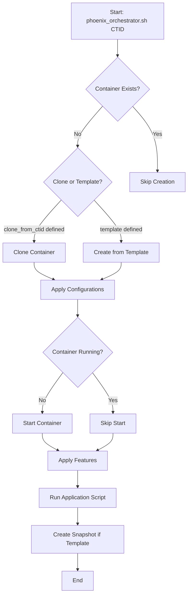
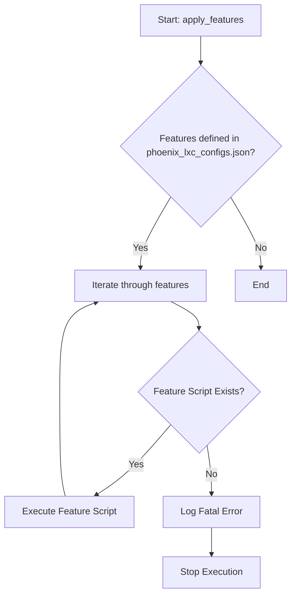

This document provides an architectural summary of the Phoenix Hypervisor project, a sophisticated, automated system for provisioning Proxmox LXC containers and Virtual Machines (VMs). It leverages a combination of shell scripts and JSON configuration files to create a stateless, idempotent, and highly customizable deployment pipeline.

## 1. Architecture Analysis and Explanation

The Phoenix Hypervisor project is a sophisticated, automated system for provisioning Proxmox LXC containers and Virtual Machines (VMs). It leverages a combination of shell scripts and JSON configuration files to create a stateless, idempotent, and highly customizable deployment pipeline.

### End-to-End Provisioning Process

The process begins with the execution of the `phoenix_orchestrator.sh` script, which takes a Container ID (CTID) or VM ID (VMID) as its primary argument. The orchestrator then follows a well-defined, stateless workflow for both LXC containers and Virtual Machines:

1.  **Configuration Loading**: The orchestrator reads the global settings from `phoenix_hypervisor_config.json` and the specific container definitions from `phoenix_lxc_configs.json`.
2.  **Container Creation/Cloning**: If the container does not already exist, it is either created from a template or cloned from an existing container, based on the `clone_from_ctid` property in its configuration.
3.  **Configuration Application**: The orchestrator applies the specific hardware and network configurations defined in the JSON file, such as memory, CPU cores, and IP address.
4.  **Container Start-Up**: The container is started, with built-in retry logic to handle transient start-up issues.
5.  **Feature Installation**: A series of feature-installation scripts are executed in the order they are defined in the container's `features` array. These scripts are designed to be idempotent, meaning they can be run multiple times without causing unintended side effects.
6.  **Application Script Execution**: If an `application_script` is defined, it is executed to perform final, container-specific customizations.
7.  **Snapshot Creation**: If the container is designated as a template (i.e., it has a `template_snapshot_name` defined), a snapshot is created to be used as a cloning source for other containers.

The expected outcome of this process is a fully configured, ready-to-use LXC container or Virtual Machine (VM) with all the necessary software and settings installed, all without manual intervention.

## 2. Key Features

*   **Stateless Orchestration**: The `phoenix_orchestrator.sh` script is designed to be stateless and idempotent. It checks the current state of the system at each step and only performs the actions necessary to bring the container to the desired state. This makes the system resilient to failures and allows for safe, repeatable deployments.
*   **Hierarchical Templates and Cloning**: The system employs a sophisticated, multi-layered templating strategy for both LXC containers and Virtual Machines (VMs). A base template is created from a standard OS image, and then subsequent templates are cloned from this base, with additional features layered on top (e.g., a GPU-enabled template, a Docker-enabled template). This hierarchical approach minimizes duplication of effort and ensures a consistent foundation for all virtualized environments.
*   **Modular Feature Installation**: The feature installation process is highly modular. Each feature (e.g., `base_setup`, `docker`, `nvidia`) is encapsulated in its own script. This separation of concerns makes it easy to add new features or modify existing ones without affecting the rest of the system.
*   **Centralized Configuration**: All container definitions and global settings are managed in a set of well-structured JSON files. This provides a single source of truth for the entire system and makes it easy to manage and version-control the infrastructure.
    *   **Note on Hardcoded Dependencies**: While the principle of centralized configuration is paramount, certain critical dependencies, such as NVIDIA driver versions, are intentionally hardcoded within configuration files like `phoenix_lxc_configs.json`. This design choice ensures platform-wide stability and consistency, preventing unintended variations that could arise from dynamic configuration of these specific elements.
*   **Container-Native Execution**: Application scripts are executed using container-native commands (`systemctl`, `docker`, etc.) rather than host-level `pct exec` commands. This approach enhances portability and reduces dependencies on the host environment.

## 3. Flow Diagrams

### Container Creation/Cloning Workflow



### Feature Application Process



### Hypervisor Setup Workflow

```mermaid
graph TD
    A[Start: phoenix_orchestrator.sh --setup-hypervisor] --> B{Load hypervisor_config.json};
    B --> C[Execute hypervisor_initial_setup.sh];
    C --> D[Iterate through enabled features];
    D --> E{Feature Script Exists?};
    E -- Yes --> F[Execute Feature Script e.g., setup_zfs.sh (config passed)];
    E -- No --> G[Log Fatal Error];
    F --> D;
    G --> H[Stop Execution];
    D -- All features processed --> I[End];
```

## 4. Script Roles

### `/bin` Directory

*   **`phoenix_orchestrator.sh`**: The unified main entry point for the system. It now orchestrates both the initial hypervisor setup and the entire container provisioning process.
*   **`phoenix_hypervisor_common_utils.sh`**: A library of shared functions for logging, error handling, and interacting with Proxmox (`pct`) and `jq`. It is sourced by all other scripts to ensure a consistent execution environment.

### `/bin/hypervisor_setup` Directory

*   **`hypervisor_initial_setup.sh`**: Performs the first-time setup of the hypervisor, including system updates and package installation.
*   **`hypervisor_feature_create_admin_user.sh`**: Creates a new administrative user with sudo privileges.
*   **`hypervisor_feature_install_nvidia.sh`**: Installs the NVIDIA driver on the Proxmox host.
*   **`hypervisor_feature_setup_nfs.sh`**: Configures NFS shares based on the central JSON configuration.
*   **`hypervisor_feature_setup_samba.sh`**: Configures Samba shares based on the central JSON configuration.
*   **`hypervisor_feature_setup_zfs.sh`**: Creates and configures ZFS pools and datasets based on the central JSON configuration.

### `/bin/lxc_setup` Directory

*   **`phoenix_hypervisor_feature_install_base_setup.sh`**: A feature script that performs the initial OS configuration for an LXC container.
*   **`phoenix_hypervisor_feature_install_docker.sh`**: A feature script that installs and configures Docker Engine within a container.
*   **`phoenix_hypervisor_feature_install_nvidia.sh`**: A feature script that configures GPU passthrough and installs the NVIDIA driver inside a container.
*   **`phoenix_hypervisor_feature_install_vllm.sh`**: A feature script that installs the vLLM inference server from source.
*   **`phoenix_hypervisor_lxc_950.sh`**: An application script that creates and manages a systemd service for the vLLM API server using container-native commands.
*   **`phoenix_hypervisor_lxc_952.sh`**: An application script that starts the Qdrant Docker container using container-native commands.

## 5. Observations and Recommendations

### Observations

*   The current architecture is robust, well-structured, and highly effective for its intended purpose.
*   The use of idempotency in all scripts is a key strength, making the system resilient and predictable.
*   The hierarchical templating model is a sophisticated and efficient way to manage container images.

### Recommendations for Future Enhancements

*   **Dynamic IP Address Management**: Currently, IP addresses are hardcoded in the `phoenix_lxc_configs.json` file. A future enhancement could involve integrating with a DHCP server or an IPAM (IP Address Management) tool to dynamically assign IP addresses.
*   **Secret Management**: The system could be enhanced by integrating with a secret management solution like HashiCorp Vault to manage sensitive information such as API tokens and credentials, rather than storing them in configuration files.
*   **Configuration Validation**: While the system uses JSON schemas for basic validation, a more advanced configuration validation step could be added to the orchestrator to catch logical errors in the configuration (e.g., assigning a GPU to a container that doesn't have the `nvidia` feature).
*   **Expanded Feature Library**: The modular design of the feature installation process makes it easy to add new features. A library of pre-built feature scripts for common applications (e.g., databases, web servers) could be developed to further accelerate the deployment process.
