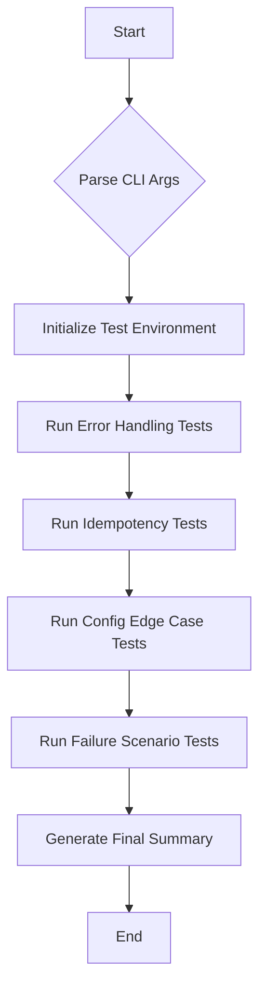

# Architectural and Implementation Plan: phoenix_hypervisor_qa.sh

This document outlines the design and implementation strategy for the `phoenix_hypervisor_qa.sh` script, a comprehensive test suite for the Phoenix Hypervisor setup scripts.

## 1. Overall Script Design

The `phoenix_hypervisor_qa.sh` script will be a modular, function-driven bash script designed for robust testing of the hypervisor setup process. It will leverage the existing `phoenix_hypervisor_common_utils.sh` for consistent logging and error handling.

### High-Level Structure

The script will be organized as follows:
1.  **Header and Configuration:** Script metadata, global variables, and sourcing of common utilities.
2.  **Command-line Interface:** Argument parsing for flags like `--verbose`, `--quiet`, and `--help`.
3.  **Core Test Runner:** A main loop that iterates through test categories and executes individual test functions.
4.  **Test Categories:** Functions that group and run related tests (e.g., `run_error_handling_tests`, `run_idempotency_tests`).
5.  **Test Case Functions:** Individual functions for each test case defined in `QA_TEST_PLAN.md`.
6.  **Reporting and Summary:** Functions to report pass/fail status and provide a final summary.

### Workflow

The script will execute the following workflow:

## 2. Integration Plan

The new QA script will be integrated into the existing `phoenix_orchestrator.sh` script via a new `--qa-check` command-line flag.

### `phoenix_orchestrator.sh` Modifications

1.  **Argument Parsing:** The `parse_arguments` function in `phoenix_orchestrator.sh` will be updated to recognize `--qa-check`.
2.  **Dispatch Logic:** The main logic will be updated to call `usr/local/phoenix_hypervisor/bin/tests/phoenix_hypervisor_qa.sh` when the `--qa-check` flag is present.

This approach ensures a clean separation of concerns, keeping the QA logic separate from the main orchestration workflow.

## 3. Test Case Implementation Strategy

Each test case from `QA_TEST_PLAN.md` will be implemented as a dedicated function in the QA script. The strategy will focus on modularity and minimizing overhead.

### Test Case Breakdown

| Test Case ID | Function Name | Implementation Strategy |
| :--- | :--- | :--- |
| **PFC-001** | `test_pfc_001_no_config` | Execute a setup script without the `--config` flag and assert the expected error message and exit code. |
| **PFC-002** | `test_pfc_002_non_existent_config` | Execute a setup script with a path to a non-existent config file and assert the expected error. |
| **ENV-001** | `test_env_001_non_root` | Use `sudo -u nobody` to run a setup script and verify it exits with a "run as root" error. |
| **TC-DEPS-003** | `test_tc_deps_003_missing_deps` | Temporarily rename a required command (e.g., `mv /usr/bin/jq /usr/bin/jq.bak`), run the relevant script, and assert it fails with a dependency error. Restore the command afterward. |
| **TC-IDEM-001** | `test_tc_idem_001_user_creation` | Run the user creation script twice. After the second run, check that no duplicate users were created. |
| **CFG-001** | `test_cfg_001_nvidia_disabled` | Use a modified config file with `nvidia_driver.install` set to `false`. Run the NVIDIA script and check the logs for a "skipping" message. |

### Overhead and Simplification

To maintain a lean approach, the following considerations will be made:
*   **Simulated Failures:** For tests involving command failures (e.g., `apt-get update`), we will use function overrides or temporary wrapper scripts to simulate non-zero exit codes rather than inducing actual system failures.
*   **Configuration Management:** A temporary directory with modified configuration files will be used for tests that require specific config states. This avoids modifying the main configuration files.
*   **Excluded Tests:** Function-level failure scenario tests (Section 4 of `QA_TEST_PLAN.md`) are high-overhead as they require modifying the setup scripts themselves. These are better suited for unit tests and will be **excluded** from this integration test suite to maintain simplicity.

## 4. Error Handling and Logging

The script will adopt the logging conventions from `phoenix_hypervisor_common_utils.sh` and enhance them for test reporting.

### Logging Strategy

*   **Color-Coded Output:** `STDOUT` will feature color-coded `[ PASS ]` and `[ FAIL ]` messages for immediate visual feedback.
*   **Verbose Mode:** A `--verbose` flag will enable detailed logging, showing the commands being executed and their output.
*   **Log File:** All output will be logged to `/var/log/phoenix_hypervisor/qa_tests_$(date +%Y%m%d).log` for later analysis.
*   **Non-Terminating Errors:** The script will not terminate on a single test failure. It will log the failure and continue with the remaining tests.

### Final Summary

At the end of the execution, a summary will be printed to the console and log file, showing the total number of tests run, passed, and failed. The script will exit with a non-zero status code if any tests have failed.

## 5. Command-line Interface

The script will support the following command-line options:

| Option | Description |
| :--- | :--- |
| `--verbose` | Enable verbose output, showing all commands and their results. |
| `--quiet` | Suppress all output except for the final summary. |
| `--help` | Display a help message with usage instructions. |
| `--test <test_id>` | Run a specific test case by its ID (e.g., `PFC-001`). |

This provides flexibility for both automated and manual test execution.