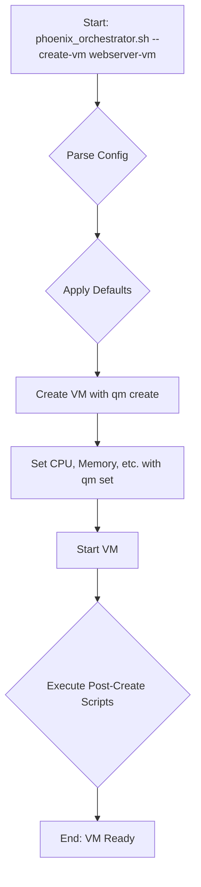

# VM Creation Design for phoenix_orchestrator.sh

## 1. Overview

This document outlines the design for enhancing the `phoenix_orchestrator.sh` script to support the creation and management of virtual machines (VMs). This design is tailored for general-purpose server VMs, such as a web server, based on user feedback.

## 2. `phoenix_orchestrator.sh` Enhancements

### 2.1. New Command-Line Arguments

The orchestrator script will be updated to accept the following new arguments:

-   `--create-vm <vm_name>`: Creates a new VM based on a definition in the configuration file.
-   `--start-vm <vm_id>`: Starts an existing VM.
-   `--stop-vm <vm_id>`: Stops an existing VM.
-   `--delete-vm <vm_id>`: Deletes an existing VM.

## 3. `phoenix_hypervisor_config.json` Modifications

A new `vms` section will be added to the `phoenix_hypervisor_config.json` file to define VM configurations. A `vm_defaults` section will also be added to provide default values for VM creation.

### 3.1. New `vm_defaults` Section

This section will provide default settings for VMs, which can be overridden by individual VM configurations.

```json
"vm_defaults": {
    "template": "ubuntu-24.04-standard",
    "cores": 4,
    "memory_mb": 8192,
    "disk_size_gb": 100,
    "storage_pool": "local-lvm",
    "network_bridge": "vmbr0"
}
```

### 3.2. New `vms` Section

This section will contain an array of VM objects, each defining a specific VM to be created.

```json
"vms": [
    {
        "name": "webserver-vm",
        "cores": 4,
        "memory_mb": 8192,
        "disk_size_gb": 100,
        "post_create_scripts": [
            "install_webserver.sh"
        ]
    }
]
```

## 4. VM Creation Workflow

The `--create-vm` command will trigger the following sequence of operations:

1.  **Parse Configuration**: Read the `phoenix_hypervisor_config.json` file and locate the specified VM definition.
2.  **Apply Defaults**: Merge the `vm_defaults` with the specific VM configuration.
3.  **Create VM**: Execute a series of `qm` commands to create and configure the VM.
4.  **Post-Creation Setup**: Execute any specified post-creation scripts inside the VM to install software and apply configurations.

### 4.1. Mermaid Diagram of the Workflow



### 4.2. Example `qm` Command Sequence

```bash
# Create the VM from a template
qm create 9002 --name webserver-vm --memory 8192 --cores 4 --net0 virtio,bridge=vmbr0

# Set the disk size
qm resize 9002 scsi0 100G

# Set boot order
qm set 9002 --boot order=scsi0

# Start the VM
qm start 9002
```

## 5. Schema Updates

The `phoenix_hypervisor_config.schema.json` file will be updated to include definitions for the new `vm_defaults` and `vms` sections to ensure proper validation.
