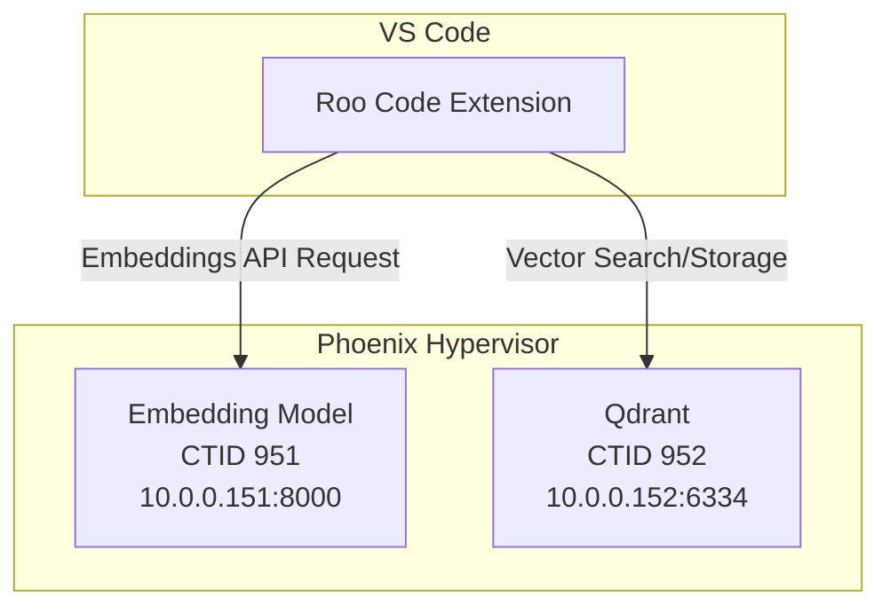

# Roo Code Integration Guide

This document provides the necessary configuration settings to integrate the Roo Code extension in VS Code with your self-hosted embedding model and Qdrant vector database.

## Configuration Settings

The following table contains the values you should use in the Roo Code extension settings:

| Setting                 | Value                                         |
| ----------------------- | --------------------------------------------- |
| **Embedder Provider**   | `OpenAI Compatable`                           |
| **Base URL**            | `http://10.0.0.151:8000/v1`                   |
| **API Key**             | *(leave blank)*                               |
| **Model**               | `ibm-granite/granite-embedding-english-r2`    |
| **Model Dimension**     | `768`                                         |
| **Qdrant URL**          | `http://10.0.0.152:6334`                      |
| **Qdrant API Key**      | *(leave blank)*                               |

## Architecture Diagram

The following diagram illustrates the architecture of the integration:

## Advanced Configuration

Based on your initial request, here are some suggested values for the advanced configuration:

*   **Search Score Threshold:** `0.40`
*   **Maximum Search Results:** `50`

These values can be adjusted based on your specific needs and the performance of the system.