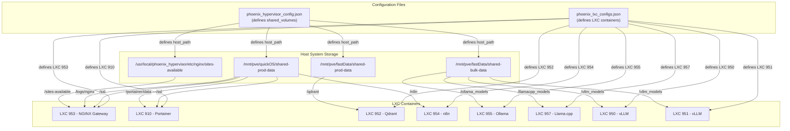
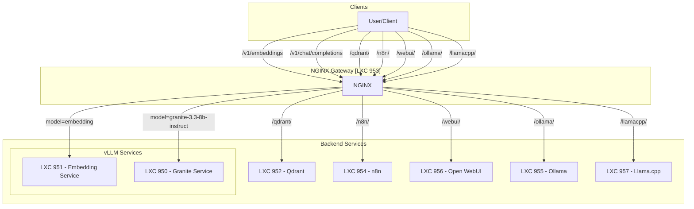

# System Architecture Overview: Shared Storage and NGINX Gateway

This document provides a high-level overview of the shared storage strategy and the NGINX gateway configuration for the Phoenix Hypervisor system.

## Shared Storage Summary

The shared storage strategy is designed to provide centralized, persistent storage for various services running in LXC containers. This approach simplifies data management, reduces data duplication, and ensures data availability across container restarts and migrations. The configuration is driven by `phoenix_hypervisor_config.json`, which defines the shared volumes, and `phoenix_lxc_configs.json`, which defines the LXC containers that use them.

The following shared volumes are configured:

*   **`ssl_certs`**:
    *   **Purpose**: Provides a centralized location for SSL certificates.
    *   **LXCs**: `953` (NGINX Gateway), `910` (Portainer)
    *   **Use Case**: The `ssl_certs` volume ensures that all services requiring SSL encryption can access the same certificates, simplifying certificate management and renewal.

*   **`portainer_data`**:
    *   **Purpose**: Stores persistent data for the Portainer container management UI.
    *   **LXCs**: `910` (Portainer)
    *   **Use Case**: This volume ensures that Portainer's configuration, user data, and container information are preserved across restarts.

*   **`nginx_sites`**:
    *   **Purpose**: Stores the NGINX site configurations.
    *   **LXCs**: `953` (NGINX Gateway)
    *   **Use Case**: This volume allows for easy management and updates of NGINX configurations from the host system without needing to access the container directly.

*   **`nginx_logs`**:
    *   **Purpose**: Centralizes NGINX access and error logs.
    *   **LXCs**: `953` (NGINX Gateway)
    *   **Use Case**: Storing logs on a shared volume simplifies log aggregation, analysis, and rotation.

*   **`qdrant_data`**:
    *   **Purpose**: Provides persistent storage for the Qdrant vector database.
    *   **LXCs**: `952` (Qdrant)
    *   **Use Case**: The `qdrant_data` volume ensures that the vector embeddings and collections managed by Qdrant are durable and not lost if the container is recreated.

*   **`n8n_data`**:
    *   **Purpose**: Stores persistent data for the n8n automation platform.
    *   **LXCs**: `954` (n8n)
    *   **Use Case**: This volume preserves n8n workflows, credentials, and execution data.

*   **`ollama_models`**:
    *   **Purpose**: Provides a centralized location for Ollama models.
    *   **LXCs**: `955` (Ollama)
    *   **Use Case**: The `ollama_models` volume allows the Ollama container to access a shared repository of models, saving disk space and simplifying model management.

*   **`llamacpp_models`**:
    *   **Purpose**: Provides a centralized location for Llama.cpp models.
    *   **LXCs**: `957` (Llama.cpp)
    *   **Use Case**: Similar to the other model volumes, this allows for efficient storage and access to models for the Llama.cpp service.

*   **`vllm_models`**:
    *   **Purpose**: Provides a centralized location for Hugging Face models used by vLLM.
    *   **LXCs**: `950` (vLLM), `951` (vLLM)
    *   **Use Case**: The `vllm_models` volume allows multiple vLLM containers to access the same models without duplication, saving significant disk space and simplifying model management.

## NGINX Gateway Summary

The NGINX gateway serves as a central reverse proxy, providing a single entry point for accessing various backend services. This simplifies service discovery, centralizes access control, and provides a unified API for clients.

The following service endpoints are configured:

*   **`/v1/chat/completions`**, **`/v1/completions`**, **`/v1/embeddings`**:
    *   **Service**: vLLM and other language model services.
    *   **Routing**: The gateway dynamically routes requests to the appropriate backend service based on the `model` name in the request body. This is achieved using a JavaScript function (`http.get_model`) and a `map` directive.
    *   **Use Case**: These endpoints provide a standard OpenAI-compatible API for interacting with various language models, abstracting the underlying service implementation from the client.

*   **`/qdrant/`**:
    *   **Service**: Qdrant vector database.
    *   **Routing**: Requests are forwarded to the `qdrant_service` upstream.
    *   **Use Case**: The `/qdrant/` endpoint exposes the Qdrant API, allowing clients to store and query vector embeddings.

*   **`/n8n/`**:
    *   **Service**: n8n automation platform.
    *   **Routing**: Requests are forwarded to the `n8n_service` upstream.
    *   **Use Case**: The `/n8n/` endpoint exposes the n8n UI and API, allowing users to build and manage workflows through a single, consistent gateway address.

*   **`/webui/`**:
    *   **Service**: Open WebUI for language models.
    *   **Routing**: Requests are forwarded to the `open_webui_service` upstream, with support for WebSocket connections.
    *   **Use Case**: This endpoint provides access to a user-friendly web interface for interacting with language models.

*   **`/ollama/`**:
    *   **Service**: Ollama model service.
    *   **Routing**: Requests are forwarded to the `ollama_service` upstream.
    *   **Use Case**: This endpoint exposes the Ollama API, allowing clients to interact with models managed by Ollama.

*   **`/llamacpp/`**:
    *   **Service**: Llama.cpp model service.
    *   **Routing**: Requests are forwarded to the `llamacpp_service` upstream.
    *   **Use Case**: This endpoint exposes the Llama.cpp API, providing another option for running and interacting with language models.