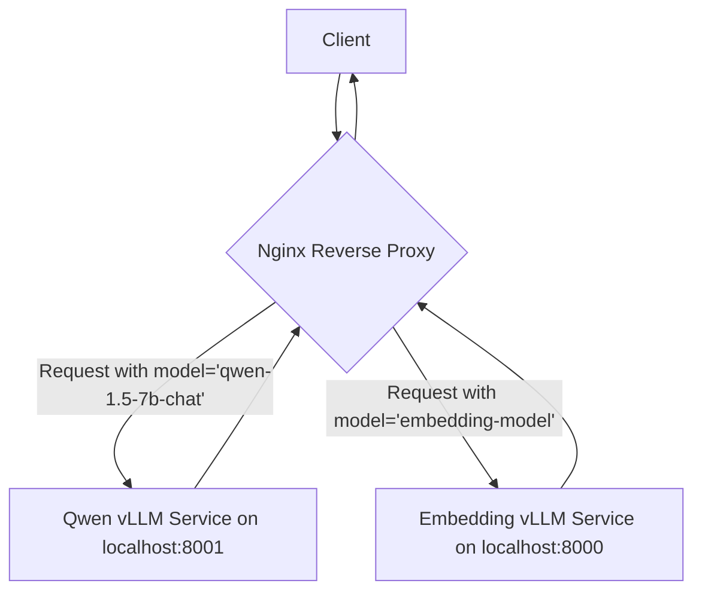

# Strategic Plan: Integrating vLLM Qwen Model with Nginx

This document outlines the strategy for integrating a new vLLM Qwen model into an existing Nginx setup that serves a vLLM embedding model.

## 1. Recommended Nginx Configuration Strategy

Nginx will be configured as a reverse proxy and a smart router, directing incoming API requests to the appropriate backend vLLM service. The routing logic will be based on the `model` field within the JSON payload of the request.

### Request Body Inspection

To route requests dynamically, Nginx must inspect the request body to extract the model name. Since Nginx does not natively parse JSON, we will use the `njs` module (Nginx's native JavaScript scripting language) to achieve this. This approach is efficient and avoids the need for external services or more complex Lua scripting.

The `js_set` directive will be used to define a JavaScript function that extracts the `model` field from the request body. This value is then assigned to an Nginx variable (e.g., `$model_name`).

### Nginx Configuration Example

Below is a conceptual Nginx configuration snippet demonstrating this strategy. This would typically be placed within the `http` block of your `nginx.conf` or a site-specific configuration file.

```nginx
# /etc/nginx/nginx.conf

# Define a javascript function to extract the model from the JSON body.
js_set $model_name http.get_model;

# Define upstream servers for each vLLM model.
upstream embedding_service {
    server 127.0.0.1:8000;
}

upstream qwen_service {
    server 127.0.0.1:8001;
}

# Map the model name to the correct upstream service.
map $model_name $target_upstream {
    default embedding_service; # Default to the embedding model for safety
    "qwen-1.5-7b-chat" qwen_service;
    "text-embedding-ada-002" embedding_service; # Explicitly map embedding model
}

server {
    listen 80;
    server_name api.yourdomain.com;

    # Common proxy settings to avoid repetition
    proxy_set_header Host $host;
    proxy_set_header X-Real-IP $remote_addr;
    proxy_set_header X-Forwarded-For $proxy_add_x_forwarded_for;
    proxy_set_header X-Forwarded-Proto $scheme;

    location /v1/chat/completions {
        # This location is for chat models
        proxy_pass http://$target_upstream;
    }

    location /v1/embeddings {
        # This location is for embedding models
        proxy_pass http://$target_upstream;
    }
}
```

### Nginx JavaScript (`njs`) Code

The corresponding JavaScript code (`http.js`) for the `js_set` directive would be:

```javascript
// /etc/nginx/scripts/http.js

function get_model(r) {
    try {
        if (r.requestBuffer) {
            const body = JSON.parse(r.requestBuffer);
            return body.model || '';
        }
    } catch (e) {
        r.error(`Error parsing JSON: ${e}`);
    }
    return '';
}

export default { get_model };
```

This setup provides a scalable and maintainable way to route requests to different models based on the client's request.

## 2. Backend vLLM Service Architecture

The recommended architecture is to run each vLLM model as a separate, independent service. Each service will listen on a unique internal port, ensuring clear separation and avoiding port conflicts.

*   **Embedding Model Service:** `localhost:8000`
*   **Qwen Model Service:** `localhost:8001`

This approach offers several key advantages:

*   **Isolation:** Each model runs in its own process, preventing a failure in one service from impacting the other.
*   **Independent Scalability:** Resources (CPU, GPU, memory) can be allocated to each service based on its specific needs. If the Qwen model requires more resources, it can be scaled independently of the embedding model.
*   **Simplified Maintenance:** Models can be updated, restarted, or taken offline for maintenance individually without affecting the availability of other models.
*   **Flexibility:** This architecture makes it straightforward to add new models in the future by simply launching a new service on a new port and updating the Nginx configuration.

### System Architecture Diagram

The following diagram illustrates the request flow from the client to the backend services through Nginx.



## 3. API Contract and Client Interaction

To ensure maximum compatibility with existing tools, libraries, and ecosystems, the API contract will adhere strictly to the OpenAI API specification. This means using distinct endpoints for different API functionalities, such as chat completions and embeddings.

### OpenAI-Compatible Endpoints

We will expose two primary, standardized endpoints:

*   **/v1/chat/completions:** For generating text completions with chat models.
*   **/v1/embeddings:** For creating vector embeddings from text inputs.

This separation is critical for drop-in compatibility with clients like the official OpenAI Python library, LangChain, LlamaIndex, and others that are hardcoded to use these specific endpoints for their respective functions.

### Client Request Payloads

Clients must specify the desired model in the `model` field of the JSON request body. Nginx will use this field to route the request to the correct backend service.

**Example Request for the Qwen Chat Model:**
*   **Endpoint:** `POST /v1/chat/completions`
*   **Body:**
    ```json
    {
      "model": "qwen-1.5-7b-chat",
      "messages": [
        {
          "role": "user",
          "content": "Explain the importance of a well-defined API contract."
        }
      ]
    }
    ```

**Example Request for an Embedding Model:**
*   **Endpoint:** `POST /v1/embeddings`
*   **Body:**
    ```json
    {
      "model": "text-embedding-ada-002", // Or your specific embedding model name
      "input": "A well-defined API contract is crucial for system interoperability."
    }
    ```

By adopting this standard-compliant approach, we ensure that the service is immediately usable by a wide range of existing applications and developer tools, significantly reducing integration friction.

## 4. Key Operational Considerations

### 4.1. Scalability

The proposed architecture is inherently scalable. To add a new model in the future, the process is simple:

1.  **Deploy the Model:** Launch the new vLLM model as a new service on a dedicated internal port (e.g., `localhost:8002`).
2.  **Update Nginx:**
    *   Add a new `upstream` block for the new service.
    *   Add an entry to the `map` directive to link the new model name to its upstream service.
3.  **Reload Nginx:** Apply the changes with a graceful reload (`nginx -s reload`).

This design requires zero downtime and minimal configuration changes to expand the portfolio of supported models.

### 4.2. Health Checks

To ensure service reliability, Nginx should be configured to perform health checks on the backend vLLM services. This prevents traffic from being routed to an unresponsive or failing service.

*   **Active Health Checks:** The `health_check` directive (available in Nginx Plus or as a third-party module) can be used to periodically send requests to a health endpoint on each vLLM service (e.g., `/health`). If a service fails the health check, Nginx will temporarily remove it from the load-balancing pool.
*   **Passive Health Checks:** The `proxy_next_upstream` directive can be configured to automatically retry a request with another server in the upstream group if the initial server returns an error or times out.

### 4.3. Logging and Monitoring

Effective logging is crucial for monitoring the performance and usage of each model. Nginx's logging capabilities can be customized to capture relevant information.

*   **Custom Log Format:** Define a custom log format that includes the `$model_name` and `$target_upstream` variables. This will allow you to easily distinguish logs for each model.

    ```nginx
    log_format vllm_logs '$remote_addr - $remote_user [$time_local] "$request" '
                         '$status $body_bytes_sent "$http_referer" '
                         '"$http_user_agent" "$http_x_forwarded_for" '
                         'model:"$model_name" upstream:"$target_upstream"';
    access_log /var/log/nginx/vllm_access.log vllm_logs;
    ```

*   **Monitoring:** The structured logs can be ingested into a monitoring platform (e.g., Prometheus, Grafana, ELK stack) to create dashboards that visualize:
    *   Request counts per model.
    *   Average latency per model.
    *   Error rates per model.
    *   Usage patterns over time.

### 4.4. Security

Security is a primary consideration. The following best practices should be implemented:

*   **No Direct Exposure:** The vLLM services should only be accessible from the Nginx proxy. They should not be exposed directly to the public internet. This can be achieved by binding the services to `localhost` or using firewall rules to restrict access to the Nginx server's IP address.
*   **TLS Termination:** Nginx should handle all TLS/SSL termination. This centralizes certificate management and encrypts traffic between the client and the proxy.
*   **Rate Limiting:** Implement rate limiting in Nginx to protect the backend services from abuse and denial-of-service attacks.
*   **Authentication:** If required, authentication (e.g., API key validation) should be handled at the Nginx layer, preventing unauthenticated requests from reaching the backend services.