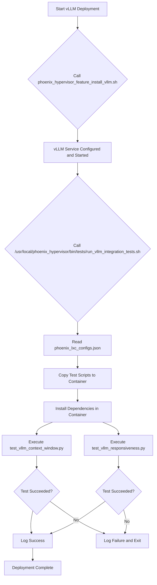

# vLLM Integration Testing Guide

## 1. Overview

This document outlines the automated integration testing framework for vLLM containers within the Phoenix Hypervisor environment. The framework is designed to verify the correctness and performance of vLLM deployments automatically after their installation.

The primary goal of this system is to ensure that every vLLM container is fully functional and meets performance expectations before it is put into service.

## 2. Architecture

The testing framework consists of three main components:

*   **Python Test Scripts:** Located in `/usr/local/phoenix_hypervisor/bin/tests/`, these scripts perform the actual tests against the vLLM API.
    *   `test_vllm_context_window.py`: Verifies that the model can handle its advertised context window size.
    *   `test_vllm_responsiveness.py`: Measures the API's response latency to ensure it meets performance standards.
*   **Orchestration Script:** The `/usr/local/phoenix_hypervisor/bin/tests/run_vllm_integration_tests.sh` script manages the entire testing process. It reads the container's configuration, copies the test scripts into the container, installs dependencies, and executes the tests.
*   **Integration Point:** The orchestration script is integrated into the vLLM deployment workflow via the `/usr/local/phoenix_hypervisor/bin/lxc_setup/phoenix_hypervisor_feature_install_vllm.sh` script.

## 3. Control Flow

The testing process is triggered automatically at the end of a successful vLLM installation. The control flow is as follows:

1.  The `phoenix_hypervisor_feature_install_vllm.sh` script completes the vLLM installation and configuration.
2.  It then calls the `run_vllm_integration_tests.sh` script, passing the container ID.
3.  The orchestration script reads the `vllm_served_model_name` and `vllm_max_model_len` from `phoenix_lxc_configs.json`.
4.  The Python test scripts are copied into the container's `/tmp/` directory.
5.  The `python3-openai` package is installed in the container.
6.  The Python scripts are executed with the parameters read from the configuration file.
7.  If any test fails, the orchestration script exits with a non-zero status code, signaling a failure in the deployment process.

## 4. Usage

This testing framework is fully automated and requires no manual intervention. The results of the tests will be logged to the main orchestrator log file. If a deployment fails, the logs will contain the output from the failed test, which can be used for troubleshooting.