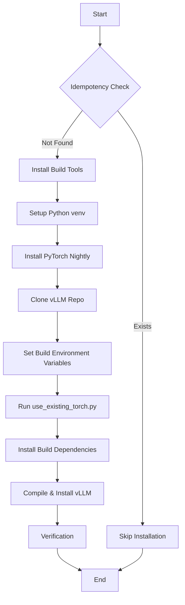

# Detailed Implementation Plan: vLLM Blackwell Upgrade

**Author:** Roo
**Version:** 1.0

## 1. Objective

This document provides a detailed, step-by-step technical plan for modifying the `phoenix_hypervisor_feature_install_vllm.sh` script to support NVIDIA Blackwell GPUs by implementing a build-from-source installation process for vLLM.

## 2. Target Script

*   `usr/local/phoenix_hypervisor/bin/lxc_setup/phoenix_hypervisor_feature_install_vllm.sh`

## 3. High-Level Logic Flow

The core logic of the `install_and_test_vllm` function within the target script will be replaced. The new flow will be as follows:

## 4. Detailed Step-by-Step Implementation

The following changes will be made to the `install_and_test_vllm` function in the target script.

### Step 1: Modify Dependency Installation

The existing `apt-get install` command is already robust. We will ensure `git` and `cmake` are explicitly included, as they are essential for the build process.

*   **Action:** Modify the `apt-get install` line to ensure `git` and `cmake` are present.
*   **Current:** `pct_exec "$CTID" -- apt-get install -y python3.11-full ...`
*   **Proposed:** `pct_exec "$CTID" -- apt-get install -y python3.11-full ... git cmake`

### Step 2: Update PyTorch Installation

We will change the PyTorch index URL from `/test/` to `/nightly/` to align with the research findings.

*   **Action:** Update the `pip install torch` command.
*   **Current:** `pct_exec "$CTID" -- "${vllm_dir}/bin/pip" install --pre torch ... --index-url https://download.pytorch.org/whl/test/cu128`
*   **Proposed:** `pct_exec "$CTID" -- "${vllm_dir}/bin/pip" install --pre torch ... --index-url https://download.pytorch.org/whl/nightly/cu128`

### Step 3: Replace vLLM Installation with Build-from-Source Logic

This is the core of the change. The existing `pip install --pre vllm` command will be removed and replaced with the following sequence of commands, all executed via `pct_exec "$CTID" -- /bin/bash -c "..."` to ensure they run within the same shell context inside the container.

1.  **Define Variables:**
    *   `vllm_repo_dir="/opt/vllm_repo"`
    *   `vllm_venv_dir="/opt/vllm"`
    *   `VLLM_COMMIT_HASH=""` (Initially empty to use `main`, will be populated in Phase 2)

2.  **Clone the vLLM Repository:**
    *   `git clone https://github.com/vllm-project/vllm.git "${vllm_repo_dir}"`
    *   If `VLLM_COMMIT_HASH` is not empty, add: `cd "${vllm_repo_dir}" && git checkout "${VLLM_COMMIT_HASH}"`

3.  **Set Build-Time Environment Variables:**
    *   `export TORCH_CUDA_ARCH_LIST="12.0"`
    *   `export VLLM_FLASH_ATTN_VERSION=2`
    *   `export MAX_JOBS=8`
    *   `export CMAKE_BUILD_PARALLEL_LEVEL=8`

4.  **Execute Dependency Alignment:**
    *   `cd "${vllm_repo_dir}"`
    *   `"${vllm_venv_dir}/bin/python" use_existing_torch.py`

5.  **Install Build Dependencies:**
    *   `"${vllm_venv_dir}/bin/pip" install -r "${vllm_repo_dir}/requirements/build.txt"`

6.  **Compile and Install vLLM:**
    *   `cd "${vllm_repo_dir}"`
    *   `"${vllm_venv_dir}/bin/pip" install --no-build-isolation -e .`

### Step 4: Update Verification Step

The verification step is already good, but we can enhance it to use the `vllm` command directly, which is a more direct test of a successful installation.

*   **Action:** Change the verification command.
*   **Current:** `pct_exec "$CTID" -- "${vllm_dir}/bin/python" -c "import vllm; print(vllm.__version__)"`
*   **Proposed:** `pct_exec "$CTID" -- "${vllm_dir}/bin/vllm" --version`

### Step 5: Remove Obsolete Commands

The section for "Dependency Harmonization" (`pip uninstall -y pynvml` and `pip install nvidia-ml-py`) will be removed, as the build-from-source process should handle this correctly.

## 5. Estimated Timing

*   The build process is the most time-consuming part. Based on the research, compiling vLLM can take anywhere from **15 to 45 minutes**, depending on the allocated CPU cores.
*   The rest of the script (dependency downloads, etc.) should take approximately **5-10 minutes**.
*   **Total Estimated Time:** 20-55 minutes per container creation. This is a significant increase from the current pre-compiled wheel installation, which is a trade-off for enabling cutting-edge hardware.

This detailed plan provides a clear blueprint for the required changes. It addresses all the specific, involved steps you were concerned about, from the exact commands to the estimated timing.