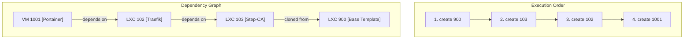

# Analysis of `phoenix create 1001` Execution Flow

This document details the successful, end-to-end creation process for VM 1001 (Portainer). The execution is orchestrated by the `phoenix-cli` script, which correctly resolves dependencies and dispatches tasks to the appropriate managers.

## 1. Command Invocation

The process is initiated with the command:
```bash
phoenix create 1001
```

## 2. Dependency Resolution (`phoenix-cli`)

The `phoenix-cli` script begins by building a dependency graph for the target, `1001`.

1.  **Initial Target**: `1001` (Portainer VM)
2.  **First-Level Dependency**: From `phoenix_vm_configs.json`, it identifies that `1001` depends on `102` (Traefik LXC).
3.  **Second-Level Dependency**: From `phoenix_lxc_configs.json`, it finds that `102` depends on `103` (Step-CA LXC).
4.  **Base Dependency**: It also sees that `103` is cloned from `900` (Base LXC Template).

The script performs a topological sort on this graph to determine the final, correct execution order.

## 3. Execution Flow Visualization

The following diagram illustrates the resolved dependency chain and the resulting execution order:



## 4. Step-by-Step Orchestration

The `phoenix-cli` script iterates through the sorted list, calling the appropriate manager for each ID.

1.  **`phoenix create 900` (`lxc-manager.sh`)**:
    *   Creates the base LXC container `900` from the Ubuntu 24.04 template.
    *   Applies base configurations (network, resources).
    *   Runs the `base_setup` feature script.
    *   Creates a final snapshot named `final-form` to be used for cloning.

2.  **`phoenix create 103` (`lxc-manager.sh`)**:
    *   Clones LXC `900` to create `103`.
    *   Applies specific configurations for Step-CA, including mounting the persistent ZFS volume for SSL state.
    *   Runs the `step_ca` feature script.
    *   Executes the `phoenix_hypervisor_lxc_103.sh` application script, which initializes the CA, generates the root certificate, and creates the provisioner.

3.  **`phoenix create 102` (`lxc-manager.sh`)**:
    *   Clones LXC `900` to create `102`.
    *   Applies configurations for Traefik, including mounting the shared SSL volume.
    *   Runs the `traefik` feature script.
    *   Executes `phoenix_hypervisor_lxc_102.sh`, which requests a TLS certificate from the now-active Step-CA.

4.  **`phoenix create 1001` (`vm-manager.sh`)**:
    *   **Template Creation (if not exists)**: First, it ensures the base VM template `9000` exists. It creates it from a cloud image, injects the QEMU agent, runs cloud-init, applies features, cleans the image, and converts it to a template.
    *   **Cloning**: Clones the `9000` template to create VM `1001`.
    *   **Configuration**: Applies core configurations (CPU, memory) and network settings.
    *   **Staging & Features**: Prepares the CA staging area by copying the root certificate and provisioner password from the Step-CA's shared volume. It then applies the VM features (`base_setup`, `trusted_ca`, `step_cli`, `docker`), which use these artifacts to establish trust and install tooling.
    *   **Docker Stack**: The `docker` feature script deploys the Portainer service as defined in `phoenix_stacks_config.json`.

This sequence ensures that each component is fully provisioned and operational before its dependents are created, which is why the process is now succeeding without race conditions.